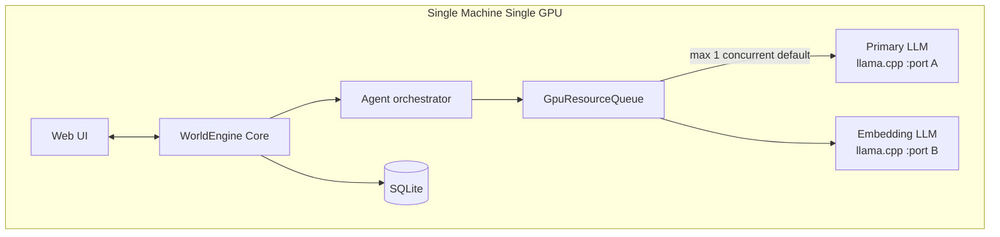
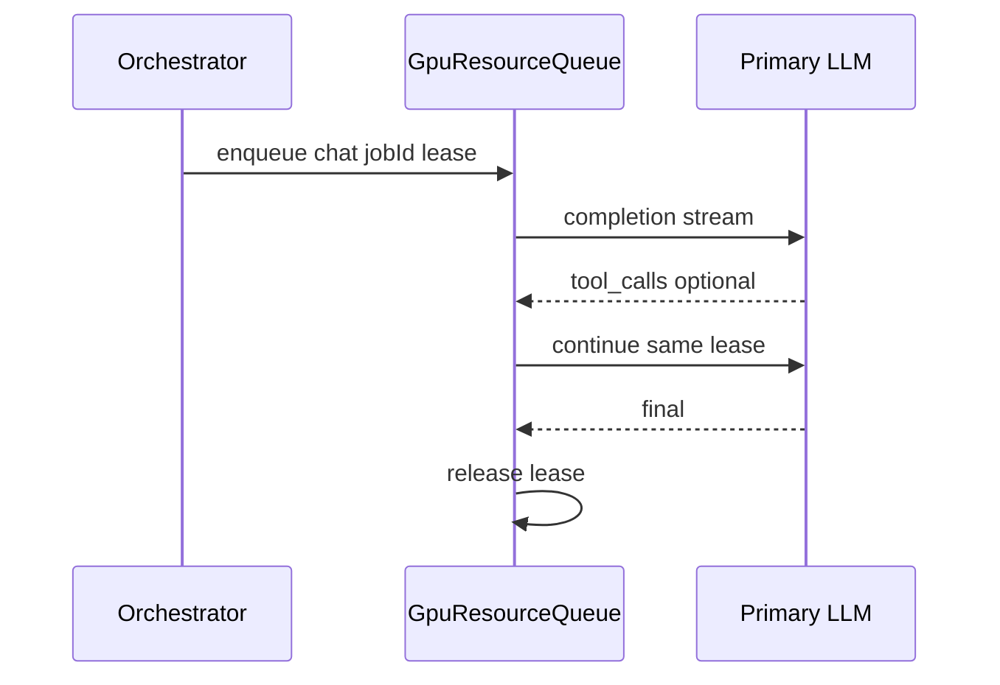

# 00 — Inference Runtime

This document specifies how WorldEngine invokes local LLMs on a **single-GPU** host: primary chat (llama.cpp router), embedding service, **GpuResourceQueue**, streaming, and model profiles.

## 1. Architecture

| Layer | Responsibility |
|-------|----------------|
| **Agent orchestrator** ([13-agent-orchestration.md](13-agent-orchestration.md)) | *What* generates, when, eligibility |
| **GpuResourceQueue** | *Whether* GPU work runs now; serializes chat, embed, future image jobs |
| **LLM adapters** | OpenAI-compatible HTTP to llama-server instances |

Implementations MUST enqueue `GpuRequest { kind, jobId, priority }` and MUST NOT call llama/ComfyUI ports directly from scattered call sites.

## 2. Configuration

| Key | Description |
|-----|-------------|
| `primary.baseUrl` | Chat completions endpoint (e.g. `http://127.0.0.1:8080/v1`) |
| `embedding.baseUrl` | Embeddings endpoint (separate port) |
| `primary.defaultModelProfile` | Default profile id (v1: `qwen3.6-35b-a3b`) |
| `gpu.maxConcurrent` | Max simultaneous GPU jobs (v1 default: **1**) |
| `gpu.dualLoaded` | If `false` (default), never assume primary + embed loaded concurrently |
| `gpu.embedDuringGeneration` | If `false` (default), defer embed until chat lease released |
| `queue.maxDepth` | Backpressure threshold for idle/world-activity enqueue |
| `queue.priorityWeights` | Override default priority bands |

## 3. GpuResourceQueue

### 3.1 Requirements

| ID | Requirement |
|----|-------------|
| INF-1 | Core MUST call local OpenAI-compatible APIs for chat and embeddings. |
| INF-2 | Router MUST support hot-swappable model id per character or world default without process restart. |
| INF-3 | Tool-capable chat API required (`tool_calls` / function calling). |
| INF-4 | Config keys above MUST be documented in operator setup. |
| INF-5 | At most `gpu.maxConcurrent` GPU jobs at once; chat, embed, and (future) ComfyUI MUST NOT bypass the queue. |
| INF-5a | One **generation turn** (single `GenerationJob`, including tool recurse) holds one **lease** for all primary completions in that turn. |
| INF-5b | Embedding during active lease allowed only when `gpu.embedDuringGeneration` is true. |
| INF-5c | Priority (high → low): Observer Direct & Intervene → persona-triggered cast → Observer Narrate → operator "generate now" → idle NPC → background re-embed. |
| INF-5d | When `queue.depth >= queue.maxDepth`, pause idle/world-activity enqueue; operator/Observer Direct MAY still enqueue. |
| INF-5e | FIFO within priority band; optional starvation guard for long-waiting idle jobs. |
| INF-5f | Expose `{ busy, currentJob, depth, estimatedWait }` via API/WebSocket. |
| INF-5g | Cancel/interrupt releases lease immediately; partial streams aborted per [05-tool-calling.md](05-tool-calling.md). |
| INF-5h | When `gpu.dualLoaded` is false, serialize primary vs embedding port access. |
| INF-5i | Primary adapter MUST support streaming; core emits `generation.token`; finalize with `stripReasoning` before durable commit ([16-learning.md](16-learning.md)). |
| INF-5j | Model profiles: default `qwen3.6-35b-a3b`; per-character `modelProfile` override. |

### 3.2 Lease lifecycle

On process start, implementations SHOULD run a **lease reaper**: clear stale `GpuLease` rows older than configured timeout; mark in-flight assistant messages `streamStatus=interrupted`.

### 3.3 GpuRequest kinds

| kind | Target | v1 |
|------|--------|-----|
| `chat` | Primary port | Yes |
| `embed` | Embedding port | Yes (Sprint 1–2; debounced, low priority) |
| `image` | ComfyUI | Future ([19-comfyui-media.md](19-comfyui-media.md)) |

## 4. Primary model (generation)

| ID | Requirement |
|----|-------------|
| INF-6 | FTS `memory_search` / `diary_search` MUST run without GPU; semantic rerank MAY enqueue embed when index rows exist. |
| INF-7 | Mandatory recall assembly is CPU-only until generation; blocking memory-tool rounds use the queue like any chat completion. |

### 4.1 Streaming (STR-*)

| ID | Requirement |
|----|-------------|
| STR-1 | Stream applies to primary chat output; tool-call JSON MAY be non-streamed per model profile. |
| STR-2 | Durable diary/transcript commit only after `stripReasoning` on final text. |
| STR-3 | Reasoning stream MAY appear in operator debug panel only. |
| STR-4 | Cancel mid-stream → `streamStatus=interrupted`, lease released. |

## 5. Embedding model

| ID | Requirement |
|----|-------------|
| INF-8 | Separate `embedding.baseUrl` and model; different port from primary. |
| INF-9 | Embeddings are retrieval helpers only—never replace diary/mandatory recall ([02-memory.md](02-memory.md) §7). |
| INF-10 | MP-1: mind vectors by `characterId`; world by `sceneId`; diary by `characterId`. |
| INF-11 | Hybrid search: FTS default; semantic rerank top-k via queued embed when `EmbeddingRecord` exists. |
| INF-12 | Optional lore index—semantic via queue; inject below mandatory recall. |
| INF-13 | Re-embed on write: debounced batches, low priority, never preempt lease. |
| INF-14 | On world open, optional index hydrate batch; UI "indexing…". |

## 6. Model profiles

Profiles live at `config/models/{profileId}.yaml`. See reference: `config/models/qwen3.6-35b-a3b.yaml`.

| Field | Purpose |
|-------|---------|
| `profileId` | Stable id stored on character/world |
| `routerModelId` | Exact string passed to llama.cpp router |
| `toolCalling` | Whether native function calling is expected |
| `stripReasoningTags` | Tag pairs for [16-learning.md](16-learning.md) |
| `contextLimitRecommended` | Operator guidance (not a hard cap in core) |
| `streamSupported` | Default true for primary |

### 6.1 Reference profile (v1)

| Field | Value |
|-------|-------|
| `profileId` | `qwen3.6-35b-a3b` |
| `routerModelId` | `Qwen3.6-35B-A3B` |

Nightly acceptance runs against this profile ([17-acceptance-criteria.md](17-acceptance-criteria.md)).

## 7. Health and observability

Implementations SHOULD expose:

- `GET /health/llm` — primary reachability
- `GET /health/embeddings` — embedding reachability
- `GET /inference/queue` — INF-5f state
- Structured logs per job: `jobId`, `characterId`, `kind`, `gpuWaitMs`, `toolDepth`, `profileId`

## 8. Requirements summary

| ID | Summary |
|----|---------|
| INF-1–INF-14 | Dual-LLM local inference, queue, embeddings policy |
| STR-1–STR-4 | Streaming and finalize discipline |
| INF-5j | Profile registry with Qwen3.6-35B-A3B reference |

## Related documents

- [11-data-model.md](11-data-model.md) — GpuLease, GpuRequest persistence
- [12-api-sketch.md](12-api-sketch.md) — HTTP/WS surfaces
- [13-agent-orchestration.md](13-agent-orchestration.md) — GenerationJob integration
- [16-learning.md](16-learning.md) — stripReasoning
