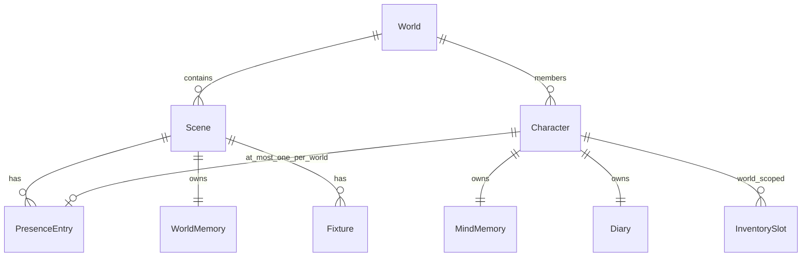

# 01 — World Model

This document defines the top-level entities of WorldEngine: worlds, scenes, characters, the operator persona, and how state persists.

## 1. Entities

### 1.1 World

A **world** is a persistent narrative container shared by a cast of characters. It owns:

- A list of **scenes** (locations).
- **World-scoped** data: group inventory mirrors, communication channels, outfit presets, and configuration that applies across scenes.
- A **membership list**: characters eligible to appear in any scene of this world.

A world MUST have at least one scene. Deleting the last scene MUST be rejected.

| Field | Description |
|-------|-------------|
| `worldId` | Stable identifier |
| `name` | Display name |
| `memberIds` | Characters in the cast |
| `sceneIds` | Ordered or unordered list of scene references |
| `activeSceneId` | Scene currently focused for operator UI and default generation |

### 1.2 Scene (location)

A **scene** is one place-and-time context within a world. Each scene has:

- Its own **transcript** (message log).
- Its own **presence roster** (who is physically present).
- Its own **fixtures** (persistent scene objects).
- Metadata: human-readable name, description, timestamps.

Scenes are the unit of spatial separation. Characters in Scene A do not automatically hear or see Scene B's public traffic unless communication rules bridge them (see [04-communication.md](04-communication.md)).

### 1.3 Character

A **character** is an agent (typically LLM-driven) with:

- A stable `characterId` and display name.
- A **definition** (persona, instructions, model binding)—implementation-specific.
- **Global** per-character state: mind loci, diary segments (see [02-memory-palace.md](02-memory-palace.md)).
- **World-scoped** inventory (worn, held, containers) while a member of a world.

Membership in a world does not imply presence in any scene.

### 1.4 Operator persona

The **persona** represents the human operator. It is not a full character card but participates in worlds with:

- A display label (configurable).
- Optional **presence** at exactly one scene per world (see [03-locations-and-presence.md](03-locations-and-presence.md)).
- Privileges granted by role configuration (location admin, diary admin, observer—see [09-roles-and-privilege.md](09-roles-and-privilege.md)).

The persona MUST be representable in presence rosters with a reserved token (e.g. `__persona__`) distinct from character IDs.

## 2. Relationships

### 2.1 Membership vs presence

| Concept | Scope | Meaning |
|---------|-------|---------|
| **Member** | World | Cast eligible for scenes |
| **Present** | Scene | Currently in the room for perception and public comms |
| **Elsewhere** | World | Member but not in active scene's present list |
| **Muted** | World | Present but generation-suppressed |

The system MUST NOT conflate membership with presence when filtering who generates, who hears public lines, or what scene framing is injected.

### 2.2 One scene per character per world

When a character joins Scene B within World W, the implementation MUST remove that character from the present list of every other scene in W. A character MUST NOT appear present in two scenes of the same world simultaneously.

The persona SHOULD follow the same rule when `persona_auto_join_on_scene_switch` (or equivalent) is enabled.

## 3. Persistence

### 3.1 Layers

| Layer | Durability | Typical contents |
|-------|------------|------------------|
| **Scene transcript** | Durable per scene | Messages, tool invocations, communication metadata |
| **Scene header metadata** | Durable per scene | Name, description, present[], fixtures, updatedAt |
| **World aggregate** | Durable per world | Inventory by character, active channels, mirrored summaries |
| **Character global** | Durable per character | Mind loci, diary segments |
| **Runtime cache** | Ephemeral | Assembled prompts, pending approvals UI state |

### 3.2 Consistency rules

1. **Canonical scene state** SHOULD live in a world-level store synchronized to scene headers on change.
2. When the operator views Scene S, active scene metadata MUST reflect S's header after hydration.
3. Writes to fixtures or presence on the **active** scene MUST flush to world memory loci when fixture sync is enabled (see [02-memory-palace.md](02-memory-palace.md)).
4. Inactive scenes persist via their own headers; hydration on world load MUST merge all scene headers into the canonical store.

### 3.3 Events

Implementations SHOULD emit events for:

| Event | Payload (minimum) | Consumers |
|-------|-------------------|-----------|
| `scene.changed` | `worldId`, `sceneId` | UI, prompt refresh |
| `presence.changed` | `worldId`, `sceneId`, `characterId`, `action` | Scene framing, roster, world activity |
| `world.member_drafted` | `worldId`, `characterId` | Per-character prompt assembly |

## 4. Solo mode

When only one implicit scene exists (no multi-scene world), the system MAY expose a **solo scene** with default name (e.g. "Scene") and the same metadata shape as multi-scene worlds. Solo mode MUST NOT disable memory palace or tool features unless explicitly configured.

## 5. World without active UI session

The implementation MAY designate a **default world** for operator actions (create scene, roster tools) when no world is open—e.g. library or home view. Tool and API entry points MUST resolve `worldId` consistently in that mode.

## 6. Requirements summary

| ID | Requirement |
|----|-------------|
| W-1 | A world contains ≥1 scene; last scene cannot be deleted. |
| W-2 | Each scene has an independent transcript and presence roster. |
| W-3 | At most one scene presence per character per world. |
| W-4 | Persona is distinguishable from characters in presence data. |
| W-5 | Membership, presence, and mute status are independently queryable. |
| W-6 | Durable state separates scene headers, world aggregates, and per-character global memory. |

## 7. Rationale

Separating **world**, **scene**, and **character** allows persistent geography (multiple places) without forking the cast into duplicate character records. Global mind/diary per character supports continuity when a character moves between scenes; world loci per scene keep shared objective facts local to where they matter.

## Related documents

- [02-memory-palace.md](02-memory-palace.md) — memory pools and diary
- [03-locations-and-presence.md](03-locations-and-presence.md) — presence operations and fixtures
- [09-roles-and-privilege.md](09-roles-and-privilege.md) — operator and admin roles
