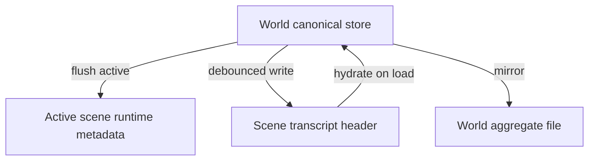

# 03 — Locations and Presence

This document specifies scenes as places, **presence** (who is in the room), **fixtures** (scene objects), **inventory** (character possessions), **scene framing** for prompts, and **world activity** (background character generations).

## 1. Scene metadata

Each scene MUST persist:

| Field | Type | Description |
|-------|------|-------------|
| `sceneId` | string | Stable id |
| `locationName` | string | Display name |
| `locationDescription` | string | Prose description for prompts |
| `present` | string[] | `characterId` or persona token |
| `fixtures` | map | Key → fixture record |
| `updatedAt` | ISO datetime | Last mutation |

If `present` is empty, `getPresentCharacters` MAY default to all world members (legacy-friendly) but SHOULD allow policy `empty` on create.

## 2. Presence

### 2.1 Operations

| Operation | Behavior |
|-----------|----------|
| **join** | Add id to scene `present`; remove from all other scenes in world |
| **leave** | Remove id from scene `present` |
| **summon** | Batch join to target scene |
| **switch scene** | Operator focuses another scene; hydrate its metadata |

When `presenceAnnounce` is true (default), batch **summon** appends scene chronicle lines with `communication.scope: presence` so operators see who requested assistance and who was called. NPC tool/narrative summons post after the summoner’s line completes; operator REST/UI summons post immediately at the target scene.

**Movement policy:** Cast move when (1) a leader with `summonRoles` calls `scene_summon` (preferred on reactive lines), (2) narrative auto-apply on **reactive** lines recognizes a leader’s **assembly order** (gather/call-in language + group noun + explicit destination) and summons elsewhere directors, (3) a character calls `scene_join` for themselves. Ambient `idle_timer` jobs cannot summon others. Casual mentions of “the team” without assembly intent do not move anyone. Narrative never summons to the speaker’s room without a stated destination.

### 2.2 Presence buckets

For roster UI and APIs:

| Bucket | Definition |
|--------|------------|
| **atLocation** | In active scene's `present`, not muted |
| **elsewhere** | World member, not in active scene's present |
| **muted** | In present but generation-disabled |
| **unplaced** | Member not in any scene's present |

### 2.3 Persona presence

The persona token (e.g. `__persona__`) MAY appear in `present`. Settings:

- `require_persona_present_to_speak` — block or warn on public send if persona not in active scene.
- `persona_auto_join_on_scene_switch` — auto-join persona when operator switches scene.

## 3. Fixtures

**Fixtures** are persistent scene objects—not character inventory.

### 3.1 Kinds

| Kind | Behavior |
|------|----------|
| **discrete** | Pick up, put down, move, describe; may become inventory item |
| **aggregate** | Harvestable source: `picksRemaining`, `yield`, `depleted` |

Fixture records SHOULD support: `label`, `description`, `portable`, `wearable`, `containerCapacity`, harvest fields for aggregate.

### 3.2 Fixture operations

Implementations SHOULD expose tools or operator APIs:

- `fixture_place`, `fixture_pickup`, `fixture_move`, `fixture_describe`
- `fixture_harvest`, `fixture_replenish`

LLM **scene tools** prefix example: `scene_fixture_*`, `scene_location_*`.

### 3.3 Exit and door state

Exit records in `exitsJson` ([11-data-model.md](11-data-model.md)) MAY include optional `doorState`:

| Value | Meaning |
|-------|---------|
| `closed` | Default; passable only when opened/unlocked per story |
| `unlocked` | May open without breaking |
| `open` | Passage open |
| `broken` | Forced entry; pair with presence move and framing update |

Tools SHOULD include `scene_exit_set_state` (or equivalent) gated like other location mutations. Setting `broken` and moving a character into the target scene MUST be explicit — no silent cross-scene retcon ([21-cross-scene-awareness.md](21-cross-scene-awareness.md) CC-11c).

## 4. Inventory

**Inventory** is **per character, world-scoped** (not duplicated per scene file):

- Slots: worn, held, containers (nested items).
- Survives scene changes; framing shows what present characters carry.

Inventory MUST be distinguished from fixtures in prompts and tools.

### 4.1 Shared stashes (group inventory)

**Shared stashes** are scene-scoped pooled items any **present** character may take from or deposit into (e.g. break-room snack shelf). Stored on `Scene.sharedStashJson`:

```json
{
  "snack-shelf": {
    "label": "Snack shelf",
    "items": [{"itemId": "item-granola-1", "label": "granola bar"}],
    "capacity": 20
  }
}
```

| ID | Rule |
|----|------|
| GS-1 | Stash is scene-scoped; persists when characters leave. |
| GS-2 | Take/deposit requires character **present** at scene (same gate as fixture pickup). |
| GS-3 | Stashes are shared consumable pools — not portable fixtures. |
| GS-4 | Take moves item to **held**; deposit moves from held or container contents. |
| GS-5 | Scene framing and observer digest show stash summaries alongside fixtures. |

Tools: `scene_stash_take`, `scene_stash_deposit`.

### 4.2 Outfit presets

World-level templates in `World.configJson.outfitPresets` apply worn (and optional held) via operator API or `scene_inventory_apply_outfit`. See [11-data-model.md](11-data-model.md) §3.2.

## 5. Scene framing

**Scene framing** injects per-character context when that character is drafted for generation:

```
[Scene — Kitchen]
Warm hearth, rain on shutters.
Fixtures: kettle (discrete), herb rack (aggregate, 3 picks left)
Present: Alice [worn: apron; held: ladle], Bob
Present roles (optional): Alice (teacher), Bob (student)
```

When `WorldMember.sceneRole` is set, framing SHOULD include role labels for AO-18 role-fit scoring.

Requirements:

- Resolve character's scene via `findCharacterPresentSceneId`.
- Include scene name, description, fixture summary, short inventory for each present character.
- Controlled by `sceneFramingEnabled` and position/depth/role settings (see [10-prompt-injection.md](10-prompt-injection.md)).
- Refresh on: scene change, presence change, member drafted.

## 6. World activity

**World activity** runs background character generations when the operator is not driving the scene.

### 6.1 Triggers

| Trigger | Typical behavior |
|---------|------------------|
| Persona joins scene with NPCs | Up to `personaArrivalMaxReplies` reactive jobs via `scoreSpeakers` ([13-agent-orchestration.md](13-agent-orchestration.md) AO-18; default 1) |
| Operator public message completes | **One** reactive NPC at active scene via `scoreSpeakers` (not round-robin) |
| Cast scene line completes | Optional `agent_continue` chain (AO-19) when enabled |
| Whisper/phone to character | Target generates |
| Idle timer | **AO-4 only:** weighted random one NPC per eligible scene (solo ambient or banter dyad) |

Reactive and continue paths use contextual speaker selection; idle uses fair rotation when the operator is not driving the scene.

### 6.2 Eligibility

NPC MUST be: present at scene, not persona, not muted, not observer/admin-excluded (configurable).

Idle scope: `active_scene_only` or `all_scenes_with_present_cast`.

Caps: hourly generation limit, skip when browser tab hidden (optional).

### 6.3 Quiet prompt

Idle/reactive generations SHOULD use a compact prompt from scene name, description, fixture keys—not full transcript replay unless configured.

## 7. Narrative presence (optional)

**Narrative presence** detects enter/leave, item pickup, whisper, phone answer from message text.

| Mode | Behavior |
|------|----------|
| `off` | No automation |
| `detect` | Suggest actions to operator |
| `auto` | Apply join/leave/fixture/inventory/stash ops via heuristics |
| `llm` | Parse fenced `narrativePresence` JSON block from model output; same invariants as `auto` |

Auto/llm modes MUST respect the same one-scene-per-character invariant.

**LLM block shape (optional when `narrativePresenceMode=llm`):**

```json
{
  "narrativePresence": {
    "actions": [
      {"kind": "join", "sceneId": "scene-break-room"},
      {"kind": "pickup", "fixtureKey": "travel-mug"},
      {"kind": "stash_take", "stashKey": "snack-shelf", "itemId": "item-granola-1"},
      {"kind": "give", "itemId": "...", "toCharacterId": "..."}
    ]
  }
}
```

| ID | Rule |
|----|------|
| NP-LLM-1 | Parser strips block before transcript persist; invalid JSON → no-op + log (`detect` surfaces to operator). |
| NP-LLM-2 | Same invariants as `auto` (MAP-MOVE-2, present gates). |
| NP-LLM-3 | `detect` mode returns parsed actions without applying. |
| NP-LLM-4 | Prompt injection documents optional instruction when mode is `llm` ([10-prompt-injection.md](10-prompt-injection.md)). |

**MAP-MOVE-2:** Narrative presence MUST NOT create scenes or exits. Join/leave applies only when the target scene **already exists** on the map.

**MAP-MOVE-3:** When text implies a missing destination, implementations SHOULD surface add-location flow to the operator ([14-web-ui.md](14-web-ui.md) UI-MAP-P14) — no silent scene create. See [25-map-authoring.md](25-map-authoring.md) §5.

## 8. Scene lifecycle

| Action | Rules |
|--------|-------|
| **create** | Foreground (switch to new scene) or background (append scene id, empty transcript) |
| **rename** | Update `locationName` |
| **delete** | Reject if last scene; remove id from world |
| **initial present** | Policy: `empty`, `all_members`, `copy_active`, `pick` |

## 9. Persistence flow



- **Flush active:** When `sceneId === activeSceneId`, copy CPR block to runtime and trigger memory fixture sync.
- **Persist all scenes:** Debounced write headers to each scene's durable store.
- **Hydrate on load:** Read all scene headers into canonical store.

## 10. Observer digest (multi-scene)

When enabled, privileged **observer** characters receive a digest listing all scenes with presence and fixture previews. This is an **operator/model affordance** for coherence—not in-character knowledge unless communicated in play (see [09-roles-and-privilege.md](09-roles-and-privilege.md)).

## 11. Requirements summary

| ID | Requirement |
|----|-------------|
| LP-1 | One present scene per character per world. |
| LP-2 | Fixtures are scene-scoped; inventory is world-scoped per character. |
| LP-3 | Scene framing reflects present cast and fixtures for drafted character. |
| LP-4 | Fixture mirror to world loci on active scene flush when enabled. |
| LP-5 | World activity respects eligibility and rate limits. |
| LP-6 | Last scene in world cannot be deleted. |

## Related documents

- [01-world-model.md](01-world-model.md) — world/scene entities
- [02-memory.md](02-memory.md) — fixture mirror keys
- [04-communication.md](04-communication.md) — audience = present at scene
- [05-tool-calling.md](05-tool-calling.md) — scene tools
