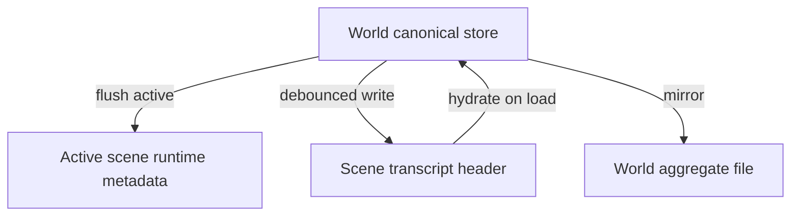

# 03 — Locations and Presence

This document specifies scenes as places, **presence** (who is in the room), **fixtures** (scene objects), **inventory** (character possessions), **scene framing** for prompts, and **world activity** (background character generations).

## 1. Scene metadata

Each scene MUST persist:

| Field | Type | Description |
|-------|------|-------------|
| `sceneId` | string | Stable id |
| `locationName` | string | Display name |
| `locationDescription` | string | Prose description for prompts |
| `present` | string[] | `characterId` or persona token |
| `fixtures` | map | Key → fixture record |
| `updatedAt` | ISO datetime | Last mutation |

If `present` is empty, `getPresentCharacters` MAY default to all world members (legacy-friendly) but SHOULD allow policy `empty` on create.

## 2. Presence

### 2.1 Operations

| Operation | Behavior |
|-----------|----------|
| **join** | Add id to scene `present`; remove from all other scenes in world |
| **leave** | Remove id from scene `present` |
| **summon** | Batch join to target scene |
| **switch scene** | Operator focuses another scene; hydrate its metadata |

Optional system transcript lines (e.g. `[Name joined Kitchen]`) MAY be appended when `presence_announce` is enabled.

### 2.2 Presence buckets

For roster UI and APIs:

| Bucket | Definition |
|--------|------------|
| **atLocation** | In active scene's `present`, not muted |
| **elsewhere** | World member, not in active scene's present |
| **muted** | In present but generation-disabled |
| **unplaced** | Member not in any scene's present |

### 2.3 Persona presence

The persona token (e.g. `__persona__`) MAY appear in `present`. Settings:

- `require_persona_present_to_speak` — block or warn on public send if persona not in active scene.
- `persona_auto_join_on_scene_switch` — auto-join persona when operator switches scene.

## 3. Fixtures

**Fixtures** are persistent scene objects—not character inventory.

### 3.1 Kinds

| Kind | Behavior |
|------|----------|
| **discrete** | Pick up, put down, move, describe; may become inventory item |
| **aggregate** | Harvestable source: `picksRemaining`, `yield`, `depleted` |

Fixture records SHOULD support: `label`, `description`, `portable`, `wearable`, `containerCapacity`, harvest fields for aggregate.

### 3.2 Fixture operations

Implementations SHOULD expose tools or operator APIs:

- `fixture_place`, `fixture_pickup`, `fixture_move`, `fixture_describe`
- `fixture_harvest`, `fixture_replenish`

LLM **scene tools** prefix example: `scene_fixture_*`, `scene_location_*`.

### 3.3 Exit and door state

Exit records in `exitsJson` ([11-data-model.md](11-data-model.md)) MAY include optional `doorState`:

| Value | Meaning |
|-------|---------|
| `closed` | Default; passable only when opened/unlocked per story |
| `unlocked` | May open without breaking |
| `open` | Passage open |
| `broken` | Forced entry; pair with presence move and framing update |

Tools SHOULD include `scene_exit_set_state` (or equivalent) gated like other location mutations. Setting `broken` and moving a character into the target scene MUST be explicit — no silent cross-scene retcon ([21-cross-scene-awareness.md](21-cross-scene-awareness.md) CC-11c).

## 4. Inventory

**Inventory** is **per character, world-scoped** (not duplicated per scene file):

- Slots: worn, held, containers (nested items).
- Survives scene changes; framing shows what present characters carry.

Inventory MUST be distinguished from fixtures in prompts and tools.

## 5. Scene framing

**Scene framing** injects per-character context when that character is drafted for generation:

```
[Scene — Kitchen]
Warm hearth, rain on shutters.
Fixtures: kettle (discrete), herb rack (aggregate, 3 picks left)
Present: Alice [worn: apron; held: ladle], Bob
Present roles (optional): Alice (teacher), Bob (student)
```

When `WorldMember.sceneRole` is set, framing SHOULD include role labels for AO-18 role-fit scoring.

Requirements:

- Resolve character's scene via `findCharacterPresentSceneId`.
- Include scene name, description, fixture summary, short inventory for each present character.
- Controlled by `sceneFramingEnabled` and position/depth/role settings (see [10-prompt-injection.md](10-prompt-injection.md)).
- Refresh on: scene change, presence change, member drafted.

## 6. World activity

**World activity** runs background character generations when the operator is not driving the scene.

### 6.1 Triggers

| Trigger | Typical behavior |
|---------|------------------|
| Persona joins scene with NPCs | Up to `personaArrivalMaxReplies` reactive jobs via `scoreSpeakers` ([13-agent-orchestration.md](13-agent-orchestration.md) AO-18; default 1) |
| Operator public message completes | **One** reactive NPC at active scene via `scoreSpeakers` (not round-robin) |
| Cast scene line completes | Optional `agent_continue` chain (AO-19) when enabled |
| Whisper/phone to character | Target generates |
| Idle timer | **AO-4 only:** round-robin one NPC per eligible scene |

Reactive and continue paths use contextual speaker selection; idle uses fair rotation when the operator is not driving the scene.

### 6.2 Eligibility

NPC MUST be: present at scene, not persona, not muted, not observer/admin-excluded (configurable).

Idle scope: `active_scene_only` or `all_scenes_with_present_cast`.

Caps: hourly generation limit, skip when browser tab hidden (optional).

### 6.3 Quiet prompt

Idle/reactive generations SHOULD use a compact prompt from scene name, description, fixture keys—not full transcript replay unless configured.

## 7. Narrative presence (optional)

**Narrative presence** detects enter/leave, item pickup, whisper, phone answer from message text.

| Mode | Behavior |
|------|----------|
| `off` | No automation |
| `detect` | Suggest actions to operator |
| `auto` | Apply join/leave/fixture/inventory ops |
| `llm` | Parse structured JSON block from model output |

Auto mode MUST respect the same one-scene-per-character invariant.

## 8. Scene lifecycle

| Action | Rules |
|--------|-------|
| **create** | Foreground (switch to new scene) or background (append scene id, empty transcript) |
| **rename** | Update `locationName` |
| **delete** | Reject if last scene; remove id from world |
| **initial present** | Policy: `empty`, `all_members`, `copy_active`, `pick` |

## 9. Persistence flow



- **Flush active:** When `sceneId === activeSceneId`, copy CPR block to runtime and trigger memory fixture sync.
- **Persist all scenes:** Debounced write headers to each scene's durable store.
- **Hydrate on load:** Read all scene headers into canonical store.

## 10. Observer digest (multi-scene)

When enabled, privileged **observer** characters receive a digest listing all scenes with presence and fixture previews. This is an **operator/model affordance** for coherence—not in-character knowledge unless communicated in play (see [09-roles-and-privilege.md](09-roles-and-privilege.md)).

## 11. Requirements summary

| ID | Requirement |
|----|-------------|
| LP-1 | One present scene per character per world. |
| LP-2 | Fixtures are scene-scoped; inventory is world-scoped per character. |
| LP-3 | Scene framing reflects present cast and fixtures for drafted character. |
| LP-4 | Fixture mirror to world loci on active scene flush when enabled. |
| LP-5 | World activity respects eligibility and rate limits. |
| LP-6 | Last scene in world cannot be deleted. |

## Related documents

- [01-world-model.md](01-world-model.md) — world/scene entities
- [02-memory.md](02-memory.md) — fixture mirror keys
- [04-communication.md](04-communication.md) — audience = present at scene
- [05-tool-calling.md](05-tool-calling.md) — scene tools
