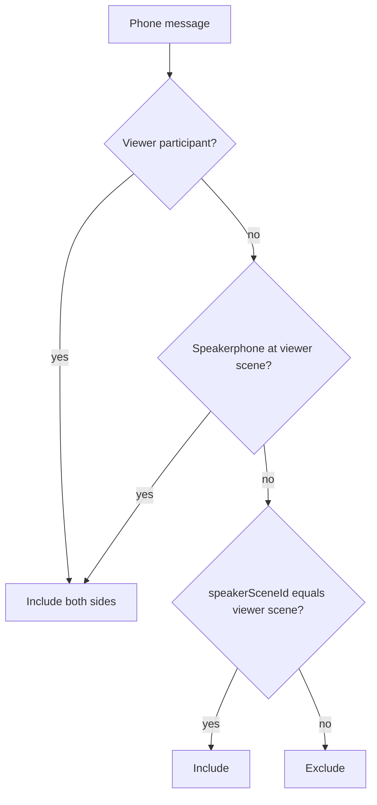

# 04 — Communication

WorldEngine tags messages with **communication scope** so prompts, UI, and tools know who can perceive each line. Scopes interact with **presence** at the active scene and optional **cross-scene phone** links.

## 1. Scope matrix

| Scope | Metadata value | Default audience | Prompt filter |
|-------|----------------|------------------|---------------|
| **Public** | `public` | All characters **present** at active scene | Everyone at scene |
| **Whisper** | `whisper` | `participants` + speaker | Listed participants only |
| **Phone** | `phone` | Participants: both sides; bystanders: one side or both if speakerphone at their scene | §3.3 |
| **DM** | `dm` | Explicit `participants` | Listed participants only |
| **Narrator** | `narrator` | All **present** at scene | Present cast (Observer narrator) |

**v1 play:** public, whisper, DM, narrator. **v1.1:** phone ([21-cross-scene-awareness.md](21-cross-scene-awareness.md)).

Messages with `channelKind=meta` ([11-data-model.md](11-data-model.md)) are excluded from cast perception entirely.

Metadata lives on each message, e.g. `message.meta.communication`:

```json
{
  "scope": "whisper",
  "participants": ["char-alice-id"],
  "phone": {
    "channelId": "...",
    "speakingCharacterId": "char-alice-id",
    "speakerSceneId": "scene-kitchen"
  }
}
```

Phone messages MUST record **who spoke** and **which scene they spoke from** (`speakingCharacterId`, `speakerSceneId`). Per-end audio mode lives on the **channel**, not on each line.

## 2. Narrator scope

Observer **Narrate** mode ([09-roles-and-privilege.md](09-roles-and-privilege.md)) uses `scope: narrator` on `channelKind=scene` messages:

- Perceivable by all characters present at the scene
- Not whispers; not cast private knowledge unless a character witnesses and stores in mind pool
- Distinct typography in Web UI ([14-web-ui.md](14-web-ui.md))

## 3. Phone channels (v1.1)

**v1:** schema and parsers only (CC-5); UI and tools disabled.

A **phone channel** links call **participants** (typically two characters, possibly more) across one or two scenes. Audio privacy is controlled **per scene endpoint**, not globally for the call.

### 3.1 Channel shape

Stored per world in `activeChannels[]` ([11-data-model.md](11-data-model.md)):

```json
{
  "channelId": "ch-1",
  "participants": ["char-alice-id", "char-bob-id"],
  "endpoints": [
    {
      "sceneId": "scene-kitchen",
      "participantIds": ["char-alice-id"],
      "speakerphone": false
    },
    {
      "sceneId": "scene-hall",
      "participantIds": ["char-bob-id"],
      "speakerphone": false
    }
  ]
}
```

| Field | Meaning |
|-------|---------|
| `participants` | Characters on the call (hear **both sides**) |
| `endpoints[].sceneId` | Scene where that end of the line is "located" |
| `endpoints[].speakerphone` | If **true**, present bystanders at **this scene only** hear the full call (both sides). If **false** (default), bystanders hear **one side** only (see §3.3). |

**Requirement (C-9):** `speakerphone` is an **independent toggle per endpoint**. Enabling it at the kitchen does **not** enable it at the hall. There is no automatic "both scenes hear everything" when a call starts.

### 3.2 Participants vs bystanders

| Role | Handset (speakerphone off at their scene) | Speakerphone on at their scene |
|------|------------------------------------------|--------------------------------|
| **Call participant** | Hears both sides | Hears both sides |
| **Present, not on call** | Hears **one side** — speech from characters **physically at that scene** only | Hears **both sides** (full call audible in room) |
| **Not present / other scene** | Hears nothing | Hears nothing |

**One-sided overhear (C-8):** If Charlie is in the kitchen with Alice (on the phone to Bob in the hall), Charlie hears Alice's lines but **not** Bob's. In the hall, a bystander with Bob hears Bob's lines but **not** Alice's. This matches overhearing a handset call in the room—not a speaker broadcast.

### 3.3 Perception algorithm (phone)

For `canPerceive(viewer, message)` when `scope === phone`:

1. If `viewer.characterId` is in `channel.participants` → **include** (both sides).
2. Else if viewer is not present at any endpoint scene of `channelId` → **exclude**.
3. Let `viewerScene` = scene where viewer is present.
4. Let `endpoint` = channel endpoint for `viewerScene`.
5. If `endpoint.speakerphone === true` → **include** (bystander hears full call).
6. Else (handset bystander at this scene) → **include** only if `message.phone.speakerSceneId === viewerScene` (local leg only).

Persona rules: operator MAY be treated as participant when listed on channel, or as bystander per scene policy.



### 3.4 Operator controls

| Control | Effect |
|---------|--------|
| Start phone | Creates channel; default `speakerphone: false` at **both** endpoints |
| Toggle speakerphone (local end) | Sets `speakerphone` on **this scene's endpoint only** |
| End call | Closes channel |

UI MUST show speakerphone state **per scene** (e.g. "Kitchen: handset / Speakerphone", "Hall: handset"). See [14-web-ui.md](14-web-ui.md).

Slash/commands (implementation-defined): `/phone-speaker` toggles speakerphone for **caller's current scene endpoint only**.

## 4. Cross-scene phone mirrors (v1.1)

Canonical phone/whisper lines live on the **speaker's active scene** transcript.

**Mirror stubs** MAY append to other participants' scene transcripts with:

```json
{
  "communication": {
    "mirrorOf": {
      "sceneId": "...",
      "messageIndex": 42,
      "canonicalId": "..."
    }
  }
}
```

Mirrors exist for operator visibility and continuity. **canPerceive MUST still apply** on mirror rows: a bystander at the remote scene uses the same one-sided rule against `speakerSceneId` (typically hears only lines spoken from the hall, not the kitchen leg).

Mirrors MUST NOT bypass handset privacy by copying both legs as public traffic.

## 5. Perception filter

Before prompt assembly, each message passes through **canPerceive(viewer, message)**:

1. Resolve viewer's `characterId` (or persona rules).
2. Read `message.meta.communication`.
3. Return include/exclude for prompt and optional UI dimming.

Hook/event equivalent: `message.perceive_filter` with `{ viewerId, message, include }`.

Legacy fallback: callback `shouldIncludeMessageForViewer` if no listeners registered.

### 5.1 Generation member filter and speaker selection

**Eligibility** — which characters MAY be scheduled:

- Default: present at active scene.
- Optional: include phone participants from linked channel when `phone_participants_eligible` is true.
- Same filter MAY apply to `getWorldMembers()` when `filter_members_by_presence` is enabled.

**Selection** — which eligible character SHOULD speak on reactive and `agent_continue` paths ([13-agent-orchestration.md](13-agent-orchestration.md) AO-18):

| Step | Rule |
|------|------|
| 1 | Apply eligibility filter (above). |
| 2 | If trigger line addresses a character, that character wins if eligible. |
| 3 | Else `scoreSpeakers`: `speechWeight`, AO-17 relevance probe, `sceneRole` fit, recency, starvation guard. |
| 4 | Idle `idle_timer` uses AO-4 round-robin only — not this table. |

MUST NOT enqueue multiple reactive NPCs for one operator public line (AO-20).

## 6. Operator compose

The operator UI SHOULD offer scope selector above send: **v1** public / whisper / DM; **v1.1** phone.

`sendScopedMessage(world, scene, { scope, text, targetCharacterId })` attaches metadata before append.

Badges on messages indicate scope; non-audible lines MAY render dimmed for current viewer ([14-web-ui.md](14-web-ui.md) UI-3, `PerceptionDimming`).

### 6.1 Rich text in transcript

Message `outputText` MAY contain GitHub-flavored markdown and fenced `mermaid` diagrams. Scope badges and narrator typography MUST remain visible alongside formatted body copy (UI-R1–R2, UI-3). Reasoning blocks MUST NOT appear in rendered transcript (UI-R6, OQ-3).

### 6.2 Transcript immutability

The Web UI MUST NOT offer delete or inline edit of committed scene or meta messages (UI-TRN-1–UI-TRN-3). Operator guides story via new messages, Observer modes, and tools—not erasure.

## 7. Tools and commands

Slash or natural commands (implementation-defined):

| Command | Effect |
|---------|--------|
| `/whisper Target \| text` | Whisper to target |
| `/phone Target \| text` | Start/continue phone |
| `/phone-end` | End channel |
| `/phone-speaker` | Toggle speakerphone at **current scene endpoint only** |
| `/dm A B \| text` | Direct message |

LLM tools example: `comm_whisper`, `comm_phone` — whisper MAY send immediately when `text` provided, else open compose UI only.

## 8. Narrative detection integration

When narrative presence is in `auto` or `llm` mode, detected whispers and phone answers SHOULD set appropriate scope metadata and MAY trigger join/leave side effects (see [03-locations-and-presence.md](03-locations-and-presence.md)).

## 8.1 Debate activity (post-v1)

When `scene.activity.kind=debate` ([23-in-world-work.md](23-in-world-work.md)):

| Rule | Level |
|------|-------|
| Debate lines use `scope: public` unless operator uses whisper/DM per normal rules | MUST |
| Only `speakingOrder[currentIndex]` is generation-eligible for debate turns (DEB-2) | MUST |
| MP-20 diary fan-out applies to witnessed debate lines | MUST |
| Phase `synthesis` MAY add a narrator or chair line; per-debater mind loci written per DEB-1 | MUST |

Debate is not a separate channel; it uses the scene transcript and existing scope matrix.

## 9. Requirements summary

| ID | Requirement |
|----|-------------|
| C-1 | Every operator-originated line SHOULD have explicit scope metadata. |
| C-2 | Public scope audience = present at active scene only. |
| C-3 | Perception filter runs before prompt assembly per viewer. |
| C-4 | Phone participants always perceive both sides of the channel (v1.1). |
| C-5 | Cross-scene mirrors reference canonical message; perception rules unchanged (v1.1). |
| C-6 | Generation eligibility respects presence + optional phone rules. |
| C-7 | Narrator scope perceivable by present cast at scene; not meta channel. |
| C-8 | Meta channel messages excluded from cast perception. |
| C-9 | Handset bystanders hear only messages whose `speakerSceneId` matches their present scene (one side). |
| C-10 | `speakerphone` is per endpoint; default false; toggling one end does not toggle the other. |
| C-11 | Speakerphone on at an endpoint lets present bystanders at **that scene only** hear both sides. |
| C-12 | Reactive and continue speaker selection uses AO-18; idle uses AO-4 only ([13-agent-orchestration.md](13-agent-orchestration.md)). |
| C-12 | Debate activity uses public scope and DEB-2 turn eligibility (post-v1). |

## Related documents

- [03-locations-and-presence.md](03-locations-and-presence.md) — present roster
- [09-roles-and-privilege.md](09-roles-and-privilege.md) — persona speak guards
- [05-tool-calling.md](05-tool-calling.md) — communication tools
- [23-in-world-work.md](23-in-world-work.md) — debate activity
