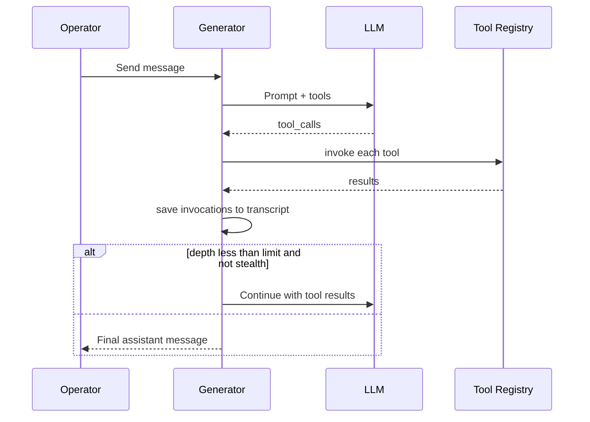

# 05 — Tool Calling

This document defines how agents invoke **function tools**: registration, eligibility, the invoke/recurse loop, persistence, loop guarding, and tool categories.

## 1. Tool registry

The **tool registry** is the central catalog of callable functions exposed to the LLM.

Each tool registration MUST include:

| Field | Description |
|-------|-------------|
| `name` | Stable identifier (e.g. `memory_search`) |
| `displayName` | Human label for logs/UI |
| `description` | Model-facing instructions |
| `parameters` | JSON Schema for arguments |
| `handler` | Async `(params, context) => result` |
| `shouldRegister` | Optional predicate on generation context |
| `stealth` | If true: no transcript row, no recurse |

Registration MAY be dynamic per extension/module at startup.

## 2. Generation gate

Tools are attached to the model payload only when **all** gates pass:

| Gate | Requirement |
|------|-------------|
| API | Chat-completions (or equivalent tool-capable API) |
| Preset | Function calling enabled |
| Post-processing | Compatible mode (none, merge, semi, strict) |
| Generation type | Not impersonate, quiet, or continue-only |
| Model | On supported provider list |
| Per-tool | `shouldRegister(context) === true` |
| Filters | Pass any global registration filters (e.g. mandatory recall blocking) |

Token budget SHOULD reserve space for tool schemas before prompt assembly.

## 3. Invoke loop

### 3.1 Steps

1. Build prompt with eligible tools (`tool_choice: auto` or equivalent).
2. Model returns `tool_calls`.
3. Execute via `invokeTool(name, params)`.
4. Stringify non-string results as JSON.
5. Append tool results to context; increment **depth**.
6. Recurse until: no more tool calls, **recurse limit**, stealth completion, or loop guard abort.

### 3.2 Recurse limit

- Configurable `toolCallRecurseLimit` (default ~5 per operator send).
- Exceeding limit MUST stop recursion and surface final text or error.

### 3.3 Transcript persistence

Tool invocations MUST be stored so replay reconstructs:

- Assistant message with `tool_calls`
- Tool role messages with results

Enables swipe/regenerate consistency.

## 4. Loop guard

When enabled, the system tracks a signature of each tool batch (names + serialized args).

| Condition | Action |
|-----------|--------|
| Same signature repeats ≥ threshold | Inject synthetic tool result: stop repeating |
| Mode `stop` | Abort further recurse |

Default threshold: 2 identical batches.

## 5. Registration filters

Extensions MAY register filters that remove tools from the payload for a given generation.

**Example — mandatory recall blocking:** Only `memory_*` tools until first memory tool invoked; reset on generation end.

Filters MUST compose predictably (intersection of allowed tools).

## 6. Stealth tools

**Stealth** tools:

- Do not append visible transcript rows
- Do not trigger recurse
- Use for side-channel metrics or internal housekeeping

SHOULD be rare and documented per tool.

## 7. Tool categories

### 7.1 Memory tools

See [02-memory-palace.md](02-memory-palace.md). No approval queue.

### 7.2 Scene tools

Location CRUD, join/leave, summon, fixture/inventory ops. Gated by `locationAdminIds` + primary observer for destructive ops.

Examples: `scene_location_list`, `scene_fixture_harvest`, `scene_inventory_give`.

### 7.3 Web tools

See [06-web-tools.md](06-web-tools.md). Plugin may require approval.

### 7.4 Real-world tools

Filesystem and scheduled tasks. Writes require approval (see [07-approvals.md](07-approvals.md), [08-real-world-capabilities.md](08-real-world-capabilities.md)).

### 7.5 Character admin

`character_list`, `character_create`, `character_update` — structured record APIs. MUST NOT write raw character binary/card files via filesystem tools.

## 8. Context object

Handlers SHOULD receive:

| Field | Use |
|-------|-----|
| `characterId` | Speaking agent |
| `worldId`, `sceneId` | Active scope |
| `operatorId` | Session owner |
| `generationType` | normal, swipe, etc. |

## 9. Tool reasoning (optional)

Some providers support forwarding **reasoning** tokens with tool calls. Implementations MAY preserve reasoning blocks in transcript for OpenRouter-style chains.

## 10. Requirements summary

| ID | Requirement |
|----|-------------|
| TC-1 | Tools register with schema + handler + optional gates. |
| TC-2 | Ineligible generations never receive tool definitions. |
| TC-3 | Invoke loop respects recurse limit. |
| TC-4 | Tool calls and results persist in transcript. |
| TC-5 | Loop guard prevents identical batch storms. |
| TC-6 | Stealth tools skip transcript and recurse. |
| TC-7 | Registration filters can restrict tool set per generation. |

## Related documents

- [06-web-tools.md](06-web-tools.md)
- [07-approvals.md](07-approvals.md)
- [02-memory-palace.md](02-memory-palace.md)
