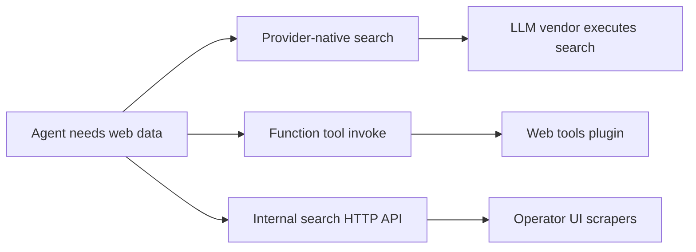

# 06 — Web Tools

Characters may need **live web data**. WorldEngine distinguishes three paths; conflating them causes security gaps and confused approval behavior.

## 1. Three paths overview



| Path | Who executes | Approval | Typical use |
|------|--------------|----------|-------------|
| **Provider-native** | LLM provider | Vendor-defined | Toggle in model preset |
| **Function tool** | Server plugin via `web_invoke` | Plugin + local queue | Agent-driven search/fetch |
| **HTTP API** | Server `/search/*` | None for direct call | UI features; wrap for agents |

## 2. Provider-native web search

When **enableWebSearch** (or equivalent) is set on the generation payload:

- The server adds provider-specific structures (e.g. Anthropic `web_search` tool, OpenRouter `web` plugin, Gemini grounding).
- The model invokes search through the **vendor**, not the local tool registry.
- Local approval UI does **not** apply unless the vendor exposes it.

**Requirement (WEB-1):** Provider-native search MUST be documented separately from plugin tools in operator settings.

## 3. Function tool: unified invoke

The browser registers one umbrella tool, e.g. `webtools_invoke`:

```json
{
  "tool": "web_search",
  "arguments": { "query": "...", "maxResults": 5 }
}
```

Flow:

1. Client POSTs to `/api/plugins/web-tools/{invokePath}` (default `invoke`).
2. Body: `{ tool, arguments }`.
3. Plugin dispatches to `web_search`, `web_fetch`, etc.

**Requirements:**

| ID | Requirement |
|----|-------------|
| WEB-2 | Plugin host MUST be enabled in server config (`enableServerPlugins`). |
| WEB-3 | Plugin defines tool names, schemas, and which require approval. |
| WEB-4 | Client polls `GET .../pending-approvals` when approval polling enabled. |

### 3.1 Approval UI

Built-in panel **Web tool approvals** (or third-party replacement):

- Poll every ~3s
- Approve tries POST endpoints: `approve`, `approval-respond`, `respond-approval` (compatibility)
- Deny parallel paths
- Yield to unified third-party approval panel when configured

### 3.2 Settings

| Setting | Purpose |
|---------|---------|
| `function_tools` | Register invoke tool |
| `invoke_path` | Plugin route suffix |
| `approval_polling` | Show built-in panel |

## 4. Internal search HTTP API

Server routes (examples) proxy third-party search APIs and fetch URLs:

| Route | Purpose |
|-------|---------|
| `POST /search/serpapi` | SerpAPI proxy |
| `POST /search/tavily` | Tavily |
| `POST /search/visit` | Fetch URL content |
| `POST /search/transcript` | YouTube transcript |

### 4.1 Visit security (SSRF)

`visit` MUST enforce:

- Scheme `http` or `https` only
- Block private/link-local IP ranges
- Block non-standard ports where applicable
- Optional HTML vs raw body modes

**Requirement (WEB-5):** Agent access to visit SHOULD go through the web-tools plugin (with approval) unless explicitly hardened for autonomous use.

## 5. Automatic memory lookup

Agents SHOULD use **memory tools** ([02-memory.md](02-memory.md)) for endogenous facts before web search:

1. `memory_search` / `diary_search` on mind/world pools
2. Then `webtools_invoke` if external fact needed

Mandatory recall blocking enforces step 1 before other tools when enabled.

## 6. Operator checklist

1. Enable server plugins and deploy `web-tools` plugin package.
2. Configure API keys for search providers in secrets store.
3. Decide: provider-native vs plugin vs both (token cost + behavior differ).
4. Enable approval polling for risky plugin tools.
5. Train character prompts: memory first, web second, cite sources in dialogue.

## 7. Requirements summary

| ID | Requirement |
|----|-------------|
| WEB-1 | Provider-native search is distinct from plugin tools. |
| WEB-2 | Plugin host enabled for function-tool web path. |
| WEB-3 | Plugin owns tool catalog and approval rules. |
| WEB-4 | Client polls pending approvals when configured. |
| WEB-5 | Visit API has SSRF protections; agent use via plugin by default. |
| WEB-6 | Memory tools are preferred before web for in-world facts. |

## Related documents

- [05-tool-calling.md](05-tool-calling.md)
- [07-approvals.md](07-approvals.md)
- [02-memory.md](02-memory.md)
