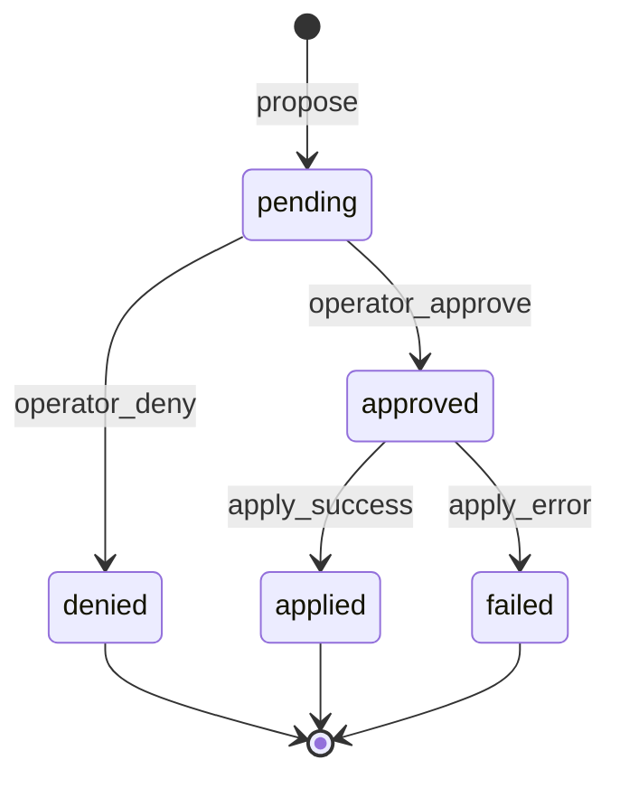

# 07 — Approvals

Real-world side effects (filesystem writes, risky web fetches) MUST NOT apply until the **operator** approves, unless an explicit unattended exemption applies.

## 1. Unified approval model

Altrasia RECOMMENDS a **single pending-operation store** per operator (or per world), consumed by one UI surface, with pluggable backends for filesystem vs web plugin.

### 1.1 Operation record

| Field | Description |
|-------|-------------|
| `approvalId` | Unique id |
| `kind` | `filesystem` \| `web` \| ... |
| `title` | Short summary |
| `description` | Detail for operator |
| `payload` | Opaque proposal (path, diff, URL, etc.) |
| `state` | See state machine |
| `createdAt` | Timestamp |
| `characterId` | Requesting agent (optional) |

### 1.2 State machine



| State | Meaning |
|-------|---------|
| `pending` | Awaiting operator |
| `approved` | Operator accepted; apply MAY run immediately |
| `denied` | Rejected; no side effects |
| `applied` | Mutation completed |
| `failed` | Approved but apply errored |

**Requirement (APR-1):** Approve SHOULD apply immediately in one step (no mandatory second "apply" click) unless audit mode requires two-phase commit.

For `webtools_invoke`, approve MUST run the fetch (`safe_fetch` or mock), persist `resultJson`, set state `applied`, and enqueue an `agent_tool` follow-up so the requesting character can reply using the approved summary.

Approval rows SHOULD record `characterId`, `jobId`, and `messageId` when created from generation.

## 2. When approval is required

| Operation class | Default |
|-----------------|--------|
| Filesystem read/list | No |
| Filesystem write/patch/delete | Yes |
| Web plugin tools marked high-risk | Yes (plugin-defined) |
| Memory/scene tools | No |
| Character admin API | No (uses structured API) |
| Provider-native web search | Vendor-defined |

### 2.1 Filesystem destructive signals

Classification SHOULD treat as destructive:

- Delete
- Overwrite with much smaller content
- Large patch removals

Destructive ops SHOULD trigger backup before apply when `backupBeforeDestructive` is enabled.

## 3. Exemptions

| Exemption | Condition |
|-----------|-----------|
| **Read-only** | Never queued |
| **Unattended writes** | Global `unattendedWrites: true` |
| **Pre-approved** | Scheduled job carries `preApproved: true` AND unattended allowed |
| **Denied paths** | Hard reject—no queue (secrets, traversal, character binaries) |

Scheduled **architect_fs** jobs: reads run headless; writes without pre-approval fail with pending id list.

## 4. Operator UI

### 4.1 Built-in panels

Two domains MAY show separate stacks:

- **Web tool approvals** (~top)
- **Filesystem approvals** (below)

Or one merged panel via **third-party approval-panel** extension—built-in panels MUST disable when replacement active.

### 4.2 Polling

Poll `GET /pending-approvals` every ~3 seconds while session active.

Actions:

- **Approve** → `POST /respond` with `{ id, decision: "approve" }` → apply
- **Deny** → `{ decision: "deny" }`

### 4.3 Restore

Filesystem approvals SHOULD support restore from `.architect-fs-backups/{approvalId}/` after destructive apply.

## 5. Model contract

When a tool proposes a gated operation, the handler MUST return:

```json
{
  "pending": true,
  "approvalId": "uuid",
  "message": "Awaiting operator approval in the panel."
}
```

The model MUST NOT narrate successful writes until state is `applied`. Prompts for **Architect**-class characters SHOULD instruct waiting for approval.

## 6. Security hard blocks

No approval can override:

| Block | Reason |
|-------|--------|
| Path outside `allowedRoots` | Traversal |
| Denylist paths (`.ssh`, secrets, `characters/*.png`) | Safety |
| Metadata dirs (`.architect-fs/`) | Integrity |
| Device paths | Safety |

## 7. HTTP surface (filesystem example)

| Method | Path | Action |
|--------|------|--------|
| GET | `/api/architect-fs/pending-approvals` | List |
| POST | `/api/architect-fs/respond` | Approve/deny (+ apply on approve) |
| POST | `/api/architect-fs/apply/:id` | Apply already-approved (if two-phase) |
| POST | `/api/architect-fs/restore` | Restore backup |

Web plugin exposes parallel routes under `/api/plugins/web-tools/`.

## 8. Requirements summary

| ID | Requirement |
|----|-------------|
| APR-1 | Approve applies immediately by default. |
| APR-2 | Pending ops visible in operator UI with poll. |
| APR-3 | Model receives pending response, not fake success. |
| APR-4 | Denylist paths cannot be queued. |
| APR-5 | Destructive FS ops backup when configured. |
| APR-6 | Unattended/preApproved only when explicitly enabled. |
| APR-MAP-1 | Map layout overwrite ack uses the **dedicated map preview panel** ([14-web-ui.md](14-web-ui.md) UI-MAP-P1–P14, [25-map-authoring.md](25-map-authoring.md)) — **not** the FS/web unified approval queue. |
| APR-MAP-2 | When `requireApprovalForMapOverwrite` is enabled, same panel uses **Approve → Confirm overwrite** (UI-MAP-P12). |

## Related documents

- [08-real-world-capabilities.md](08-real-world-capabilities.md)
- [06-web-tools.md](06-web-tools.md)
- [05-tool-calling.md](05-tool-calling.md)
- [25-map-authoring.md](25-map-authoring.md)
