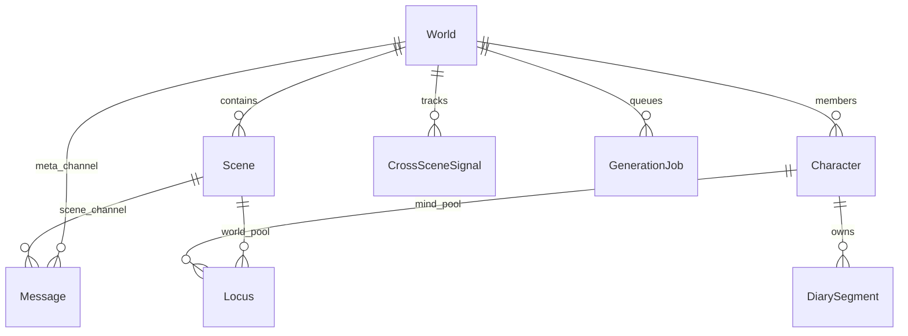

# 11 — Data Model

This document formalizes persistent entities, SQLite storage, and event payloads for WorldEngine v1.

## 1. Storage

| ID | Requirement |
|----|-------------|
| DM-1 | v1 persistence is **SQLite only** — one database per operator (e.g. `~/.worldengine/operator.db` or config path). |
| DM-2 | Binary assets (future images) live under `assets/{worldId}/...` with paths referenced from DB rows. |
| DM-3 | Scene transcripts are **not** authoritative JSON files on disk; the database is source of truth. |
| DM-4 | **World package** export/import: zip containing `worldengine.db` slice or full DB + `assets/` ([20-product-principles.md](20-product-principles.md)). |

## 2. Entity overview



## 3. Core entities

### 3.1 World

| Column | Type | Notes |
|--------|------|-------|
| `worldId` | TEXT PK | UUID |
| `name` | TEXT | Display |
| `activeSceneId` | TEXT FK | Operator focus |
| `defaultModelProfile` | TEXT | Default `qwen3.6-35b-a3b` |
| `configJson` | TEXT | World-level settings blob |
| `createdAt` | TEXT ISO | |
| `updatedAt` | TEXT ISO | |

**Orchestration keys in `configJson`:**

| Key | Type | Default |
|-----|------|---------|
| `agentContinueEnabled` | boolean | true (preset may override) |
| `maxContinueDepth` | integer | 2 |
| `personaArrivalMaxReplies` | integer | 1 |
| `idleRoundRobinWeights` | object | optional `characterId` → weight for AO-4 |

### 3.2 Scene

| Column | Type | Notes |
|--------|------|-------|
| `sceneId` | TEXT PK | |
| `worldId` | TEXT FK | |
| `locationName` | TEXT | |
| `locationDescription` | TEXT | |
| `presentJson` | TEXT | Array of characterId or `__persona__` |
| `fixturesJson` | TEXT | Map fixtureKey → fixture record |
| `exitsJson` | TEXT | Array of exit records (CC-1) |
| `activityJson` | TEXT NULL | Optional debate overlay ([23-in-world-work.md](23-in-world-work.md)) |
| `roundRobinIndex` | INTEGER | Idle-only speaker cursor (AO-4b); per scene |
| `updatedAt` | TEXT ISO | |

**Exit record shape:**

```json
{
  "exitId": "kitchen-door",
  "label": "Oak door to hall",
  "targetSceneId": "scene-hall",
  "kind": "door"
}
```

`kind` MUST be one of: `door`, `path`, `portal`.

### 3.3 Character

| Column | Type | Notes |
|--------|------|-------|
| `characterId` | TEXT PK | |
| `displayName` | TEXT | |
| `definitionJson` | TEXT | Persona, instructions |
| `modelProfile` | TEXT | Default `qwen3.6-35b-a3b` |
| `speechWeight` | REAL | 0–1; base speak appetite for AO-18 (default 0.5) |
| `createdAt` | TEXT ISO | |

### 3.4 WorldMember

| Column | Type | Notes |
|--------|------|-------|
| `worldId` | TEXT FK | |
| `characterId` | TEXT FK | |
| `muted` | INTEGER | 0/1 |
| `disabled` | INTEGER | 0/1 |
| `sceneRole` | TEXT NULL | Optional role tag for AO-18 (e.g. `teacher`, `student`) |

### 3.5 Message

| Column | Type | Notes |
|--------|------|-------|
| `messageId` | TEXT PK | |
| `worldId` | TEXT FK | |
| `channelKind` | TEXT | `scene` \| `meta` |
| `sceneId` | TEXT NULL | Required when `channelKind=scene` |
| `role` | TEXT | `user` \| `assistant` \| `system` \| `tool` |
| `characterId` | TEXT NULL | Speaker when assistant |
| `outputText` | TEXT | Post-strip canonical text |
| `reasoning` | TEXT NULL | Debug-only; not in memory pipeline |
| `streamStatus` | TEXT | `streaming` \| `final` \| `interrupted` |
| `metaJson` | TEXT | `communication`, `tool_calls`, etc. |
| `createdAt` | TEXT ISO | |

**Communication metadata** (in `metaJson`, v1-ready for v1.1 phone):

```json
{
  "communication": {
    "scope": "public",
    "participants": [],
    "phone": {
      "channelId": "...",
      "speakingCharacterId": "char-alice-id",
      "speakerSceneId": "scene-kitchen"
    }
  }
}
```

Scopes: `public`, `whisper`, `dm`, `phone`, `narrator`.

**Phone channel** (`comm_channels.endpointsJson`): array of `{ sceneId, participantIds[], speakerphone: boolean }` — speakerphone is **per endpoint**, default `false` ([04-communication.md](04-communication.md) §3.1).

### 3.6 Locus

| Column | Type | Notes |
|--------|------|-------|
| `locusKey` | TEXT | |
| `pool` | TEXT | `mind` \| `world` \| `commons` |
| `ownerId` | TEXT | characterId (mind), sceneId (world), or worldId (commons) |
| `value` | TEXT | Append-only text (output only) |
| `updatedAt` | TEXT ISO | |

### 3.7 DiarySegment

| Column | Type | Notes |
|--------|------|-------|
| `segmentId` | TEXT PK | |
| `characterId` | TEXT FK | |
| `text` | TEXT | outputText only |
| `sourceSceneId` | TEXT | |
| `messageIdsJson` | TEXT | Provenance |
| `dedupeKey` | TEXT | Unique per `characterId` (see §4.2) |
| `kind` | TEXT NULL | |
| `createdAt` | TEXT ISO | |

### 3.8 CrossSceneSignal (v1 tracking)

| Column | Type | Notes |
|--------|------|-------|
| `signalId` | TEXT PK | |
| `worldId` | TEXT FK | |
| `kind` | TEXT | `knock` \| `ring` \| `buzz` |
| `sourceSceneId` | TEXT | |
| `targetSceneId` | TEXT | |
| `fromCharacterId` | TEXT NULL | |
| `status` | TEXT | `pending` \| `acknowledged` \| `expired` |
| `createdAt` | TEXT ISO | |

### 3.9 CommChannel (stub v1)

Reserved for v1.1 phone; MAY be empty table with schema:

| Column | Type |
|--------|------|
| `channelId` | TEXT PK |
| `worldId` | TEXT FK |
| `endpointsJson` | TEXT | Per-scene `{ sceneId, participantIds, speakerphone }` |
| `participantsJson` | TEXT | All participant characterIds |
| `active` | INTEGER |

### 3.10 GenerationJob

| Column | Type | Notes |
|--------|------|-------|
| `jobId` | TEXT PK | |
| `worldId` | TEXT FK | |
| `characterId` | TEXT | |
| `sceneId` | TEXT | |
| `trigger` | TEXT | |
| `priority` | INTEGER | |
| `observerMode` | TEXT NULL | Watch, Narrate, etc. |
| `status` | TEXT | `queued` \| `running` \| `done` \| `cancelled` |
| `continueDepth` | INTEGER NULL | 0 = reactive; 1..N for `agent_continue` (AO-19) |
| `triggerMessageId` | TEXT NULL FK | Message that triggered scheduling |
| `selectionRationaleJson` | TEXT NULL | AO-18 factors for UI-1 |
| `createdAt` | TEXT ISO | |

**`selectionRationaleJson` shape (example):**

```json
{
  "pick": "addressed",
  "scores": {
    "char-alice": { "total": 0.92, "relevance": 0.82, "speechWeight": 0.5, "recency": -0.1 }
  }
}
```

### 3.11 GpuLease / GpuRequest

| Column | Type | Notes |
|--------|------|-------|
| `leaseId` | TEXT PK | |
| `jobId` | TEXT FK | |
| `kind` | TEXT | `chat` \| `embed` \| `image` |
| `startedAt` | TEXT ISO | |
| `releasedAt` | TEXT NULL | |

### 3.12 Approval

Per [07-approvals.md](07-approvals.md); unified pending store with `approvalId`, `worldId`, `toolName`, `paramsJson`, `state`, etc.

### 3.13 EmbeddingRecord (v1 schema)

| Column | Type | Notes |
|--------|------|-------|
| `recordId` | TEXT PK | |
| `sourceType` | TEXT | `locus` \| `diary` \| `lore` |
| `sourceId` | TEXT | |
| `ownerScope` | TEXT | MP-1 isolation key (`characterId` or `sceneId`) |
| `vectorBlob` | BLOB | Embedding bytes |
| `textHash` | TEXT | Invalidate on source text change |

Table MUST exist in **migration 001** (MAY be empty until embed jobs run). Re-embed on write per [00-inference-runtime.md](00-inference-runtime.md) INF-13. Semantic search assists tools only ([02-memory.md](02-memory.md) §7).

### 3.14 Commission (post-v1 schema)

| Column | Type | Notes |
|--------|------|-------|
| `commissionId` | TEXT PK | |
| `worldId` | TEXT FK | |
| `assigneeCharacterId` | TEXT FK | |
| `targetSceneId` | TEXT FK | |
| `brief` | TEXT | |
| `status` | TEXT | `queued` \| `running` \| `blocked` \| `done` \| `failed` |
| `deliverablePolicy` | TEXT | Default `mind` (COM-1) |
| `deliverableLocusPrefix` | TEXT | Default `commission:{commissionId}:` |
| `deliverableLocusKeysJson` | TEXT | Set on `done` (COM-3) |
| `allowedToolsJson` | TEXT NULL | |
| `forceCompleteReason` | TEXT NULL | Operator skip audit |
| `createdAt` | TEXT ISO | |
| `updatedAt` | TEXT ISO | |

Table MAY ship in migration 001 as empty schema; runtime Phase 4+.

### 3.15 EvidenceRecord (post-v1 schema)

| Column | Type | Notes |
|--------|------|-------|
| `evidenceId` | TEXT PK | |
| `locusKey` | TEXT | Linked locus |
| `pool` | TEXT | `mind` \| `world` \| `commons` |
| `ownerId` | TEXT | |
| `sourceKind` | TEXT | `dialogue` \| `web` \| `file` \| `operator` |
| `sourceRef` | TEXT | URL, path, messageId |
| `retrievedAt` | TEXT ISO | |
| `commissionId` | TEXT NULL FK | |

## 4. Indexes and full-text search (migration 001)

| ID | Requirement |
|----|-------------|
| DM-5 | Migration 001 MUST create composite B-tree indexes on hot paths (below). |
| DM-6 | Migration 001 MUST create SQLite **FTS5** virtual tables (or equivalent) for `memory_search` / `diary_search` ([02-memory.md](02-memory.md) MEM-PERF-1). |
| DM-7 | FTS and embed queries MUST scope by `ownerId` / `characterId` / `ownerScope` — no cross-pool leakage (MP-1, MEM-ACC-1). |

### 4.1 B-tree indexes (normative)

```sql
CREATE INDEX idx_locus_pool_owner ON Locus(pool, ownerId);
CREATE INDEX idx_locus_pool_owner_key ON Locus(pool, ownerId, locusKey);
CREATE INDEX idx_diary_character_time ON DiarySegment(characterId, createdAt DESC);
CREATE UNIQUE INDEX idx_diary_dedupe ON DiarySegment(characterId, dedupeKey);
CREATE INDEX idx_message_scene_time ON Message(sceneId, createdAt);
CREATE INDEX idx_embedding_scope ON EmbeddingRecord(ownerScope, sourceType);
```

### 4.2 Diary dedupe

`dedupeKey` MUST be unique per `(characterId, dedupeKey)` so fan-out (MP-20) does not collide across characters.

### 4.3 FTS5 (illustrative)

Implementations MAY use external-content FTS5 tables synced on write to `Locus` and `DiarySegment`:

- **Locus FTS:** `locusKey`, `value` — filter `pool` + `ownerId` before or within query.
- **Diary FTS:** `text` — filter `characterId`; rank newest-first for `diary_search`.

Full table scans on `Locus` / `DiarySegment` for tool search are **forbidden** (MEM-PERF-1).

### 4.4 Vector search (v1)

- **Default:** In-process cosine top-k over `EmbeddingRecord.vectorBlob` for modest N (&lt;20k rows per scope).
- **Scale-out:** Optional LanceDB sidecar if p95 semantic search &gt;100ms or N &gt;50k — keyed by `ownerScope`. Not MemPalace ChromaDB.

## 5. PersistencePort (`packages/persistence`)

| ID | Requirement |
|----|-------------|
| DM-8 | All durable reads/writes go through a **`PersistencePort`** interface in `packages/persistence`. |
| DM-9 | v1 implementation: **SQLite** via `better-sqlite3` or `libsql` (single file per operator, DM-1). |
| DM-10 | Port exposes: loci CRUD, diary append/query, FTS search, mandatory-recall assembly inputs, embed record upsert — no scattered SQL in orchestrator/memory packages. |

Suggested layout:

```
packages/persistence/
  src/port.ts          # PersistencePort types
  src/sqlite/          # migration 001, FTS sync, indexes
```

## 6. Events

Implementations SHOULD emit events with monotonic per-world `eventSeq`:

| Event | Payload (minimum) |
|-------|-------------------|
| `scene.changed` | `worldId`, `sceneId` |
| `presence.changed` | `worldId`, `sceneId`, `characterId`, `action` |
| `world.member_drafted` | `worldId`, `characterId` |
| `generation.token` | `jobId`, `delta`, `messageId` |
| `generation.tool_call` | `jobId`, `toolCalls` |
| `generation.done` | `jobId`, `messageId` |
| `generation.error` | `jobId`, `error` |
| `approval.updated` | `approvalId`, `state` |
| `signal.created` | `signalId`, `targetSceneId` |
| `commission.updated` | `commissionId`, `status` |
| `queue.updated` | `busy`, `depth`, `currentJob` |

## 7. Requirements summary

| ID | Requirement |
|----|-------------|
| DM-1 | SQLite-only v1 persistence |
| DM-2 | Asset paths external to row blobs |
| DM-3 | No parallel JSON transcript source of truth |
| DM-4 | World package backup format |
| DM-5 | Composite indexes in migration 001 |
| DM-6 | FTS5 for tool search |
| DM-7 | Scoped FTS/embed queries (MP-1) |
| DM-8 | PersistencePort abstraction |
| DM-9 | SQLite implementation v1 |
| DM-10 | No scattered SQL outside persistence package |

## Related documents

- [01-world-model.md](01-world-model.md)
- [02-memory.md](02-memory.md)
- [00-inference-runtime.md](00-inference-runtime.md)
- [12-api-sketch.md](12-api-sketch.md)
- [17-acceptance-criteria.md](17-acceptance-criteria.md)
- [21-cross-scene-awareness.md](21-cross-scene-awareness.md)
- [23-in-world-work.md](23-in-world-work.md)
