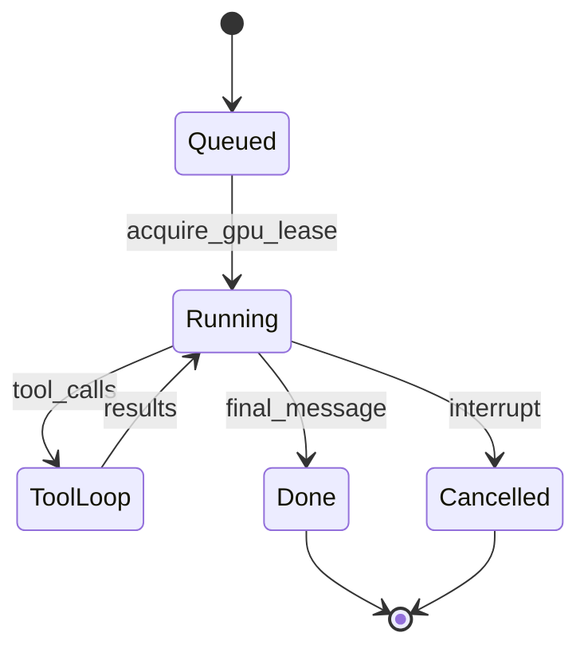

# 13 — Agent Orchestration

This document specifies the **agent runtime**: turn scheduling, triggers, eligibility, fairness, movement, and integration with [GpuResourceQueue](00-inference-runtime.md).

## 1. Overview

The **orchestrator** decides *which* `GenerationJob` runs next. The **GpuResourceQueue** decides *when* GPU work executes. Orchestrator MUST NOT overlap primary completions for two jobs (AO-11, INF-5a).

## 2. GenerationJob

| Field | Description |
|-------|-------------|
| `jobId` | Stable id |
| `worldId` | |
| `characterId` | Agent speaking |
| `sceneId` | Active context |
| `trigger` | See §3 |
| `priority` | Numeric; mapped from INF-5c bands |
| `observerMode` | NULL or `Watch` \| `Narrate` \| `Intervene` \| `Direct` |
| `status` | `queued` \| `running` \| `done` \| `cancelled` |

## 3. Triggers (AO-2)

| Trigger | v1 | Description |
|---------|-----|-------------|
| `operator_message` | Yes | Persona or operator sent a line |
| `persona_arrival` | Yes | Persona joined scene with NPCs |
| `idle_timer` | Yes | World activity tick |
| `whisper_target` | Yes | Character targeted by whisper |
| `agent_tool` | Yes | Scene/comm tool initiated follow-up |
| `agent_continue` | Optional | Public line → optional NPC chain |
| `phone_target` | v1.1 | CC-12 |
| `knock_answered` | v1.1 | CC-11 |

## 4. Eligibility (AO-3)

A character MAY be scheduled when:

- World member, not `disabled`
- Not `muted` (unless operator forces)
- Present at `sceneId` for scene-scoped generation
- Passes communication eligibility ([04-communication.md](04-communication.md))

**Observer:** excluded from **ambient idle** pools; included when operator requests Watch/Narrate/Intervene/Direct (AO-3a, elevated priority).

## 5. Fairness and caps

| ID | Requirement |
|----|-------------|
| AO-1 | Per-world FIFO queue of GenerationJobs with priority bands. |
| AO-3a | Operator-initiated Observer jobs above idle NPC. |
| AO-4 | Round-robin across eligible characters at a scene; configurable weights. |
| AO-5 | Respect `maxGenerationsPerHour`, tab-hidden pause ([03-locations-and-presence.md](03-locations-and-presence.md)). |
| AO-6 | Quiet vs full context presets for ambient generations. |
| AO-10 | `pause_world` / `pause_scene` drains queue without dropping jobs; release GPU lease if in flight. |
| AO-11 | No overlapping GPU leases across jobs. |
| AO-12 | Skip idle tick when GpuResourceQueue at maxDepth (INF-5d). |
| AO-13 | Mandatory-recall blocking steps use queue slots—no parallel LLM. |

## 6. Tool loop integration

Generation MUST follow [05-tool-calling.md](05-tool-calling.md):

1. Build prompt (memory, framing, perception-filtered transcript)
2. Enqueue chat GpuRequest (holds lease)
3. On tool_calls → execute → recurse until limit or done
4. `stripReasoning` → persist `outputText` to `channelKind=scene` (AO-9)
5. Diary capture: witnessed scene snippet + fan-out to present cast (MP-6, MP-17, MP-20)

Meta channel (`channelKind=meta`) excluded from AO-9 scene transcript rules.

## 7. Movement (AO-7)

`scene_join`, `scene_leave`, and narrative presence ([03-locations-and-presence.md](03-locations-and-presence.md) §7) MUST emit `presence.changed`. One scene per character per world (W-3).

## 8. Learning pass (AO-8, optional Phase 4)

Post-generation **reflection** job MAY propose `memory_store` mind loci from output-only summary. Reflection uses GPU queue like any chat call. MP-14 applies.

## 9. Requirements summary

| ID | Requirement |
|----|-------------|
| AO-1–AO-13 | Scheduler, triggers, eligibility, caps, GPU integration |

## Related documents

- [00-inference-runtime.md](00-inference-runtime.md)
- [03-locations-and-presence.md](03-locations-and-presence.md)
- [05-tool-calling.md](05-tool-calling.md)
- [09-roles-and-privilege.md](09-roles-and-privilege.md)
