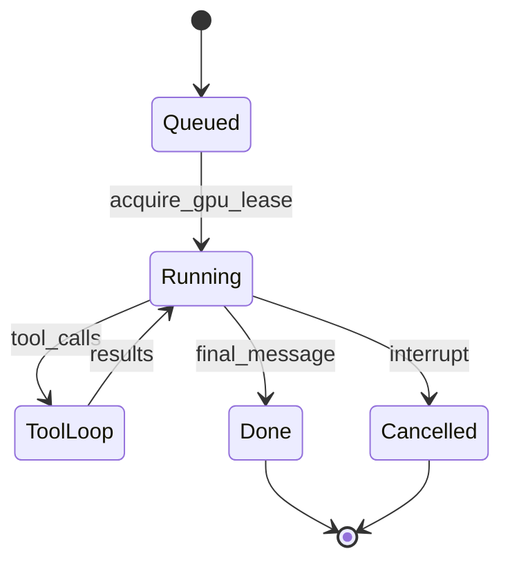

# 13 — Agent Orchestration

This document specifies the **agent runtime**: turn scheduling, triggers, eligibility, fairness, movement, and integration with [GpuResourceQueue](00-inference-runtime.md).

## 1. Overview

The **orchestrator** decides *which* `GenerationJob` runs next. The **GpuResourceQueue** decides *when* GPU work executes. Orchestrator MUST NOT overlap primary completions for two jobs (AO-11, INF-5a).

### 1.1 v1 scheduling policy

| Path | Who speaks next | Mechanism |
|------|-----------------|-----------|
| `idle_timer` | One NPC per eligible scene | **AO-4** scene-scoped round-robin (fair background rotation) |
| `operator_message` (reactive) | One NPC after persona/operator public line | **AO-18** `scoreSpeakers` (not round-robin) |
| `agent_continue` | Up to `maxContinueDepth` NPCs after a cast line | **AO-18** `scoreSpeakers` per step |
| `whisper_target` / operator direct | Named character | Targeted; no scoring |
| `debate_turn` (post-v1) | `speakingOrder[currentIndex]` only | DEB-2 overrides AO-4 and continue |

**Ensemble dialogue:** Alice and Bob MAY trade lines via **`agent_continue`** before Carol speaks on **idle**. Round-robin MUST NOT be used for reactive or continue paths (AO-4a).

## 2. GenerationJob

| Field | Description |
|-------|-------------|
| `jobId` | Stable id |
| `worldId` | |
| `characterId` | Agent speaking |
| `sceneId` | Active context |
| `trigger` | See §3 |
| `priority` | Numeric; mapped from INF-5c bands |
| `observerMode` | NULL or `Watch` \| `Narrate` \| `Intervene` \| `Direct` |
| `status` | `queued` \| `running` \| `done` \| `cancelled` |
| `continueDepth` | INTEGER NULL — 0 = reactive first beat; 1..N for `agent_continue` chain (AO-19) |
| `triggerMessageId` | TEXT NULL — scene message that caused scheduling (for scoring cache) |
| `selectionRationaleJson` | TEXT NULL — factors for UI-1 (AO-18) |

## 3. Triggers (AO-2)

| Trigger | v1 | Description |
|---------|-----|-------------|
| `operator_message` | Yes | Persona or operator sent a line; on completion enqueue **one** reactive NPC job (AO-18) |
| `persona_arrival` | Yes | Persona joined scene with NPCs; queue up to `personaArrivalMaxReplies` reactive jobs (default 1) |
| `idle_timer` | Yes | World activity tick; **one** NPC via AO-4 round-robin per eligible scene |
| `whisper_target` | Yes | Character targeted by whisper |
| `agent_tool` | Yes | Scene/comm tool initiated follow-up |
| `agent_continue` | Yes | After cast scene line completes; optional NPC chain (AO-19) when enabled |
| `discussion_deliverable` | Yes | After ensemble chain stops; named cast fulfill operator obligations (report, etc.) parsed from persona line |
| `phone_target` | v1.1 | CC-12 |
| `knock_answered` | v1.1 | Explicit operator answer action only (CC-11); not on knock create |
| `commission_started` | Post-v1 | Operator/API started commission ([23-in-world-work.md](23-in-world-work.md)) |
| `commission_tick` | Post-v1 | Scheduler tick while commission `running` |
| `debate_turn` | Post-v1 | Debate phase advance at scene with `activity.kind=debate` |

**Post-v1 (not v1):** `scene.activity.kind` values `conversation` and `banter` are reserved for optional structured overlays; v1 uses `agent_continue` + `scoreSpeakers` only (AO-22).

## 4. Eligibility (AO-3)

A character MAY be scheduled when:

- World member, not `disabled`
- Not `muted` (unless operator forces)
- Present at `sceneId` for scene-scoped generation (MAP-MOVE-1 — no generation at a scene the character has not joined via presence/exits; [25-map-authoring.md](25-map-authoring.md))
- Passes communication eligibility ([04-communication.md](04-communication.md))

**Observer:** excluded from **ambient idle** pools; included when operator requests Watch/Narrate/Intervene/Direct (AO-3a, elevated priority).

**Commission (COM-6, post-v1):** Assignee MUST be present at commission `targetSceneId` for `commission_started` / `commission_tick` jobs. Status `queued` or `blocked` until presence matches.

**Debate (DEB-2, post-v1):** When `scene.activity.kind=debate`, only `speakingOrder[currentIndex]` is eligible for `debate_turn` jobs at that scene (overrides AO-4 round-robin and `agent_continue` until phase advances).

## 5. Weighted idle selection (AO-4 / AO-4w)

| ID | Requirement |
|----|-------------|
| AO-4 | For **`idle_timer`** (solo ambient) and **`banter_turn` / `idle_continue`** (dyad banter), pick speakers via **weighted random** among scored candidates — not round-robin. |
| AO-4a | Weighted idle MUST NOT select speakers for `operator_message` reactive jobs or `agent_continue` (except cast-directed follow-up enqueue). |
| AO-4b | `Scene.roundRobinIndex` is legacy; implementations MUST NOT advance it for idle picks. |
| AO-4c | Idle selection ignores reactive “reply to last line” scoring; banter uses relationship/culture hooks. |

**Banter (AO-22 `kind=banter`):** When `idleSocialEnabled` and ≥2 NPCs present, idle tick MAY start a dyad session (`banter_turn` + `idle_continue` chain, depth capped by `idleSocialMaxDepth`). Gated by open discussion resolution, floor hold, and pending directed addressing.

**Triggers:** `banter_turn`, `idle_continue` (social idle; `orchestration.socialIdle` on messages).

**Tone (`idleSocialTone`):** `roleplay` (default) favors in-voice color; `professional` steers banter toward grounded workplace small talk, `memory_search` / `diary_search` before factual claims, and sparse `social_signal` updates.

**Task affinity:** Dyad pick scores higher when both speakers have **recent active work** (open commissions, pending discussion deliverables), with extra weight when tasks share a target scene. `idleSocialTaskAffinityEnabled`, `idleSocialTaskAffinityWeight`. Matched tasks are passed into banter prompts as `taskHints`.

**Diary:** Banter captures use `DiarySegment.kind=banter` with a short window (`idleSocialBanterDiaryWindow`, `idleSocialBanterDiaryMaxChars`). Mandatory recall injects at most `idleSocialBanterDiaryMaxEntries` condensed banter lines (`idleSocialBanterRecallMaxChars` each) so sidebar chat does not crowd out witnessed play.

**Floor hold:** Operator or cast floor/attention cues, cast-to-cast directed lines, and open unresolved discussions block or halt banter (`Scene.socialStateJson.floorHold`).

**Banter gates (volume control):** New dyad sessions are additionally gated by session cooldown, probabilistic start, and a digest window (operator lines, active commissions/deliverables at the scene). When banter is enabled but gates block a start, the idle tick falls through to solo `idle_timer` instead of silence.

| Config | Default | Effect |
|--------|---------|--------|
| `idleSocialSessionCooldownSeconds` | 180 | Min seconds after any banter session ends before a new one |
| `idleSocialStartProbability` | 0.4 | Per-tick chance to start banter when otherwise eligible |
| `idleSocialDigestWindowSeconds` | 300 | Block new banter while operator-influenced work is recent |
| `idleSocialTabIntervalSeconds` | 45 | Tab-visible idle tick interval |

**Balanced social preset** (`BALANCED_SOCIAL_PRESET` in `world_config.py`): apply via `merge_world_policy` for quieter worlds — `idleSocialMaxDepth` 2, recency half-life 600s, exploration 0, jitter 0.08, task affinity weight 0.35, `idleSocialTone` professional, floor hold 120s, plus the gate defaults above.

## 6. Reactive and continue chains

### 6.1 Reactive (`operator_message`, `persona_arrival`)

After a persona or operator **public** scene line completes:

1. Enqueue **one** `GenerationJob` with `trigger=operator_message` (or `persona_arrival`) and `continueDepth=0`.
2. Pick `characterId` via **AO-18** `scoreSpeakers` — not AO-4.
3. MUST NOT enqueue multiple reactive NPCs for a single operator line (AO-20).

### 6.2 `agent_continue` (AO-19)

When `agentContinueEnabled` is true (world or preset default on):

1. After any completed **cast** scene line (`channelKind=scene`, assistant/character), orchestrator MAY enqueue follow-up jobs with `trigger=agent_continue`.
2. Each chain step increments `continueDepth` (1..`maxContinueDepth`).
3. Pick speaker via AO-18 at each step (allows A↔B ping-pong before a third party).
4. While `continueDepth > 0` chain is active for a scene, **`idle_timer` jobs for that scene MUST be suppressed** (AO-19a).
5. Continue job priority: below `whisper_target` and operator direct generate; **above** `idle_timer` (INF-5c spirit).

| Config | Default (Solo story) | Writer | Aquarium |
|--------|----------------------|--------|----------|
| `agentContinueEnabled` | true | true | false |
| `maxContinueDepth` | 2 | 3 | 1 |
| `directedReplyMaxDepth` | 1 | 1 | 0 |
| `openReplyMaxDepth` | 2 | 2 | 1 |
| `clarificationMaxDepth` | 0 | 0 | 0 |
| `maxToolRoundsPerJob` | 5 | 5 | 5 |
| `addressingFuzzyEnabled` | true | true | true |
| `addressingFuzzyMaxDistance` | 2 | 2 | 2 |
| `directedWitnessRelevanceMin` | 0.55 | 0.55 | 0.55 |
| `personaArrivalMaxReplies` | 1 | 1 | 1 |

**Speaker-turn depth vs tool rounds:** `agent_continue` / `maxContinueDepth` / `openReplyMaxDepth` cap how many **different cast members** may speak per operator line. **`maxToolRoundsPerJob`** caps LLM↔tool loops **inside one** `GenerationJob` (memory search, scene tools, etc.) and does not consume speaker-turn depth. `generation_recovery` may re-queue the same character after a failed tool-heavy job without counting as a witness.

**Directed replies:** When the operator names one cast member (first name, full name, `@slug`, optional `definition.aliases`, or whisper/DM `participants`), orchestration stores `orchestration.addressing` on the operator message. The addressee speaks first (`continueDepth=0`); at most one **named** witness may continue if AO-17 relevance ≥ `directedWitnessRelevanceMin` (`directedWitnessRequireMention`, default true). Unmentioned cast are never pulled in by memory relevance alone. **Multi-addressee** lines (`Marco and Lena, …`) set `addresseeIds`; each named character speaks in order via `agent_continue` (no witnesses). Ensemble cues bypass directed caps.

**Forgiving match:** Light fuzzy typos (Levenshtein, unique best match), unique last-name in room, and per-character `aliases` in `definitionJson` — **only among cast present in the scene**. The operator may also declare a nickname in dialogue (e.g. *"Liam, I will refer to you as LiLi"*) which is stored on the world as `configJson.operatorAliases` and used for routing and prompts on later lines. Names that match nobody present (`matchReason: not_in_scene`) enqueue one clarifier to say they are not in the room; partial multi-addressee lines (e.g. `Rach` in room, `Lili` absent) route only to those present. Ambiguous in-room tokens use `mode: clarification` to ask who was meant.

**Generic enforcement (`addressing_policy`):** Every scene `GenerationJob` is checked in `_run_job` via `may_character_generate` before tokens are emitted. Directed/clarification threads block idle; conflicting jobs are preempted when a new operator line arrives.

Presets: [20-product-principles.md](20-product-principles.md) §6.

### 6.3 Post-discussion deliverables

When a persona line invites ensemble discussion **and** names a cast obligation (e.g. *"Liam, when finished, I expect a report from you"*):

1. Parser stores pending deliverables on `scene.activityJson` (`kind: ensemble_discussion`).
2. `agent_continue` runs until discussion sufficiency (depth + judgement) — **orthogonal** to deliverable fulfillment.
3. On chain stop (`conversation_resolved`, depth cap, etc.), orchestrator enqueues `discussion_deliverable` jobs (one per assignee).
4. Assignee posts a public report, `memory_store`s to mind (`discussion:{sceneId}:{characterId}:{kind}`), and a **done** commission row is recorded for the Commissions UI.

| Config | Default |
|--------|---------|
| `discussionDeliverablesEnabled` | true |
| `maxDeliverablesPerDiscussion` | 3 |

## 7. Speaker selection — `scoreSpeakers` (AO-18)

Shared by reactive and `agent_continue` paths. Idle RR does **not** call this function.

### 7.1 Algorithm

1. **Filter** eligible characters (AO-3 + [04-communication.md](04-communication.md) §5.1).
2. **Addressed override:** if the trigger line names a character (display name, `@`, whisper/DM metadata, or `targetCharacterId`), that character wins if eligible (AO-18a).
3. Else compute **speak score** per eligible character (§7.2).
4. **Pick:** weighted random among top scores, or argmax with small jitter; apply **starvation guard** (boost if never spoke this scene session).
5. Persist `selectionRationaleJson` on the job for UI-1.

### 7.2 Score factors

| Factor | Source | Notes |
|--------|--------|-------|
| Base appetite | `Character.speechWeight` (0–1, default 0.5) | Opinionated / outgoing cast |
| Relevance | AO-17 speak-readiness probe | FTS top hit in speaker's mind + diary vs trigger line |
| Addressed | Parse trigger metadata | Large bonus; near-certain pick |
| Role fit | `WorldMember.sceneRole` optional | e.g. `teacher` penalized on open class questions; `student` boosted |
| Recency penalty | Last N scene speakers | Reduces same-voice spam; does not block addressed |
| Dyad boost | Not last speaker when scores tie | Encourages A↔B before third party |
| Starvation guard | Time since last spoke in scene | Small boost if never spoke |

Third parties (Carol) need higher relevance or address unless only one dyad remains active.

### 7.3 Speak-readiness probe (AO-17)

Before scheduling, orchestrator MAY query memory **only** for speaker selection—not full mandatory recall per cast member (MEM-PERF-4 exception, [02-memory.md](02-memory.md) §3.1.1).

| Rule | Level |
|------|-------|
| ≤1 FTS query per eligible character (mind + diary pools for that `characterId` only) | MUST |
| ≤8 eligible characters scored per pick | MUST |
| P95 total scoring latency &lt;100ms excluding GPU | SHOULD |
| Cache key `(sceneId, triggerMessageId, eligibleSetHash)` | SHOULD |
| Probe results MUST NOT be injected as mandatory recall for non-selected characters | MUST |

Optional: hybrid embed rerank top-1 per character when `EmbeddingRecord` exists ([02-memory.md](02-memory.md) §7).

## 8. Fairness and caps

| ID | Requirement |
|----|-------------|
| AO-1 | Per-world FIFO queue of GenerationJobs with priority bands. |
| AO-3a | Operator-initiated Observer jobs above idle NPC. |
| AO-5 | Respect `maxGenerationsPerHour`; when global heartbeat off, MAY skip idle if browser tab hidden ([03-locations-and-presence.md](03-locations-and-presence.md)). |
| AO-5a | `idle_timer` source MUST be recorded: `tab_visible` \| `server_heartbeat` (HB-1). |
| AO-5b | When global heartbeat on, idle runs for all non-paused worlds with present cast regardless of WebSocket clients. |
| AO-6 | Quiet vs full context presets for ambient generations. |
| AO-10 | `pause_world` / `pause_scene` drains queue without dropping jobs; release GPU lease if in flight. |
| AO-11 | No overlapping GPU leases across jobs. |
| AO-12 | Skip idle tick when GpuResourceQueue at maxDepth (INF-5d). |
| AO-13 | Mandatory-recall blocking steps use queue slots—no parallel LLM. |
| AO-14 | `commission_*` jobs priority below `operator_message` and `whisper_target`. |
| AO-15 | Commission `done` requires mind-pool `memory_store` per COM-2 unless force-complete. |
| AO-16 | Debate `synthesis` phase writes mind loci per DEB-1 before marking activity complete. |
| AO-17 | Bounded speak-readiness probe for AO-18 (see §7.3). |
| AO-18 | `scoreSpeakers` for reactive and continue; addressed override; rationale on job. |
| AO-19 | `agent_continue` chain depth, idle suppression during chain (see §6.2). |
| AO-20 | One reactive NPC per operator public line completion. |
| AO-21 | v1 MUST NOT enqueue parallel reactive generations for one stimulus. |
| AO-22 | `conversation` / `banter` scene activities are post-v1; not required for v1 ensemble dialogue. |

## 9. Tool loop integration

Generation MUST follow [05-tool-calling.md](05-tool-calling.md):

1. Build prompt (memory, framing, perception-filtered transcript)
2. Enqueue chat GpuRequest (holds lease)
3. On tool_calls → execute → recurse until limit or done
4. `stripReasoning` → persist `outputText` to `channelKind=scene` (AO-9)
5. Diary capture: witnessed scene snippet + fan-out to present cast (MP-6, MP-17, MP-20)
6. On done: evaluate `agent_continue` enqueue per AO-19

Meta channel (`channelKind=meta`) excluded from AO-9 scene transcript rules.

## 10. Movement (AO-7)

`scene_join`, `scene_leave`, and narrative presence ([03-locations-and-presence.md](03-locations-and-presence.md) §7) MUST emit `presence.changed`. One scene per character per world (W-3).

## 11. Learning pass (AO-8, optional Phase 4)

Post-generation **reflection** job MAY propose `memory_store` mind loci from output-only summary. Reflection uses GPU queue like any chat call. MP-14 applies.

## 12. Requirements summary

| ID | Requirement |
|----|-------------|
| AO-1–AO-22 | Scheduler, triggers, eligibility, idle RR, continue chains, speak scoring, GPU integration, in-world work |

## Related documents

- [00-inference-runtime.md](00-inference-runtime.md)
- [02-memory.md](02-memory.md)
- [03-locations-and-presence.md](03-locations-and-presence.md)
- [04-communication.md](04-communication.md)
- [05-tool-calling.md](05-tool-calling.md)
- [09-roles-and-privilege.md](09-roles-and-privilege.md)
- [11-data-model.md](11-data-model.md)
- [14-web-ui.md](14-web-ui.md)
- [20-product-principles.md](20-product-principles.md)
- [08-real-world-capabilities.md](08-real-world-capabilities.md)
- [23-in-world-work.md](23-in-world-work.md)
