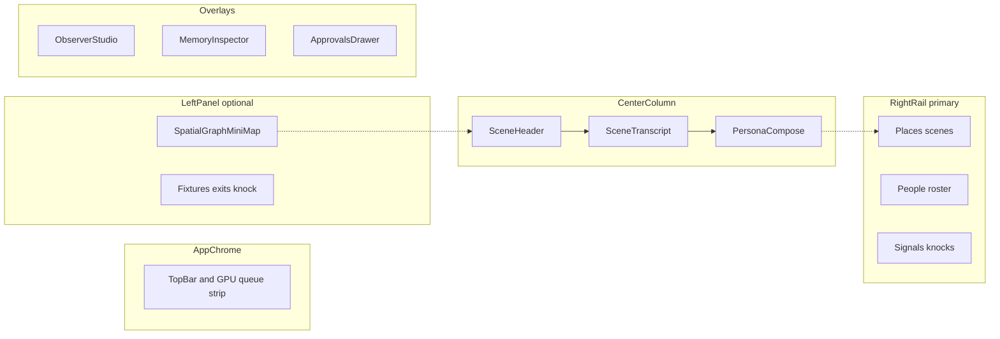
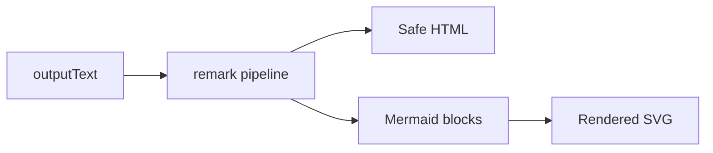

# 14 — Web UI

Professional **operator console** for Altrasia. **Persona-first** play; **Observer Studio** for tuning and world control.

**Delivery:** First-class **Web UI SPA** (separate from the Python backend); stack and boundaries in [26-system-architecture.md](26-system-architecture.md) (SYS-2, SYS-4, SYS-11–SYS-14). API binding: [12-api-sketch.md](12-api-sketch.md).

**Product bar:** Net-new **spatial operator console** (memory + places)—not a chat skin. **Platform:** desktop-first ([§2](#2-application-shell-and-layout)).

Component names in [§19](#19-component-inventory-spec-vocabulary) are **spec vocabulary** for implementers—not implied to exist in any given milestone until an implementation plan says so.

**Design system:** tokens, scope colors, typography, and visual vocabulary — [Appendix A](#appendix-a--design-system-non-normative). **Accessibility:** [Appendix B](#appendix-b--accessibility-normative-when-web-ui-exists).

## 0. v1 implementation subset (Sprint 2)

Build **only** these sections for the v1 tag; other `UI-*` rows are later phases ([ROADMAP.md](ROADMAP.md), [IMPLEMENTATION-CHECKLIST.md](IMPLEMENTATION-CHECKLIST.md)).

| Area | Spec sections | Blocking tests ([17-acceptance-criteria.md](17-acceptance-criteria.md)) |
|------|---------------|---------------------------------------------------------------------------|
| Shell, compose, scene switch | §1–§4, §6–§9 | UI-1–UI-5, UI-LAY-6, UI-2, UI-SET-* |
| Observer Studio | §5 | OBS-2, meta channel isolation |
| Rich transcript | §14–§15 | UI-R1–R3, UI-R5–R8, UI-TRN-1, UI-REG-1, UI-W6–W7 |
| Worlds launcher | §16 | UI-WLD-1 |
| Locations / knock | §20, Signals in §2 | UI-S4, CC-11a–d |
| Structured mini-map | §21.1 only | UI-MAP-ACC1–4 |
| API binding | §24 | STR-*, queue strip |

**v1.1 (shipped wedge):** §11 heartbeat UI, §21.2–§21.3 shapes/envelopes (UI-MAP-ACC5–8) — see [MiniMap.tsx](../web/src/components/MiniMap.tsx); Playwright coverage in `web/e2e/`.

**Post-v1 wedge (shipped in tree; full spec depth in [SPEC-GAPS.md](SPEC-GAPS.md)):** §12 character authoring, §13 in-world work, §17 ComfyUI stub, §21.4–§21.5 MapDraft / WorldMapCanvas minimal overlay.

**Still partial vs normative:** UI-* automated acceptance in CI, full Phase 6 maps ([18-location-maps.md](18-location-maps.md)), production ComfyUI ([19-comfyui-media.md](19-comfyui-media.md)).

### Wireframe → UI mapping (non-normative)

| Wireframe | UI / behavior |
|-----------|----------------|
| WF-1–WF-8, WF-12 | Shell, transcript, compose, Places/People, world entry ([guides/web-ui-wireframes.md](guides/web-ui-wireframes.md)) |
| WF-9 | Demo load (UI-WLD-1) |
| WF-7, WF-10–WF-11 | Observer Studio, settings, approvals |
| WF-17 | Memory inspector (UI-M*) |
| WF-18–WF-21 | Streaming, interrupted, queue strip, rationale popover |
| WF-2b | Mini-map v1.1 envelopes — **not v1** |
| WF-13 | ComfyUI media — post-v1 |
| WF-14–WF-16 | Phase 6 maps / MapDraft — **not v1** |

## 1. Design principles (UI-*)

| ID | Principle |
|----|-----------|
| UI-1 | **Legible causality** — show why a character spoke (memory tools, framing, queue position, **selection rationale** from `GenerationJob.selectionRationaleJson`). |
| UI-2 | **Queue honesty** — visible GPU busy state and wait (INF-5f). |
| UI-3 | **Scope clarity** — public / whisper / DM visually distinct; narrator lines distinct; dim non-perceived lines per [04-communication.md](04-communication.md) §5. |
| UI-4 | **Rich readability** — markdown for structure; Mermaid for diagrams the model or operator produces ([§14](#14-rich-message-rendering)). |
| UI-5 | **Spatial orientation** — “Where am I?” always visible; movement feels like place, not tab swap. |

## 2. Application shell and layout

### 2.1 Shell diagram



### 2.2 Regions

| Region | Priority | Primary jobs |
|--------|----------|--------------|
| **Center** | v1 hero | Scene transcript + persona compose; rich markdown/Mermaid render |
| **Right rail (primary)** | v1 | Scenes, roster, elsewhere, signals — world control deck |
| **Left panel (optional)** | v1 collapsed default | Mini-map, exits, fixtures, knock — spatial context |
| **Top strip** | v1 | GPU queue status; trigger, `continueDepth`, rationale (UI-Q1) |
| **Observer slide-over** | v1 | Meta chat, modes, digest (from **left** edge) |
| **Approvals drawer** | v1 | Tool side effects |
| **Settings modal** | v1 partial | World, persona, scene; v1.1 server/phone/package |

### 2.3 Layout rules (UI-LAY-*)

| ID | Rule |
|----|------|
| UI-LAY-1 | **Primary nav rail is right** (inline-end): **Places** → **People** → **Signals**. |
| UI-LAY-2 | **Optional left panel** (inline-start): spatial graph, exits, fixtures; **collapsed by default**; toggle in `SceneHeader` or `TopBar`. |
| UI-LAY-3 | Center column `min-width` ≥ 640px (768px target); collapse **left** before **right**; then icon-collapse right rail. |
| UI-LAY-4 | Below 1280px width: right rail becomes **drawer**; left panel hidden or sheet; sections accordion inside drawer. |
| UI-LAY-5 | Multi-scene digest (UI-D1) lives in **Observer Studio**, not pinned on right rail. |
| UI-LAY-6 | Active scene highlighted in **right Places** and **center SceneHeader** (dual cue). When scene has `structureId`, header shows **`{structure} › {scene}`** (UI-MAP-N1). |

**Right rail section order:**

1. **Places** — scene list, badges, one-click switch (UI-S1–S2)  
2. **People** — presence roster, elsewhere list (UI-D2)  
3. **Signals** — pending knocks; dismiss/expire (UI-S4)

**Left panel (when expanded):** `SpatialGraphMiniMap`, `ExitList` (knock on door exits with `doorState` `closed` or `unlocked` only; width `--spatial-w` 300px), fixture chips.

Desktop-first; large tablets: right drawer + floating left sheet for spatial panel.

Wireframes: [guides/web-ui-wireframes.md](guides/web-ui-wireframes.md) (WF-1–WF-12, WF-17–WF-21; v1.1 WF-2b; Phase 6 WF-14–16).

## 3. Persona compose

| ID | Requirement |
|----|-------------|
| UI-P1 | Scope selector: **v1** public, whisper, DM ([04-communication.md](04-communication.md)). |
| UI-P2 | v1.1 adds phone; **per-scene speakerphone toggle** (not global); bystanders see one-sided overhear unless speakerphone on at their scene ([04-communication.md](04-communication.md) §3). |
| UI-P3 | Persona speak guard feedback when not present ([09-roles-and-privilege.md](09-roles-and-privilege.md)). |
| UI-P4 | Send enqueues cast reply generation after persona message. |
| UI-P5 | Optional **markdown preview** toggle before send ([§14](#14-rich-message-rendering) UI-R7). |
| UI-Q1 | Queue strip shows `trigger`, `continueDepth`, and collapsed selection rationale (AO-18, UI-1). |

## 4. Scene switcher (spatial wedge)

| ID | Requirement |
|----|-------------|
| UI-S1 | World scene list in right rail **Places** with present / elsewhere badges (CC-3). |
| UI-S2 | One-click switch active scene; persona auto-join policy visible. |
| UI-S3 | **Knock on [exit]** in left spatial panel for **door** exits when `doorState` is `closed` or `unlocked` (hidden when `open` or `broken`; non-door exits are travel-only in `ExitList`). Creates `CrossSceneSignal`; target scene banner (CC-2). Operator MAY dismiss/expire (CC-11b). **No** v1 control that auto-triggers NPC generation on knock (CC-11a). |
| UI-S4 | **Signals** section on right rail: pending knocks with dismiss/expire actions. |

## 5. Observer Studio (UI-OBS-CHAT)

| ID | Requirement |
|----|-------------|
| UI-O1 | Separate thread from scene transcript (`channelKind=meta`). |
| UI-O2 | Modes: Watch, Narrate, Intervene, Direct ([09-roles-and-privilege.md](09-roles-and-privilege.md)). |
| UI-O3 | Show memory-tool trace before Observer reply when blocking on (MP-9). |
| UI-O4 | World edits route through Observer tools (OBS-2). |
| UI-O5 | Slide-over opens from **left** edge; right rail remains usable (UI-LAY-5). |

Narrate/Intervene in play appear in **scene** transcript with `narrator` scope—not in meta thread. Meta and scene messages use rich rendering ([§14](#14-rich-message-rendering)).

## 6. Watch mode and streaming

| ID | Requirement |
|----|-------------|
| UI-W1 | WebSocket/SSE: `generation.token`, tool calls, memory ops, presence, approvals. |
| UI-W2 | Label operator-only affordances (“Operator / Observer view”). |
| UI-W3 | Partial **plain text** while `streamStatus=streaming`; finalize to `outputText`; then markdown/Mermaid pass (UI-R3). |
| UI-W4 | `interrupted` styling; partial text retained; cancel via queue strip (UI-C4). v1: no resume/regenerate on committed partial. |
| UI-W5 | Reasoning debug toggle for current session only—not in loci/diary inspector. |
| UI-W6 | `streamStatus=interrupted`: distinct border/label per [Appendix A](#a11-message-states); no markdown pass (UI-R8). |
| UI-W7 | `streamStatus=streaming`: plain text + streaming caret; “Generating…” footer; [Cancel] affordance (WF-18). |

## 7. Digest and roster

| ID | Requirement |
|----|-------------|
| UI-D1 | Multi-scene digest in **Observer Studio** (OBS-6); pending signals and channel summary—not a permanent right-rail panel. |
| UI-D2 | **People** section: presence roster (atLocation, muted) and elsewhere roster (character + `presentSceneId`). |

## 8. Memory inspector

Wireframe: [guides/web-ui-wireframes.md](guides/web-ui-wireframes.md) WF-17.

| ID | Requirement |
|----|-------------|
| UI-M1 | Per-character mind loci, per-scene world loci, diary timeline. |
| UI-M2 | Output text only in inspector (MP-14). |
| UI-M3 | MP-1: no cross-mind display. |
| UI-M4 | Open from **People** roster per character (“Memory” action); MAY also open from `SelectionRationalePopover` (WF-21). |
| UI-M5 | **Right slide-over** overlay; Esc closes; focus trap (UI-A11Y-1); center/left may dim; right rail remains usable. |
| UI-M6 | Tabs: **Mind loci**, **World loci** (active scene), **Diary**; all read-only; searchable loci list with key, truncated `outputText`, `updatedAt`. |

## 9. Controls

| ID | Requirement |
|----|-------------|
| UI-C1 | Pause world / scene. |
| UI-C2 | Approve/deny ([07-approvals.md](07-approvals.md)). |
| UI-C3 | “Restart-safe” when durable memory hydrated (MP-11). |
| UI-C4 | **Cancel in-flight generation** (INF-5g); primary retry affordance in v1 (UI-REG-1). |

## 10. Settings (unified IA)

| ID | Requirement |
|----|-------------|
| UI-SET-1 | **Settings** opens modal (or panel) from `TopBar`; does not replace right rail. |
| UI-SET-2 | **v1 tabs:** World, Persona, Scene (active scene editor), Inference (read-only model/queue). |
| UI-SET-3 | **v1.1 tabs:** Server (heartbeat UI-H1), Data (world package import/export). |
| UI-SET-4 | **Phase 3:** Character authoring embeds `CharacterDraft` (UI-CHAR-*). |
| UI-SET-5 | **Account (coming later):** disabled section or tab reserving future login (UI-ACC-1). |
| UI-SET-6 | **Voice (coming later):** disabled note; full STT/TTS post-v1 (UI-VOX-0). |
| UI-SET-7 | Settings modal tabs documented in WF-10; v1.1 adds Server and Data tabs. |

**World tab:** name, preset (Solo story / Writer / Aquarium), `configJson` orchestration (`agentContinue`, `maxContinueDepth`).

**Persona tab:** `require_persona_present_to_speak`, `persona_auto_join_on_scene_switch`.

**Scene tab:** `locationName`, description, exits, fixtures.

### 10.1 World policy extensions (Alpha wedge)

| Component | Purpose |
|-----------|---------|
| `WorldPolicyPanel` | citeProvenance, world pause, orchestration toggles |
| `ReflectionPolicySection` | `reflectionEnabled`, `reflectionNightlyHourUtc` (AO-8) |
| `IdleSocialPolicySection` | Banter gates, tone, depth caps, task affinity |
| `AmbientDisplaySection` | Show/hide ambient and banter lines in transcript (UI-AMB-*) |

**World commons (MP-22):** API only — no Settings panel in Alpha tree.

### 10.2 Memory inspector — reflection tab

| ID | Requirement |
|----|-------------|
| UI-M4-R1 | Memory inspector tabs: **memory** \| **reflection** |
| UI-M4-R2 | Reflection tab lists recent runs; **Run reflection now** triggers on-demand reflect |
| UI-M4-R3 | PersonaProposal approve/reject from reflection tab |

Cross-ref AO-8, [16-learning.md](16-learning.md) §6.4, [12-api-sketch.md](12-api-sketch.md) §9b.

## 11. Operator / server settings (v1.1 heartbeat)

| ID | Requirement |
|----|-------------|
| UI-H1 | Global **heartbeat** toggle, interval, `lastHeartbeatAt` ([08-real-world-capabilities.md](08-real-world-capabilities.md) HB-4, HB-5) — Server settings tab |
| UI-H2 | Queue strip labels `idle_source=server_heartbeat` when applicable (UI-2) |

Per-world **pause** remains UI-C1; distinct from global heartbeat.

## 11.1 Ambient activity display (idle_timer)

| ID | Requirement |
|----|-------------|
| UI-AMB-1 | `idle_timer` messages (tab-visible and server heartbeat) MUST be hidden from the scene transcript by default. |
| UI-AMB-2 | Recent ambient activity MUST appear in top chrome (`WorldActivityLog`); operator MAY expand an entry for full text. |
| UI-AMB-3 | Operator MAY enable “Show ambient lines in transcript” (session preference) to restore full chronicle bubbles. |

In-flight idle jobs continue to use the queue strip (UI-H2, UI-Q1).

## 12. Character authoring (Phase 3 UI)

| ID | Requirement |
|----|-------------|
| UI-CHAR-1 | Shared **CharacterDraft** flow: natural-language brief → LLM draft → preview → approve ([24-character-authoring.md](24-character-authoring.md)) |
| UI-CHAR-2 | Entry points: **Observer Studio** and **world settings**; Phase 3 wizard step 3 embeds same component |
| UI-CHAR-3 | Draft holds GpuResourceQueue slot in queue strip (CHAR-4) |

v1 play MAY use demo pre-seeded cast without this UI. **No** SillyTavern import in v1 (UI-IMP-0).

## 13. In-world work (post-v1 UI)

| ID | Requirement |
|----|-------------|
| UI-WK-1 | **Commission queue** in Observer slide-over or sidebar: status, assignee, `targetSceneId`, deliverable policy, `deliverableLocusKeys`. |
| UI-WK-2 | Create commission: brief, assignee, target scene, optional `deliverablePolicy` (default **mind**). |
| UI-WK-3 | **Evidence inspector** on memory rows: `sourceKind`, `sourceRef`, `retrievedAt` (MP-21). |
| UI-WK-4 | **Debate controls** when `scene.activity.kind=debate`: phase, speaking order, advance phase, current speaker highlight. |
| UI-WK-5 | Force complete with required reason when COM-2 not satisfied. |
| UI-WK-6 | Filter commission list by character `focusTags[]`. |

In-world work UI is an **affordance** on the operator console—not a separate application shell. Persona transcript remains hero.

## 14. Rich message rendering

| ID | Requirement |
|----|-------------|
| UI-R1 | Scene and meta messages render `outputText` as **GitHub-flavored markdown** (headings, lists, emphasis, links, tables, fenced code). |
| UI-R2 | Fenced blocks with language `mermaid` render as diagrams; optional lightbox pan/zoom. |
| UI-R3 | **Streaming:** plain text during `streamStatus=streaming`; markdown/Mermaid pass **on finalize** only. |
| UI-R4 | Sanitize HTML; external links `target="_blank"` + `rel="noopener"`; no raw script in transcript. |
| UI-R5 | Invalid Mermaid: show source fence + “Diagram could not be rendered”—never blank or crash transcript. |
| UI-R6 | Reasoning blocks stripped from visible transcript (OQ-3, MP-17)—not rendered as markdown. |
| UI-R7 | Operator MAY preview markdown in compose (UI-P5); NPC output always rendered. |
| UI-R8 | `streamStatus=interrupted`: no markdown/Mermaid pass; styling per UI-W6 and [Appendix A](#a11-message-states). |

Storage remains plain `outputText` in API ([12-api-sketch.md](12-api-sketch.md)); optional `contentFormat: markdown` is presentation metadata only.



## 15. Transcript integrity (guide, don’t erase)

| ID | Requirement |
|----|-------------|
| UI-TRN-1 | **No delete** on scene or meta messages once committed. |
| UI-TRN-2 | **No inline edit** of cast dialogue. Operator guides via Observer, persona, pause, approvals—not erasure. |
| UI-TRN-3 | No trash/edit icons on message bubbles. |
| UI-TRN-4 | Memory inspector diary rows read-only (MP-14). |

| ID | Requirement |
|----|-------------|
| UI-REG-1 | v1: **Cancel** in-flight generation only (UI-C4); **no Regenerate** on committed messages. v1.1 MAY add regen while `streamStatus=streaming` if partial never persisted. |

## 16. Worlds launcher

| ID | Requirement |
|----|-------------|
| UI-WLD-1 | **v1:** One active world. Entry: **Load demo world** (`demo-spatial-v1`), **Open world file…**; TopBar world menu (WF-9, WF-12)—no multi-world dashboard. |
| UI-WLD-2 | **Later:** Recents list (last 3 paths) in TopBar menu only. |

## 17. Character visuals (ComfyUI — post-v1)

Aligns with [19-comfyui-media.md](19-comfyui-media.md). **v1:** text-only; optional color dot per cast; **gray portrait placeholders** (UI-IMG-1).

| ID | Requirement |
|----|-------------|
| UI-IMG-1 | Reserve portrait slots so layout stable when media ships. |
| UI-IMG-2 | Per-character **reference sheet** (`mediaAsset` + caption locus); gens use IP-Adapter / `character_portrait` workflow for consistency. |
| UI-IMG-3 | Scene establishing shots per `sceneId`; regen shows diff + operator ack (MAP-7 pattern). |
| UI-IMG-4 | Image jobs on GpuResourceQueue `kind: image`; queue strip shows wait (IMG-8, UI-2). |
| UI-IMG-5 | Regenerate image via **Observer** only (IMG-6, IMG-7). |

## 18. Operator policies (v1)

| ID | Requirement |
|----|-------------|
| UI-SAF-1 | v1 safety: pause, cancel gen, Observer intervene; no NSFW/rating dashboard. |
| UI-IMP-0 | v1: greenfield demo; no ST/JSON import wizard. |
| UI-VOX-0 | v1: no mic/TTS UI; document in Settings placeholder. |
| UI-ACC-1 | Solo local operator; optional disabled Account section in Settings. |

## 19. Component inventory (spec vocabulary)

### Global chrome

| Component | Spec refs | Notes |
|-----------|-----------|-------|
| `AppShell` | §2 | Layout grid, responsive breakpoints |
| `TopBar` | UI-C1, UI-WLD | World menu, pause, connection, settings, Observer |
| `GpuQueueStrip` | UI-Q1, UI-2, UI-C4 | Cancel, job metadata |
| `ConnectionStatus` | UI-W1 | WS/SSE reconnect |
| `LoadDemoWorldCTA` | UI-WLD-1 | Empty state |
| `SettingsLauncher` | UI-SET-* | Opens settings modal |

### Scene / location

| Component | Spec refs | Notes |
|-----------|-----------|-------|
| `SceneNavList` / `SceneNavItem` | UI-S1–S2 | Right rail Places |
| `SpatialPanel` | UI-LAY-2 | Left: mini-map, exits, fixtures |
| `SceneHeader` | UI-LAY-6, UI-MAP-N1 | Center top; structure › scene breadcrumb when in a building ([§21.3](#213-building-envelopes-and-navigation)) |
| `ExitList` | UI-S3 | Knock actions |
| `SpatialGraphMiniMap` | CC-1, UI-MAP-* | Left panel; structured layout ([§21.1](#211-spatialgraphminimap-v1-structured-layout)) |
| `CrossSceneSignalBanner` | UI-S3 | Center header |
| `SignalSidebarList` | UI-S4 | Right rail Signals |
| `PresenceRoster` / `ElsewhereRoster` | UI-D2 | Right rail People |
| `FixtureChip` | LP-* | Header / spatial panel |

### Chat

| Component | Spec refs |
|-----------|-----------|
| `SceneTranscript`, `MessageBubble`, `ScopeBadge` | UI-W3, UI-3 |
| `MarkdownRenderer`, `MermaidBlock`, `CodeBlock` | UI-R* |
| `StreamingMessage`, `PerceptionDimming` | UI-W3–W4, §5 [04](04-communication.md) |
| `PersonaCompose`, `SelectionRationalePopover` | UI-P*, UI-1; popover data from `GET .../generations/{jobId}` via message `generationJobId` |

### Observer, memory, approvals

| Component | Spec refs |
|-----------|-----------|
| `ObserverSlideOver`, `MetaTranscript`, `ObserverModeSwitcher` | UI-O* |
| `MemoryInspector`, `ApprovalsDrawer` | UI-M*, UI-C2; inspector WF-17, right slide-over |
| `ReflectionPolicySection`, `IdleSocialPolicySection`, `AmbientDisplaySection` | Alpha wedge policy (§10.1) |
| `BanterTranscriptToggle` | Toggle banter visibility in transcript |
| `WorldPolicyPanel` | World policy toggles |

### Settings, media (future)

| Component | Phase |
|-----------|-------|
| `SettingsModal`, `WorldSettingsTab`, `PersonaSettingsTab`, `SceneEditorTab` | v1 |
| `ServerSettingsTab`, `DataPackageTab` | v1.1 |
| `CharacterPortrait`, `SceneEstablishingShot`, `ReferenceSheetPanel` | post-v1 |
| `WorldMapCanvas`, `FloorPlanView`, `LevelStackView`, `LevelSelector`, `MapViewChrome` | Phase 6 ([§21.4](#214-world-map-and-multi-level-views)) |

## 20. Locations UX (v1)

| Question | UI answer |
|----------|-----------|
| Where am I? | `SceneHeader` structure › scene breadcrumb + active scene in **Places**; you-are-here inside building envelope on mini-map ([§21.3](#213-building-envelopes-and-navigation)) |
| Who is here? | `PresenceRoster` |
| Who is elsewhere? | `ElsewhereRoster` |
| How far is another room? | `SpatialGraphMiniMap` edge length + hop/`travelSteps`; optional compass ([§21.1](#211-spatialgraphminimap-v1-structured-layout)) |
| How do I go elsewhere? | Click scene in **Places**; exits in left **SpatialPanel** |
| How do I signal another room? | Knock on exit → banner + **Signals** |
| What is in this room? | Fixture chips + description |
| Site / campus layout? | **WorldMapCanvas** (Phase 6a) — [18-location-maps.md](18-location-maps.md) §7 |
| Which floor am I on? | **LevelSelector** + **LevelStackView**; mini-map level badge (Phase 6b) — [18-location-maps.md](18-location-maps.md) §8 |

## 21. Map UX (phased)

| Phase | UI |
|-------|-----|
| v1 | `SpatialGraphMiniMap` — structured layout ([§21.1](#211-spatialgraphminimap-v1-structured-layout)); rectangular nodes default |
| v1.1 | **Architectural shapes** ([§21.2](#212-architectural-shapes-and-diagrams)); **building envelopes** ([§21.3](#213-building-envelopes-and-navigation)); optional scene thumbnail |
| Post-v1 Phase 6a | **`WorldMapCanvas`** site view, **`FloorPlanView`**, `mapArtifact` ([18-location-maps.md](18-location-maps.md) §7, [§21.4](#214-world-map-and-multi-level-views)) |
| Post-v1 Phase 6b | **`LevelStackView`**, vertical exits, level selector, mini-map level ghosts ([18-location-maps.md](18-location-maps.md) §8) |

### 21.1 SpatialGraphMiniMap (v1 structured layout)

The mini-map is a **read-only spatial diagram**, not a decorative icon cluster. It MUST help the operator judge **where scenes sit relative to each other** and **how far** a move or knock travels. Scene switching remains in right-rail **Places** (UI-S1); the mini-map orients; it does not replace the scene list.

#### Goals (UI-MAP-G*)

| ID | Goal |
|----|------|
| UI-MAP-G1 | **Structured layout** — nodes and edges on a consistent grid or orthogonal routing; no force-directed “hairball” default |
| UI-MAP-G2 | **Distance readable** — edge length and/or hop labels reflect travel cost between scenes |
| UI-MAP-G3 | **Direction readable** — when authored, exits show compass or relative bearing (e.g. Kitchen **north** of Hall) |
| UI-MAP-G4 | **Active scene obvious** — larger node, accent border, pinned near center of map viewport (UI-5) |
| UI-MAP-G5 | **Exit linkage** — clicking/hovering an exit in `ExitList` highlights the corresponding edge; hovering an edge highlights exit row |
| UI-MAP-G6 | **Architecture-readable** — scene footprint shape reflects building geometry (e.g. circular keep renders as a circle, not a generic box) |
| UI-MAP-G7 | **Diagram clarity** — orthogonal edge routing around shapes; exits attach on the correct face of a footprint |
| UI-MAP-G8 | **Building envelope** — outer boundary shows the building as a whole; operator sees which structure they are in and where the active room sits inside it |
| UI-MAP-G9 | **Interior vs exterior** — exits that leave a structure cross the outer wall; interior room-to-room exits stay inside the envelope |

#### Data (UI-MAP-D*)

Layout is computed server-side in `GET .../spatial-graph` ([12-api-sketch.md](12-api-sketch.md)) from `exits[]` (CC-1) plus optional hints below. Clients MUST NOT invent geometry that contradicts API `layout` positions.

| ID | Rule |
|----|------|
| UI-MAP-D1 | Each **node** = one `sceneId`: `locationName`, `isActive`, `presentCount`, computed `{ x, y }` in normalized space `0–100`, optional `zone` label |
| UI-MAP-D2 | Each **edge** = one exit: `exitId`, `label`, `kind`, `sourceSceneId`, `targetSceneId`, optional `travelSteps`, optional `direction`, optional `doorState` |
| UI-MAP-D3 | **`travelSteps`** (optional on exit): integer `1` \| `2` \| `3` — abstract distance. Default `1` when omitted. Drives edge length in the mini-map |
| UI-MAP-D4 | **`direction`** (optional on exit): `N` \| `NE` \| `E` \| `SE` \| `S` \| `SW` \| `W` \| `NW` — bearing from source scene toward target. Used for edge arrow and layout solver bias |
| UI-MAP-D5 | **`mapPosition`** (optional on scene): `{ "x": 0–100, "y": 0–100 }` — author anchor. Layout solver MUST respect anchors when present; MAY nudge slightly to avoid overlap |
| UI-MAP-D6 | **`mapZone`** (optional on scene): string (e.g. `Ground floor`, `Upper hall`) — renders as horizontal band or labeled row in the mini-map |
| UI-MAP-D7 | Worlds with **no** hints: server runs deterministic layered layout from active scene (BFS by `travelSteps`, direction ties broken lexicographically by `sceneId`) |
| UI-MAP-D8 | **`mapShape`** (optional on scene, v1.1+): footprint primitive — see [§21.2](#212-architectural-shapes-and-diagrams). Default `rect` when omitted |
| UI-MAP-D9 | **`exitAnchor`** (optional on exit, v1.1+): where the edge meets the source footprint — `side` (`N`\|`E`\|`S`\|`W`) + `offset` `0–1` along that side |
| UI-MAP-D10 | **`mapFootprint`** (optional on scene, post-v1 / rich worlds): polygon vertices or SVG path in normalized space; overrides `mapShape` for render |

**Exit record extensions** (stored in `exitsJson`, [11-data-model.md](11-data-model.md)): `travelSteps`, `direction`, `exitAnchor` are optional; omission MUST NOT break CC-1 round-trip.

#### Rendering (UI-MAP-R*)

| ID | Rule |
|----|------|
| UI-MAP-R1 | **Node footprint**: render per `mapShape` / `mapFootprint` ([§21.2](#212-architectural-shapes-and-diagrams)); scene name centered inside or below; active scene uses `active-scene` stroke; fill `surface-2`, stroke `border` |
| UI-MAP-R2 | **Edge length**: base unit × `travelSteps` (1 = short, 2 = medium, 3 = long); parallel edges between same pair MAY offset slightly |
| UI-MAP-R3 | **Edge label**: exit `label` on hover or when space allows; `kind` icon: door ║, path ─, portal ◇ |
| UI-MAP-R4 | **Direction**: when `direction` set, edge terminates with arrow toward target; optional compass rose inset (8-way) when any edge in view has direction |
| UI-MAP-R5 | **Zones**: scenes sharing `mapZone` align on a shared horizontal band; zone title in muted rail label style |
| UI-MAP-R6 | **Neighborhood focus**: default viewport shows active scene + all scenes within **2** hops (`travelSteps` sum along path); farther nodes dimmed (opacity ~0.45) but visible if world has ≤ 8 scenes |
| UI-MAP-R7 | **Knock affordance**: edge with `doorState` `closed` \| `unlocked` shows door glyph; `ExitList` knock targets same edge highlight |
| UI-MAP-R8 | Panel min height ~160px; pan within map when world exceeds viewport; no zoom wheel required in v1 |
| UI-MAP-R9 | **Edge routing (v1.1+):** orthogonal (Manhattan) paths between footprint bounds; no edges drawn through shape interiors |
| UI-MAP-R10 | **`architectureStyle`** (world default `diagram`): `diagram` — clean fills and 1px strokes; `blueprint` — muted fill, dashed outer walls, lighter labels ([§21.2](#212-architectural-shapes-and-diagrams)) |

#### Layout algorithm (normative for implementers)

When `mapPosition` is absent for a scene, the API/layout engine SHOULD:

1. Place **active scene** at `(50, 50)` (center of normalized canvas).
2. BFS outward along exits; assign each discovered scene a polar offset from parent using `direction` when present, else distribute evenly by sorted `sceneId`.
3. Set child distance from parent proportional to `travelSteps` (e.g. 12 / 20 / 28 units for steps 1 / 2 / 3 on 0–100 scale).
4. Resolve collisions by minimum nudge along grid (8px equivalent in normalized space).
5. Return stable positions for unchanged graph (same inputs → same layout).

6. When `mapShape` is non-rectangular, reserve bounding box from shape dimensions; route edges to `exitAnchor` on the correct side ([§21.2](#212-architectural-shapes-and-diagrams)).

#### Acceptance (UI-MAP-ACC*)

| ID | Check |
|----|-------|
| UI-MAP-ACC1 | Demo world with Hall ↔ Kitchen: mini-map shows two nodes, one edge, active scene centered |
| UI-MAP-ACC2 | Exit with `travelSteps: 2` visibly longer than `travelSteps: 1` in a three-scene chain |
| UI-MAP-ACC3 | Exit with `direction: N` places target node above source in default layout |
| UI-MAP-ACC4 | Hover exit in `ExitList` highlights matching edge (UI-MAP-G5) |
| UI-MAP-ACC5 | Scene with `mapShape: circle` renders as circle; exit with `exitAnchor` on `E` connects on east rim (v1.1+, [§21.2](#212-architectural-shapes-and-diagrams)) |

### 21.2 Architectural shapes and diagrams

The mini-map SHOULD read like a **small architecture diagram**—footprints and connectors—not only a graph of labeled boxes. Operators infer **building form** (round tower, long wing, courtyard ring) at a glance.

#### Footprint primitives (`mapShape`)

| Value | Use | Render |
|-------|-----|--------|
| `rect` | Room, hall, rectangular wing | Rounded rectangle (default v1) |
| `circle` | Rotunda, round tower, circular keep | Circle; diameter from `mapSize` |
| `ellipse` | Oval arena, elliptical plaza | Ellipse; two radii from `mapSize` |
| `corridor` | Narrow passage scene | Rounded capsule / thick line along long axis |
| `court` | Open courtyard (outdoor) | Rectangle with dashed stroke, lighter fill |
| `wing` | L-shaped or T-shaped wing | Preset `wingKind`: `L` \| `T` \| `U` + `mapRotation` `0`–`270` |
| `compound` | Multiple volumes one scene | `subShapes[]` array of child shapes with local offsets |
| `path` | Custom footprint | `mapFootprint` polygon or SVG path (post-v1 rich; Observer-authored) |

**`mapSize`** (optional): `{ "w": number, "h": number }` in normalized units (default `16×10` for `rect`, equal w=h for `circle`). Layout solver uses bounding box for collision.

**`mapRotation`** (optional): degrees `0` \| `90` \| `180` \| `270` — rotates footprint before layout; `direction` on exits is world-compass, not local to rotation.

#### Exit attachment

Exits SHOULD visually leave from the correct face of the building:

```json
{
  "exitId": "keep-door-south",
  "targetSceneId": "scene-bailey",
  "kind": "door",
  "direction": "S",
  "exitAnchor": { "side": "S", "offset": 0.5 }
}
```

- **`side`**: which edge of the bounding shape (for `circle`, anchor point on that rim).
- **`offset`**: position along that edge (`0` = start, `1` = end, `0.5` = center).
- If `exitAnchor` omitted, infer from `direction` when present, else center of side toward target node.

#### Diagram style (`architectureStyle`)

| Style | Look |
|-------|------|
| `diagram` (default) | Solid fills, 1px borders, name centered — modern facility diagram |
| `blueprint` | Dark fill ~15% opacity, dashed outer wall, monospace micro-labels, compass rose |
| `minimal` | Stroke-only footprints, no fill — dense worlds |

World-level default in world settings; per-scene MAY override.

#### Examples (authoring intent)

| Scene | Suggested `mapShape` | Notes |
|-------|---------------------|-------|
| Round keep | `circle`, `mapSize: { "w": 14, "h": 14 }` | Bailey scenes as `rect` outside the circle |
| Grand hall | `rect`, larger `mapSize` | Central hub |
| Cloister walk | `court` inside + `compound` ring of `corridor` subShapes | Ring around courtyard |
| Long gallery | `corridor`, `mapSize: { "w": 24, "h": 6 }` | Edge routes along long axis |
| Gatehouse | `wing`, `wingKind: T` | Three-way junction readable on map |

#### Relationship to future `mapArtifact` (MAP-1)

Post-v1, each scene MAY store a full `mapArtifact` ([18-location-maps.md](18-location-maps.md)). The mini-map MUST show a **simplified footprint** derived from that artifact (convex hull or authored simplification), not the full illustrated map. `MapCanvas` is the zoomed editor; `SpatialGraphMiniMap` stays schematic.

| Phase | Footprint source |
|-------|------------------|
| v1 | `rect` only (implicit) |
| v1.1 | `mapShape` + `mapSize` + `exitAnchor` on scenes/exits |
| Post-v1 | `mapFootprint` or auto-simplify from `mapArtifact` |

#### Rendering notes (UI-MAP-R extension)

- **Circle example:** A circular keep MUST appear circular in the mini-map viewport—not a square node with a circle icon inside.
- **Compound:** Sub-shapes share one `sceneId`; one label for the group; edges attach to the sub-shape boundary nearest the target.
- **Zones:** `mapZone` draws a labeled band **behind** footprints (e.g. “Upper ward”).
- **Legend inset** (optional, when ≥3 shape types in view): small glyphs for circle / rect / court / corridor.

### 21.3 Building envelopes and navigation

Scenes are **rooms**; structures are **buildings**. The mini-map MUST draw an **outer boundary** around each structure so the operator understands the building as a single entity and their position inside it—not only isolated room footprints floating in space.

#### Concepts

| Layer | What the operator sees |
|-------|------------------------|
| **Structure envelope** | Outer wall outline wrapping all scenes in one building |
| **Scene footprint** | Individual room (hall, kitchen, tower floor) inside the envelope |
| **You are here** | Active scene footprint highlighted; optional pin; parent structure envelope emphasized |
| **Exterior** | Scenes with no `structureId` (bailey, road) sit outside building envelopes |

#### Data (UI-MAP-S*)

Returned in `GET .../spatial-graph` as `structures[]` ([12-api-sketch.md](12-api-sketch.md)). Stored on world or derived at layout time.

| ID | Rule |
|----|------|
| UI-MAP-S1 | **`structureId`**, **`displayName`**, **`kind`**: `building` \| `wing` \| `outdoor` \| `campus` |
| UI-MAP-S2 | Each scene MAY set **`structureId`** — belongs to at most one structure (v1.1+) |
| UI-MAP-S3 | **`boundary`**: outer envelope in normalized `0–100` space — `shape` (`rect` \| `polygon` \| `hull`) + geometry. If omitted, server computes **`hull`** from child scene footprints + padding `4` units |
| UI-MAP-S4 | **`boundaryAuthor`** (optional): explicit polygon vertices when author draws campus outline; overrides auto-hull |
| UI-MAP-S5 | Exit MAY set **`crossesStructure`**: `true` when target scene has different `structureId` or no structure — edge MUST route through structure **outer wall**, not through another room footprint |
| UI-MAP-S6 | **`interiorOnly`**: `true` when source and target share same `structureId` — edge stays inside envelope (room-to-room) |

Domain model: [01-world-model.md](01-world-model.md) §1.2.1.

#### Rendering (UI-MAP-B*)

Draw order (back → front): `mapZone` band → **structure envelope** → scene footprints → edges → labels → you-are-here pin.

| ID | Rule |
|----|------|
| UI-MAP-B1 | **Envelope stroke**: 2px; `kind: building` solid; `wing` solid lighter; `outdoor` dashed; `campus` dashed large dash. Color: `border` token; active structure uses `active-scene` at 60% opacity fill inside envelope |
| UI-MAP-B2 | **Structure label**: `displayName` on envelope — top edge or upper-left inside margin, 12px rail label style, truncated with tooltip |
| UI-MAP-B3 | **Active structure**: structure containing active scene gets fill `surface-3` at ~25% opacity inside boundary; other structures stroke-only or dimmed fill |
| UI-MAP-B4 | **You are here**: active scene footprint uses `active-scene` stroke (existing); optional 6px dot at footprint centroid; `SceneHeader` shows **`{structure} › {scene}`** when `structureId` set (UI-MAP-N1) |
| UI-MAP-B5 | **Exterior crossing**: `crossesStructure` edges terminate on envelope wall with door/gate glyph; interior edges use normal exit anchors on room footprints |
| UI-MAP-B6 | **Multi-structure viewport**: when active scene has a structure, fit viewport to that envelope + 1-hop neighbors (rooms inside + adjacent outdoor scenes) |
| UI-MAP-B7 | **Single-room structure**: one scene in a structure — envelope wraps footprint with padding; reads as standalone building (e.g. round keep with one scene) |

#### SceneHeader navigation (UI-MAP-N*)

| ID | Rule |
|----|------|
| UI-MAP-N1 | When active scene has `structureId`, `SceneHeader` subtitle or breadcrumb: **`{structure.displayName} › {locationName}`** (e.g. `Manor House › Hall`). Outdoor scene: scene name only |
| UI-MAP-N2 | Clicking structure name in breadcrumb MAY pan mini-map to fit that envelope (does not change active scene) |
| UI-MAP-N3 | When `mapLevel` / `levelLabel` set, breadcrumb: **`{structure} › {levelLabel} › {locationName}`** (Phase 6b) |

#### Examples

**Manor** — three scenes inside one envelope:

| Scene | `structureId` | `mapShape` |
|-------|---------------|------------|
| Hall | `manor` | `rect` |
| Kitchen | `manor` | `rect` |
| Upstairs study | `manor` | `rect` |

One `structures[]` entry: `displayName: Manor House`, `boundary.shape: hull` around all three footprints.

**Keep + bailey** — circular keep (one scene) + outdoor bailey:

| Scene | `structureId` | Notes |
|-------|---------------|-------|
| Round Keep | `keep` | `mapShape: circle`; envelope ≈ circle |
| Bailey | — | Outside; exit from keep has `crossesStructure: true` |

**East wing** attached to manor — `kind: wing`, separate envelope sharing a wall edge with manor hull (author `boundaryAuthor` or aligned `mapPosition`).

#### Acceptance (UI-MAP-ACC*)

| ID | Check |
|----|-------|
| UI-MAP-ACC6 | Manor demo: three rooms show inside one labeled outer boundary; active room highlighted inside envelope |
| UI-MAP-ACC7 | Exit from Hall to Bailey crosses envelope wall; Hall ↔ Kitchen edge stays interior |
| UI-MAP-ACC8 | `SceneHeader` shows `Manor House › Hall` when persona in Hall |

### 21.4 World map and multi-level views

Large-scale and vertical navigation are specified in [18-location-maps.md](18-location-maps.md). This section defines Web UI surfaces and how they connect to the mini-map (§21.1–§21.3).

#### UI surfaces

| Component | Phase | Role |
|-----------|-------|------|
| `SpatialGraphMiniMap` | v1–v1.1 | Always-on local diagram in left panel |
| `WorldMapCanvas` | 6a | Site/campus pan/zoom overlay or full mode |
| `FloorPlanView` | 6a | Single-floor detail from `mapArtifact` |
| `LevelStackView` | 6b | Exploded vertical stack for one structure |
| `LevelSelector` | 6b | Tabs or list: Ground / Upper / Basement |
| `MapViewChrome` | 6a | Mode switch: site \| structure \| floor \| stack |

#### Goals (UI-MAP-W* / UI-MAP-L*)

| ID | Goal |
|----|------|
| UI-MAP-W1 | **Site orientation** — see all structures and outdoors at once |
| UI-MAP-W2 | **Continuity** — opening world map does not lose play context; Esc returns to transcript |
| UI-MAP-L1 | **Level clarity** — operator always knows `mapLevel` and sees floors stacked, not confused with distant site geography |
| UI-MAP-L2 | **Vertical navigation** — stairs/shafts readable; click target floor or scene to move |
| UI-MAP-L3 | **Mini-map sync** — level badge + ghosts match World/Stack selection |

#### Launch and layout (UI-MAP-W*)

| ID | Rule |
|----|------|
| UI-MAP-W3 | **TopBar** and **SceneHeader** expose `Map` control; opens `WorldMapCanvas` overlay (default 85% viewport) |
| UI-MAP-W4 | Overlay: transcript + right rail remain visible but dimmed; map is focus-trapped until Esc |
| UI-MAP-W5 | **Dedicated map mode** (optional): operator toggles full-screen map; compose hidden; Places collapses to drawer |
| UI-MAP-W6 | Picture-in-picture mini-map in map overlay corner shows viewport bounds on site |
| UI-MAP-W7 | Fit: world \| active structure \| active scene |

#### Level UI (UI-MAP-L*)

| ID | Rule |
|----|------|
| UI-MAP-L4 | **LevelSelector** in map chrome when `structureId` has scenes on >1 `mapLevel` |
| UI-MAP-L5 | **LevelStackView**: plates separated by fixed gap; vertical exits as labeled connectors (▲▼ + `kind` icon) |
| UI-MAP-L6 | **FloorPlanView**: one level only; fixtures and exits from MAP-4 hotspots |
| UI-MAP-L7 | **SceneHeader** breadcrumb extends to **`{structure} › {levelLabel} › {scene}`** (UI-MAP-N3) |
| UI-MAP-L8 | Mini-map: level badge; ghost footprints for other levels in same structure (MAP-15) |

#### Wireframes

See [guides/web-ui-wireframes.md](guides/web-ui-wireframes.md) WF-14 (world map overlay), WF-15 (level stack). Reference renders: [guides/reference-images/](guides/reference-images/README.md). LLM-authored layouts: [18-location-maps.md](18-location-maps.md) §12.

#### Acceptance

[17-acceptance-criteria.md](17-acceptance-criteria.md) MAP-ACC-*; [18-location-maps.md](18-location-maps.md) §11.

### 21.5 Map layout preview and MapDraft (Phase 6)

Operator review for LLM-authored layouts ([25-map-authoring.md](25-map-authoring.md), MAP-7). Dedicated **map preview panel** — not the FS/web approval queue ([07-approvals.md](07-approvals.md) APR-MAP-1).

| ID | Rule |
|----|------|
| UI-MAP-P1 | **Preview panel:** SVG render from `proposedJson` + optional reference thumbnail (structural target per MAP-21; PNGs design-only) |
| UI-MAP-P2 | **Diff:** visual before/after + **structural change list** (additions, moves, exit changes) |
| UI-MAP-P3 | Actions: **Approve** (partial commit), Reject, Repair (unlimited), Discard |
| UI-MAP-P4 | **Visual tab** (default) + **JSON tab**; server re-validates edits |
| UI-MAP-P5 | Entry: world settings **Enhance layout**, **World builder** step 2 (required mini MapDraft) |
| UI-MAP-P6 | Observer Studio: regen / patch / **add location** → same preview panel |
| UI-MAP-P7 | After mini commit: offer **site** then **stack** cascade; skip = per-chain only |
| UI-MAP-P8 | Repair: **Fix validation** \| **Describe change** |
| UI-MAP-P9 | **Revision** selector when `revision` > 1 |
| UI-MAP-P10 | Conflict rows: accept / revert / skip ([25-map-authoring.md](25-map-authoring.md) §6) |
| UI-MAP-P11 | When JSON/visual out of sync: banner + **Commit disabled** until explicit sync |
| UI-MAP-P12 | `requireApprovalForMapOverwrite`: **Approve** → **Confirm overwrite** (double step) |
| UI-MAP-P13 | Observer: **Add location** (in-map) + **Summon/move** after geography exists |
| UI-MAP-P14 | **Suggested location** banner when MAP-MOVE-3 (missing destination): add on map vs go to existing scene |

Wireframe: [guides/web-ui-wireframes.md](guides/web-ui-wireframes.md) WF-16.

## 22. UX acceptance (implementation gate)

When a Web UI exists, verify:

| Check | Spec |
|-------|------|
| Golden path without external docs | [17-acceptance-criteria.md](17-acceptance-criteria.md) §2 |
| Whisper isolated in UI | UI-3, MP-1 |
| Knock no auto NPC line | CC-11a |
| GPU wait visible ≤500ms after enqueue | UI-2 |
| Markdown list + Mermaid diagram in transcript | UI-R1–R2 |
| Settings: preset + persona auto-join without JSON edit | UI-SET-* |
| Scene switch updates header + rosters | UI-S2, UI-D2, UI-LAY-6 |
| Restart hydrates presence, signals, diary | MP-11 |
| No delete/edit on committed messages | UI-TRN-* |
| Cancel stops in-flight stream only | UI-REG-1, UI-C4 |

## 23. Non-goals (v1 UI)

- SillyTavern preset matrix or PNG character cards
- Expression sprites
- Full map editor ([18-location-maps.md](18-location-maps.md))
- Phone play, global heartbeat UI, world wizard (v1.1 / Phase 3)
- Voice UI, ST import, NSFW dashboard (see [§18](#18-operator-policies-v1))
- Delete or inline-edit transcript messages

## 24. API binding

See [12-api-sketch.md](12-api-sketch.md). Desktop-first; responsive layout SHOULD be usable on large tablets.

| UI surface | REST | Realtime |
|------------|------|----------|
| Transcript | `GET/POST .../messages` | `generation.token`, finalize |
| Observer | `GET/POST .../observer/meta-messages` | same |
| Scenes / presence | `PATCH scene`, `POST join/leave`, `GET roster`, `GET spatial-graph` | presence |
| Signals | `GET/POST/PATCH .../signals` | signal updates |
| Queue | `GET .../queue` | `queue.updated` |
| Rationale popover | `GET .../generations/{jobId}` | — |
| Memory inspector | `GET .../loci`, `GET .../diary` | — |
| Settings | `PATCH /worlds/{id}`, v1.1 `PATCH /operator/settings` | — |

## Appendix A — Design system (non-normative)

Visual language for the operator console. Normative behavior remains in UI-* IDs above. Wireframe proportions: [guides/web-ui-wireframes.md](guides/web-ui-wireframes.md).

### A.1 Principles → visual rules

| Principle | Visual rule |
|-----------|-------------|
| UI-1 | `GpuQueueStrip` shows monospace job metadata; selection rationale collapsible but discoverable |
| UI-2 | Queue strip always in chrome; busy/idle visually distinct; progress visible within 500ms of enqueue |
| UI-3 | Every message shows scope via `ScopeBadge` and/or bubble accent; narrator uses italic body |
| UI-4 | Transcript readable at 15–16px; markdown structure clear; Mermaid/code blocks visually contained |
| UI-5 | Active scene highlighted in `SceneHeader` and right **Places**; scene switch has no decorative animation |

### A.2 Surfaces (dark operator console)

Low-glare dark — surfaces step up in lightness, not pure black.

| Token | HSL (reference) | Use |
|-------|-----------------|-----|
| `background` | 220 15% 9% | App canvas |
| `surface-1` | 220 14% 12% | Center column, transcript |
| `surface-2` | 220 13% 15% | Rails, side panels |
| `surface-3` | 220 12% 18% | Hover, nested cards |
| `border` | 220 10% 22% | Dividers |
| `foreground` | 210 20% 92% | Primary text |
| `muted-foreground` | 215 12% 58% | Labels, metadata |
| `accent` | 235 55% 58% | Primary actions, focus |
| `destructive` | 0 62% 50% | Cancel, errors |

### A.3 Scope colors

Per [04-communication.md](04-communication.md). Each scope: **foreground**, **background-subtle**, **border** for badges and bubble accent. Do not rely on color alone — badge MUST include scope label text.

| Scope | Foreground (HSL) | Background-subtle | Border | Notes |
|-------|------------------|-------------------|--------|-------|
| `public` | 210 20% 85% | 220 12% 16% | 220 10% 28% | Neutral |
| `whisper` | 270 60% 78% | 270 25% 18% | 270 40% 35% | Violet |
| `dm` | 38 90% 72% | 38 30% 16% | 38 50% 32% | Amber |
| `narrator` | 215 15% 70% | 215 12% 16% | 215 10% 28% | Slate + italic body |
| `phone` (v1.1) | 175 50% 72% | 175 25% 16% | 175 40% 32% | Teal |
| Non-perceived | — | — | — | Bubble body opacity 0.55 (minimum 0.40); stripe stays full contrast |

### A.4 Status and active scene

| Token | HSL (reference) | Use |
|-------|-----------------|-----|
| `status-idle` | 215 12% 45% | No active GPU job |
| `status-busy` | 235 55% 58% | Generating |
| `active-scene` | 235 45% 52% | `SceneHeader` + Places highlight |
| `structure-fill` | 220 12% 18% at 25% opacity | Interior of active building envelope |
| `structure-stroke` | 220 10% 28% | Outer building boundary (2px); active structure may use `active-scene` |

### A.5 Typography

| Role | Size | Use |
|------|------|-----|
| Transcript body | 15–16px, line-height 1.6 | `MessageBubble` |
| Compose | 16px | `PersonaCompose` |
| Rail section labels | 12px | Places, People, Signals |
| Queue metadata | Monospace, rail label size | `GpuQueueStrip` |
| Narrator | Transcript size + italic | `scope: narrator` |

Sans-serif for UI chrome; monospace for queue metadata and code blocks.

### A.6 Spacing and layout

| Rule | Value | Spec |
|------|-------|------|
| Grid | 8px base unit | — |
| Bubble max-width | 720px | Center column |
| Right rail expanded | 260px | UI-LAY-1, WF-1 |
| Right rail collapsed | 48px icon-only | WF-3 |
| Center min-width | 640px (768px target) | UI-LAY-3 |
| Drawer breakpoint | 1280px | UI-LAY-4 |

### A.7 Motion

| Allowed | Forbidden |
|---------|-----------|
| Stream cursor blink (thin caret) | Parallax, bounce on scene switch |
| Overlay open/close ~150–200ms | Decorative page transitions |
| Respect `prefers-reduced-motion` | Ambient or decorative animation |

### A.8 Keyboard

| Key | Action |
|-----|--------|
| Enter (compose) | Send persona message |
| Shift+Enter | Newline in compose |
| Esc | Close overlays |
| 1–9 (optional) | Scene shortcuts when compose not focused |

### A.9 Visual vocabulary (spec components)

Groupings for implementers — names match [§19](#19-component-inventory-spec-vocabulary):

| Group | Components | Visual role |
|-------|------------|-------------|
| Chrome | `AppShell`, `TopBar`, `GpuQueueStrip` | Fixed header + queue strip; 3-region grid |
| Rails | `SceneNavList`, `PresenceRoster`, `SignalSidebarList` | Dense lists in right rail sections |
| Spatial | `SpatialGraphMiniMap`, `ExitList` | Building envelopes + room footprints; exit list; shared edge highlight |
| Transcript | `MessageBubble`, `ScopeBadge`, `StreamingMessage` | Scope stripe, readable body, stream cursor |
| Compose | `PersonaCompose` | Scope selector + text area + send |
| Overlays | `ObserverSlideOver`, `SettingsModal`, `ApprovalsDrawer`, `MemoryInspector` | Observer from left; memory from right; Esc dismiss |

### A.10 What to avoid

- Generic chat-app styling (pill bubbles, gradient avatars) — undermines operator-console positioning ([20-product-principles.md](20-product-principles.md))
- Light theme in v1
- Hard-coded colors outside scope/surface tokens
- Delete or inline-edit on committed transcript messages (UI-TRN-*)

### A.11 Message states

Visual tokens for transcript and queue (WF-18–WF-19, WF-20).

| State | Visual |
|-------|--------|
| `streaming` | Plain text body; thin accent caret at end (blink unless `prefers-reduced-motion`); muted “Generating…” label; scope stripe full contrast (UI-W7, UI-A11Y-6) |
| `interrupted` | Dashed `border` or `destructive` at 60% opacity label “Interrupted”; partial `outputText` unchanged; no markdown pass (UI-W6, UI-R8) |
| Non-perceived | Bubble body opacity 0.55 (min 0.40); scope stripe unchanged (UI-A11Y-4) |

## Appendix B — Accessibility (normative when Web UI exists)

| ID | Requirement |
|----|-------------|
| UI-A11Y-1 | Overlays: focus trap while open; **Esc** closes |
| UI-A11Y-2 | Visible focus indicator on all interactive controls (minimum 3px, high contrast on dark surfaces) |
| UI-A11Y-3 | `ScopeBadge`: text label required; foreground on background-subtle ≥ WCAG AA (4.5:1) |
| UI-A11Y-4 | `PerceptionDimming`: bubble body opacity ≥ 0.40; scope stripe unchanged |
| UI-A11Y-5 | Compose: Enter send, Shift+Enter newline (Settings MAY document override) |
| UI-A11Y-6 | Active streaming container: `aria-live="polite"` |
| UI-A11Y-7 | `prefers-reduced-motion`: disable stream cursor blink and non-essential transitions |
| UI-A11Y-8 | Scene shortcuts 1–9 (optional): MUST NOT steal focus from compose |

## Documentation history

| Date | Change |
|------|--------|
| 2026-05 | UI/UX master plan merged: right-primary layout (UI-LAY), rich chat (UI-R), transcript integrity (UI-TRN), worlds (UI-WLD), ComfyUI UI (UI-IMG), settings IA (UI-SET), operator policies, wireframes guide |
| 2026-05 | Design system expanded in Appendix A; accessibility Appendix B (UI-A11Y-*) |
| 2026-05 | SpatialGraphMiniMap structured layout (UI-MAP-*), §21.1 |
| 2026-05 | Architectural shapes and diagram style (§21.2); v1.1 footprint primitives |
| 2026-05 | Building envelopes and navigation context (§21.3); structures in data model |
| 2026-05 | World map + multi-level plan (§21.4); [18-location-maps.md](18-location-maps.md) Phase 6 |
| 2026-05 | Pre-Stitch gap closure: WF-17–21, WF-2/2b split; UI-M4–M6, UI-W6–W7, UI-R8; Appendix A.11; [guides/stitch-handoff.md](guides/stitch-handoff.md) |

## Related documents

- [12-api-sketch.md](12-api-sketch.md)
- [04-communication.md](04-communication.md)
- [03-locations-and-presence.md](03-locations-and-presence.md)
- [09-roles-and-privilege.md](09-roles-and-privilege.md)
- [18-location-maps.md](18-location-maps.md)
- [19-comfyui-media.md](19-comfyui-media.md)
- [20-product-principles.md](20-product-principles.md)
- [17-acceptance-criteria.md](17-acceptance-criteria.md)
- [guides/first-run-experience.md](guides/first-run-experience.md)
- [guides/web-ui-wireframes.md](guides/web-ui-wireframes.md)
- [guides/stitch-handoff.md](guides/stitch-handoff.md)
- [guides/design-tokens.yaml](guides/design-tokens.yaml)
