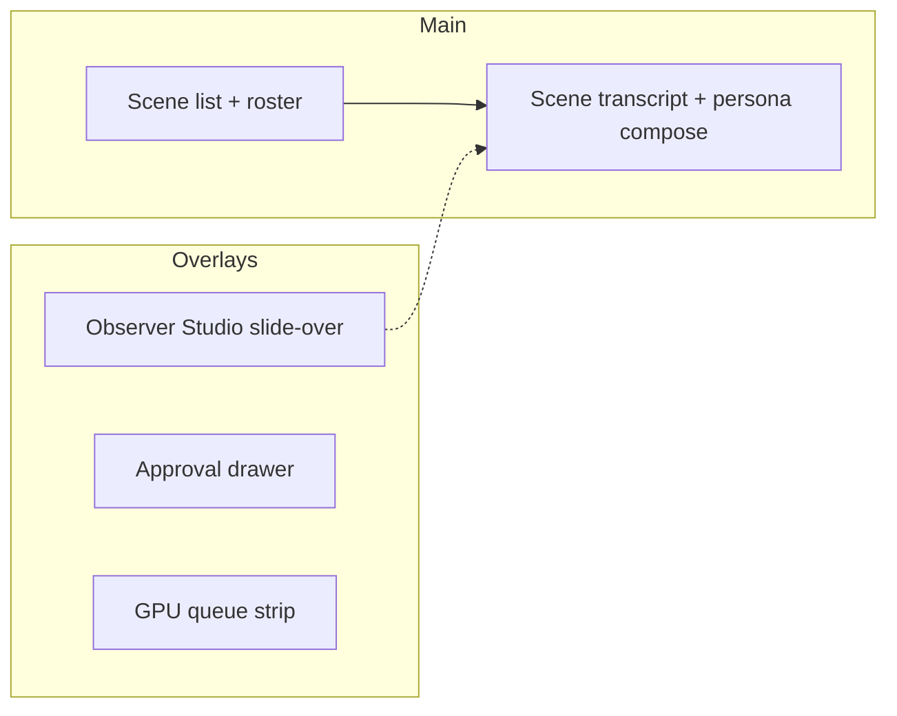

# 14 — Web UI

Professional **operator console** for WorldEngine. **Persona-first** play; **Observer Studio** for tuning and world control.

## 1. Design principles (UI-*)

| ID | Principle |
|----|-----------|
| UI-1 | **Legible causality** — show why a character spoke (memory tools, framing, queue position). |
| UI-2 | **Queue honesty** — visible GPU busy state and wait (INF-5f). |
| UI-3 | **Scope clarity** — public / whisper / DM visually distinct; narrator lines distinct. |

## 2. Layout

| Region | Priority |
|--------|----------|
| **Center** | Active scene transcript + persona compose (hero) |
| **Sidebar** | Scene switcher, presence roster, elsewhere list |
| **Slide-over** | Observer Studio (meta chat + modes) |
| **Strip** | GPU queue status |
| **Drawer** | Approvals |

## 3. Persona compose

| ID | Requirement |
|----|-------------|
| UI-P1 | Scope selector: **v1** public, whisper, DM ([04-communication.md](04-communication.md)). |
| UI-P2 | v1.1 adds phone; **per-scene speakerphone toggle** (not global); bystanders see one-sided overhear unless speakerphone on at their scene ([04-communication.md](04-communication.md) §3). |
| UI-P3 | Persona speak guard feedback when not present ([09-roles-and-privilege.md](09-roles-and-privilege.md)). |
| UI-P4 | Send enqueues cast reply generation after persona message. |

## 4. Scene switcher (spatial wedge)

| ID | Requirement |
|----|-------------|
| UI-S1 | World scene list with present / elsewhere badges (CC-3). |
| UI-S2 | One-click switch active scene; persona auto-join policy visible. |
| UI-S3 | "Knock on [exit]" creates CrossSceneSignal; target scene banner (CC-2). |

## 5. Observer Studio (UI-OBS-CHAT)

| ID | Requirement |
|----|-------------|
| UI-O1 | Separate thread from scene transcript (`channelKind=meta`). |
| UI-O2 | Modes: Watch, Narrate, Intervene, Direct ([09-roles-and-privilege.md](09-roles-and-privilege.md)). |
| UI-O3 | Show memory-tool trace before Observer reply when blocking on (MP-9). |
| UI-O4 | World edits route through Observer tools (OBS-2). |

Narrate/Intervene in play appear in **scene** transcript with `narrator` scope—not in meta thread.

## 6. Watch mode and streaming

| ID | Requirement |
|----|-------------|
| UI-W1 | WebSocket/SSE: `generation.token`, tool calls, memory ops, presence, approvals. |
| UI-W2 | Label operator-only affordances ("Operator / Observer view"). |
| UI-W3 | Partial text while `streamStatus=streaming`; finalize to `outputText` on done (STR-*). |
| UI-W4 | `interrupted` styling + optional resume/cancel. |
| UI-W5 | Reasoning debug toggle for current session only—not in loci/diary inspector. |

## 7. Digest and roster

| ID | Requirement |
|----|-------------|
| UI-D1 | Multi-scene digest panel (OBS-6); pending signals and channel summary. |
| UI-D2 | Elsewhere roster: character + `presentSceneId` label. |

## 8. Memory inspector

| ID | Requirement |
|----|-------------|
| UI-M1 | Per-character mind loci, per-scene world loci, diary timeline. |
| UI-M2 | Output text only in inspector (MP-14). |
| UI-M3 | MP-1: no cross-mind display. |

## 9. Controls

| ID | Requirement |
|----|-------------|
| UI-C1 | Pause world / scene. |
| UI-C2 | Approve/deny ([07-approvals.md](07-approvals.md)). |
| UI-C3 | "Restart-safe" when durable memory hydrated (MP-11). |
| UI-C4 | Cancel in-flight generation (INF-5g). |

## 10. Non-goals (v1 UI)

- SillyTavern preset matrix or PNG character cards
- Expression sprites
- Full map editor ([18-location-maps.md](18-location-maps.md) future)

## 11. API binding

See [12-api-sketch.md](12-api-sketch.md). Desktop-first; responsive layout SHOULD be usable on large tablets.

## Related documents

- [12-api-sketch.md](12-api-sketch.md)
- [09-roles-and-privilege.md](09-roles-and-privilege.md)
- [20-product-principles.md](20-product-principles.md)
