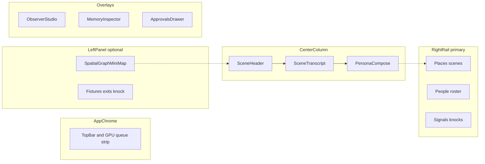
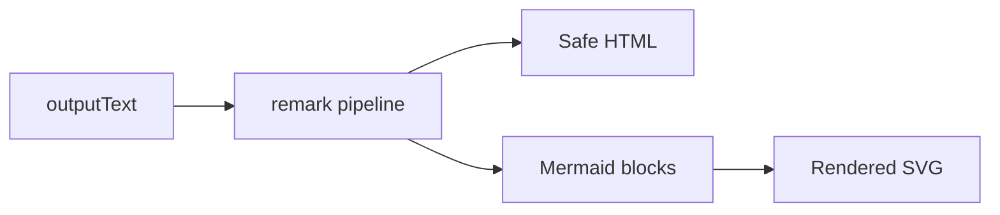

# 14 — Web UI

Professional **operator console** for WorldEngine. **Persona-first** play; **Observer Studio** for tuning and world control.

**Product bar:** Net-new **spatial operator console** (memory + places)—not a chat skin. **Platform:** desktop-first ([§2](#2-application-shell-and-layout)).

Component names in [§19](#19-component-inventory-spec-vocabulary) are **spec vocabulary** for implementers—not implied to exist in any given milestone until an implementation plan says so.

## 1. Design principles (UI-*)

| ID | Principle |
|----|-----------|
| UI-1 | **Legible causality** — show why a character spoke (memory tools, framing, queue position, **selection rationale** from `GenerationJob.selectionRationaleJson`). |
| UI-2 | **Queue honesty** — visible GPU busy state and wait (INF-5f). |
| UI-3 | **Scope clarity** — public / whisper / DM visually distinct; narrator lines distinct; dim non-perceived lines per [04-communication.md](04-communication.md) §5. |
| UI-4 | **Rich readability** — markdown for structure; Mermaid for diagrams the model or operator produces ([§14](#14-rich-message-rendering)). |
| UI-5 | **Spatial orientation** — “Where am I?” always visible; movement feels like place, not tab swap. |

## 2. Application shell and layout

### 2.1 Shell diagram

### 2.2 Regions

| Region | Priority | Primary jobs |
|--------|----------|--------------|
| **Center** | v1 hero | Scene transcript + persona compose; rich markdown/Mermaid render |
| **Right rail (primary)** | v1 | Scenes, roster, elsewhere, signals — world control deck |
| **Left panel (optional)** | v1 collapsed default | Mini-map, exits, fixtures, knock — spatial context |
| **Top strip** | v1 | GPU queue status; trigger, `continueDepth`, rationale (UI-Q1) |
| **Observer slide-over** | v1 | Meta chat, modes, digest (from **left** edge) |
| **Approvals drawer** | v1 | Tool side effects |
| **Settings modal** | v1 partial | World, persona, scene; v1.1 server/phone/package |

### 2.3 Layout rules (UI-LAY-*)

| ID | Rule |
|----|------|
| UI-LAY-1 | **Primary nav rail is right** (inline-end): **Places** → **People** → **Signals**. |
| UI-LAY-2 | **Optional left panel** (inline-start): spatial graph, exits, fixtures; **collapsed by default**; toggle in `SceneHeader` or `TopBar`. |
| UI-LAY-3 | Center column `min-width` ≥ 640px (768px target); collapse **left** before **right**; then icon-collapse right rail. |
| UI-LAY-4 | Below 1280px width: right rail becomes **drawer**; left panel hidden or sheet; sections accordion inside drawer. |
| UI-LAY-5 | Multi-scene digest (UI-D1) lives in **Observer Studio**, not pinned on right rail. |
| UI-LAY-6 | Active scene highlighted in **right Places** and **center SceneHeader** (dual cue). |

**Right rail section order:**

1. **Places** — scene list, badges, one-click switch (UI-S1–S2)  
2. **People** — presence roster, elsewhere list (UI-D2)  
3. **Signals** — pending knocks; dismiss/expire (UI-S4)

**Left panel (when expanded):** `SpatialGraphMiniMap`, `ExitList` (knock per exit), fixture chips.

Desktop-first; large tablets: right drawer + floating left sheet for spatial panel.

Wireframes: [guides/web-ui-wireframes.md](guides/web-ui-wireframes.md) (WF-1–WF-13).

## 3. Persona compose

| ID | Requirement |
|----|-------------|
| UI-P1 | Scope selector: **v1** public, whisper, DM ([04-communication.md](04-communication.md)). |
| UI-P2 | v1.1 adds phone; **per-scene speakerphone toggle** (not global); bystanders see one-sided overhear unless speakerphone on at their scene ([04-communication.md](04-communication.md) §3). |
| UI-P3 | Persona speak guard feedback when not present ([09-roles-and-privilege.md](09-roles-and-privilege.md)). |
| UI-P4 | Send enqueues cast reply generation after persona message. |
| UI-P5 | Optional **markdown preview** toggle before send ([§14](#14-rich-message-rendering) UI-R7). |
| UI-Q1 | Queue strip shows `trigger`, `continueDepth`, and collapsed selection rationale (AO-18, UI-1). |

## 4. Scene switcher (spatial wedge)

| ID | Requirement |
|----|-------------|
| UI-S1 | World scene list in right rail **Places** with present / elsewhere badges (CC-3). |
| UI-S2 | One-click switch active scene; persona auto-join policy visible. |
| UI-S3 | **Knock on [exit]** in left spatial panel (or scene header); creates `CrossSceneSignal`; target scene banner (CC-2). Operator MAY dismiss/expire (CC-11b). **No** v1 control that auto-triggers NPC generation on knock (CC-11a). |
| UI-S4 | **Signals** section on right rail: pending knocks with dismiss/expire actions. |

## 5. Observer Studio (UI-OBS-CHAT)

| ID | Requirement |
|----|-------------|
| UI-O1 | Separate thread from scene transcript (`channelKind=meta`). |
| UI-O2 | Modes: Watch, Narrate, Intervene, Direct ([09-roles-and-privilege.md](09-roles-and-privilege.md)). |
| UI-O3 | Show memory-tool trace before Observer reply when blocking on (MP-9). |
| UI-O4 | World edits route through Observer tools (OBS-2). |
| UI-O5 | Slide-over opens from **left** edge; right rail remains usable (UI-LAY-5). |

Narrate/Intervene in play appear in **scene** transcript with `narrator` scope—not in meta thread. Meta and scene messages use rich rendering ([§14](#14-rich-message-rendering)).

## 6. Watch mode and streaming

| ID | Requirement |
|----|-------------|
| UI-W1 | WebSocket/SSE: `generation.token`, tool calls, memory ops, presence, approvals. |
| UI-W2 | Label operator-only affordances (“Operator / Observer view”). |
| UI-W3 | Partial **plain text** while `streamStatus=streaming`; finalize to `outputText`; then markdown/Mermaid pass (UI-R3). |
| UI-W4 | `interrupted` styling + optional resume/cancel. |
| UI-W5 | Reasoning debug toggle for current session only—not in loci/diary inspector. |

## 7. Digest and roster

| ID | Requirement |
|----|-------------|
| UI-D1 | Multi-scene digest in **Observer Studio** (OBS-6); pending signals and channel summary—not a permanent right-rail panel. |
| UI-D2 | **People** section: presence roster (atLocation, muted) and elsewhere roster (character + `presentSceneId`). |

## 8. Memory inspector

| ID | Requirement |
|----|-------------|
| UI-M1 | Per-character mind loci, per-scene world loci, diary timeline. |
| UI-M2 | Output text only in inspector (MP-14). |
| UI-M3 | MP-1: no cross-mind display. |

## 9. Controls

| ID | Requirement |
|----|-------------|
| UI-C1 | Pause world / scene. |
| UI-C2 | Approve/deny ([07-approvals.md](07-approvals.md)). |
| UI-C3 | “Restart-safe” when durable memory hydrated (MP-11). |
| UI-C4 | **Cancel in-flight generation** (INF-5g); primary retry affordance in v1 (UI-REG-1). |

## 10. Settings (unified IA)

| ID | Requirement |
|----|-------------|
| UI-SET-1 | **Settings** opens modal (or panel) from `TopBar`; does not replace right rail. |
| UI-SET-2 | **v1 tabs:** World, Persona, Scene (active scene editor), Inference (read-only model/queue). |
| UI-SET-3 | **v1.1 tabs:** Server (heartbeat UI-H1), Data (world package import/export). |
| UI-SET-4 | **Phase 3:** Character authoring embeds `CharacterDraft` (UI-CHAR-*). |
| UI-SET-5 | **Account (coming later):** disabled section or tab reserving future login (UI-ACC-1). |
| UI-SET-6 | **Voice (coming later):** disabled note; full STT/TTS post-v1 (UI-VOX-0). |
| UI-SET-7 | Settings modal tabs documented in WF-10; v1.1 adds Server and Data tabs. |

**World tab:** name, preset (Solo story / Writer / Aquarium), `configJson` orchestration (`agentContinue`, `maxContinueDepth`).

**Persona tab:** `require_persona_present_to_speak`, `persona_auto_join_on_scene_switch`.

**Scene tab:** `locationName`, description, exits, fixtures.

## 11. Operator / server settings (v1.1 heartbeat)

| ID | Requirement |
|----|-------------|
| UI-H1 | Global **heartbeat** toggle, interval, `lastHeartbeatAt` ([08-real-world-capabilities.md](08-real-world-capabilities.md) HB-4, HB-5) — Server settings tab |
| UI-H2 | Queue strip labels `idle_source=server_heartbeat` when applicable (UI-2) |

Per-world **pause** remains UI-C1; distinct from global heartbeat.

## 12. Character authoring (Phase 3 UI)

| ID | Requirement |
|----|-------------|
| UI-CHAR-1 | Shared **CharacterDraft** flow: natural-language brief → LLM draft → preview → approve ([24-character-authoring.md](24-character-authoring.md)) |
| UI-CHAR-2 | Entry points: **Observer Studio** and **world settings**; Phase 3 wizard step 3 embeds same component |
| UI-CHAR-3 | Draft holds GpuResourceQueue slot in queue strip (CHAR-4) |

v1 play MAY use demo pre-seeded cast without this UI. **No** SillyTavern import in v1 (UI-IMP-0).

## 13. In-world work (post-v1 UI)

| ID | Requirement |
|----|-------------|
| UI-WK-1 | **Commission queue** in Observer slide-over or sidebar: status, assignee, `targetSceneId`, deliverable policy, `deliverableLocusKeys`. |
| UI-WK-2 | Create commission: brief, assignee, target scene, optional `deliverablePolicy` (default **mind**). |
| UI-WK-3 | **Evidence inspector** on memory rows: `sourceKind`, `sourceRef`, `retrievedAt` (MP-21). |
| UI-WK-4 | **Debate controls** when `scene.activity.kind=debate`: phase, speaking order, advance phase, current speaker highlight. |
| UI-WK-5 | Force complete with required reason when COM-2 not satisfied. |
| UI-WK-6 | Filter commission list by character `focusTags[]`. |

In-world work UI is an **affordance** on the operator console—not a separate application shell. Persona transcript remains hero.

## 14. Rich message rendering

| ID | Requirement |
|----|-------------|
| UI-R1 | Scene and meta messages render `outputText` as **GitHub-flavored markdown** (headings, lists, emphasis, links, tables, fenced code). |
| UI-R2 | Fenced blocks with language `mermaid` render as diagrams; optional lightbox pan/zoom. |
| UI-R3 | **Streaming:** plain text during `streamStatus=streaming`; markdown/Mermaid pass **on finalize** only. |
| UI-R4 | Sanitize HTML; external links `target="_blank"` + `rel="noopener"`; no raw script in transcript. |
| UI-R5 | Invalid Mermaid: show source fence + “Diagram could not be rendered”—never blank or crash transcript. |
| UI-R6 | Reasoning blocks stripped from visible transcript (OQ-3, MP-17)—not rendered as markdown. |
| UI-R7 | Operator MAY preview markdown in compose (UI-P5); NPC output always rendered. |

Storage remains plain `outputText` in API ([12-api-sketch.md](12-api-sketch.md)); optional `contentFormat: markdown` is presentation metadata only.

## 15. Transcript integrity (guide, don’t erase)

| ID | Requirement |
|----|-------------|
| UI-TRN-1 | **No delete** on scene or meta messages once committed. |
| UI-TRN-2 | **No inline edit** of cast dialogue. Operator guides via Observer, persona, pause, approvals—not erasure. |
| UI-TRN-3 | No trash/edit icons on message bubbles. |
| UI-TRN-4 | Memory inspector diary rows read-only (MP-14). |

| ID | Requirement |
|----|-------------|
| UI-REG-1 | v1: **Cancel** in-flight generation only (UI-C4); **no Regenerate** on committed messages. v1.1 MAY add regen while `streamStatus=streaming` if partial never persisted. |

## 16. Worlds launcher

| ID | Requirement |
|----|-------------|
| UI-WLD-1 | **v1:** One active world. Entry: **Load demo world** (`demo-spatial-v1`), **Open world file…**; TopBar world menu (WF-9, WF-12)—no multi-world dashboard. |
| UI-WLD-2 | **Later:** Recents list (last 3 paths) in TopBar menu only. |

## 17. Character visuals (ComfyUI — post-v1)

Aligns with [19-comfyui-media.md](19-comfyui-media.md). **v1:** text-only; optional color dot per cast; **gray portrait placeholders** (UI-IMG-1).

| ID | Requirement |
|----|-------------|
| UI-IMG-1 | Reserve portrait slots so layout stable when media ships. |
| UI-IMG-2 | Per-character **reference sheet** (`mediaAsset` + caption locus); gens use IP-Adapter / `character_portrait` workflow for consistency. |
| UI-IMG-3 | Scene establishing shots per `sceneId`; regen shows diff + operator ack (MAP-7 pattern). |
| UI-IMG-4 | Image jobs on GpuResourceQueue `kind: image`; queue strip shows wait (IMG-8, UI-2). |
| UI-IMG-5 | Regenerate image via **Observer** only (IMG-6, IMG-7). |

## 18. Operator policies (v1)

| ID | Requirement |
|----|-------------|
| UI-SAF-1 | v1 safety: pause, cancel gen, Observer intervene; no NSFW/rating dashboard. |
| UI-IMP-0 | v1: greenfield demo; no ST/JSON import wizard. |
| UI-VOX-0 | v1: no mic/TTS UI; document in Settings placeholder. |
| UI-ACC-1 | Solo local operator; optional disabled Account section in Settings. |

## 19. Component inventory (spec vocabulary)

### Global chrome

| Component | Spec refs | Notes |
|-----------|-----------|-------|
| `AppShell` | §2 | Layout grid, responsive breakpoints |
| `TopBar` | UI-C1, UI-WLD | World menu, pause, connection, settings, Observer |
| `GpuQueueStrip` | UI-Q1, UI-2, UI-C4 | Cancel, job metadata |
| `ConnectionStatus` | UI-W1 | WS/SSE reconnect |
| `LoadDemoWorldCTA` | UI-WLD-1 | Empty state |
| `SettingsLauncher` | UI-SET-* | Opens settings modal |

### Scene / location

| Component | Spec refs | Notes |
|-----------|-----------|-------|
| `SceneNavList` / `SceneNavItem` | UI-S1–S2 | Right rail Places |
| `SpatialPanel` | UI-LAY-2 | Left: mini-map, exits, fixtures |
| `SceneHeader` | UI-LAY-6 | Center top |
| `ExitList` | UI-S3 | Knock actions |
| `SpatialGraphMiniMap` | CC-1 | Left panel |
| `CrossSceneSignalBanner` | UI-S3 | Center header |
| `SignalSidebarList` | UI-S4 | Right rail Signals |
| `PresenceRoster` / `ElsewhereRoster` | UI-D2 | Right rail People |
| `FixtureChip` | LP-* | Header / spatial panel |

### Chat

| Component | Spec refs |
|-----------|-----------|
| `SceneTranscript`, `MessageBubble`, `ScopeBadge` | UI-W3, UI-3 |
| `MarkdownRenderer`, `MermaidBlock`, `CodeBlock` | UI-R* |
| `StreamingMessage`, `PerceptionDimming` | UI-W3–W4, §5 [04](04-communication.md) |
| `PersonaCompose`, `SelectionRationalePopover` | UI-P*, UI-1 |

### Observer, memory, approvals

| Component | Spec refs |
|-----------|-----------|
| `ObserverSlideOver`, `MetaTranscript`, `ObserverModeSwitcher` | UI-O* |
| `MemoryInspector`, `ApprovalsDrawer` | UI-M*, UI-C2 |

### Settings, media (future)

| Component | Phase |
|-----------|-------|
| `SettingsModal`, `WorldSettingsTab`, `PersonaSettingsTab`, `SceneEditorTab` | v1 |
| `ServerSettingsTab`, `DataPackageTab` | v1.1 |
| `CharacterPortrait`, `SceneEstablishingShot`, `ReferenceSheetPanel` | post-v1 |

## 20. Locations UX (v1)

| Question | UI answer |
|----------|-----------|
| Where am I? | `SceneHeader` + active scene in right **Places** |
| Who is here? | `PresenceRoster` |
| Who is elsewhere? | `ElsewhereRoster` |
| How do I go elsewhere? | Click scene in **Places**; exits in left **SpatialPanel** |
| How do I signal another room? | Knock on exit → banner + **Signals** |
| What is in this room? | Fixture chips + description |

## 21. Map UX (phased)

| Phase | UI |
|-------|-----|
| v1 | `SpatialGraphMiniMap` in left panel; scene nav in Places |
| v1.1 | Optional scene thumbnail placeholder |
| Post-v1 | `MapCanvas` per [18-location-maps.md](18-location-maps.md) |

## 22. UX acceptance (implementation gate)

When a Web UI exists, verify:

| Check | Spec |
|-------|------|
| Golden path without external docs | [17-acceptance-criteria.md](17-acceptance-criteria.md) §2 |
| Whisper isolated in UI | UI-3, MP-1 |
| Knock no auto NPC line | CC-11a |
| GPU wait visible ≤500ms after enqueue | UI-2 |
| Markdown list + Mermaid diagram in transcript | UI-R1–R2 |
| Settings: preset + persona auto-join without JSON edit | UI-SET-* |
| Scene switch updates header + rosters | UI-S2, UI-D2, UI-LAY-6 |
| Restart hydrates presence, signals, diary | MP-11 |
| No delete/edit on committed messages | UI-TRN-* |
| Cancel stops in-flight stream only | UI-REG-1, UI-C4 |

## 23. Non-goals (v1 UI)

- SillyTavern preset matrix or PNG character cards
- Expression sprites
- Full map editor ([18-location-maps.md](18-location-maps.md))
- Phone play, global heartbeat UI, world wizard (v1.1 / Phase 3)
- Voice UI, ST import, NSFW dashboard (see [§18](#18-operator-policies-v1))
- Delete or inline-edit transcript messages

## 24. API binding

See [12-api-sketch.md](12-api-sketch.md). Desktop-first; responsive layout SHOULD be usable on large tablets.

| UI surface | REST | Realtime |
|------------|------|----------|
| Transcript | `GET/POST .../messages` | `generation.token`, finalize |
| Observer | `GET/POST .../observer/meta-messages` | same |
| Scenes / presence | `PATCH scene`, `POST join/leave`, `GET roster`, `GET spatial-graph` | presence |
| Signals | `GET/POST/PATCH .../signals` | signal updates |
| Queue | `GET .../queue` | queue position |
| Settings | `PATCH /worlds/{id}`, v1.1 `PATCH /operator/settings` | — |

## Appendix A — Design tokens (non-normative)

Implementers SHOULD treat this appendix as guidance; normative behavior is in UI-* IDs above.

| Token / pattern | Guidance |
|-----------------|----------|
| Theme | Dark operator console; low glare |
| Scope colors | public neutral; whisper violet; dm amber; narrator italic slate; phone teal (v1.1) |
| Typography | Transcript 15–16px; compose 16px; rail labels 12px |
| Spacing | 8px grid; bubble max-width ~720px in center column |
| Motion | Subtle stream cursor only |
| Keyboard | Compose send; Esc closes overlays; scene shortcuts 1–9 optional |
| Right rail width | ~260px expanded; icon-only collapsed |

## Documentation history

| Date | Change |
|------|--------|
| 2026-05 | UI/UX master plan merged: right-primary layout (UI-LAY), rich chat (UI-R), transcript integrity (UI-TRN), worlds (UI-WLD), ComfyUI UI (UI-IMG), settings IA (UI-SET), operator policies, wireframes guide |

## Related documents

- [12-api-sketch.md](12-api-sketch.md)
- [04-communication.md](04-communication.md)
- [03-locations-and-presence.md](03-locations-and-presence.md)
- [09-roles-and-privilege.md](09-roles-and-privilege.md)
- [18-location-maps.md](18-location-maps.md)
- [19-comfyui-media.md](19-comfyui-media.md)
- [20-product-principles.md](20-product-principles.md)
- [17-acceptance-criteria.md](17-acceptance-criteria.md)
- [guides/first-run-experience.md](guides/first-run-experience.md)
- [guides/web-ui-wireframes.md](guides/web-ui-wireframes.md)
