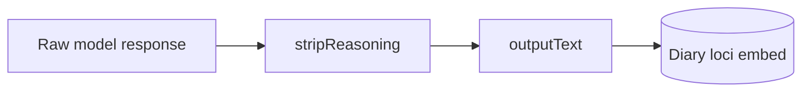

# 16 — Learning and Memory Storage

This document specifies **how characters learn** (diary, loci, reflection) and **output-only durable storage** including `stripReasoning`.

## 1. Principle

**Transcript is drama; durable memory is truth.** After server restart, no agent may rely on unstored transcript alone for continuity claims (MP-11).

## 2. Learning layers

| Layer | Mechanism | Canon |
|-------|-----------|-------|
| Episodic | Witnessed diary: rolling perceivable scene snippet after each cast reply; group fan-out (MP-6, MP-17, MP-20) | Yes |
| Semantic facts | `memory_store` → loci (stripped) | Yes |
| Retrieval | Mandatory recall + optional semantic search | Yes (MP-18) |
| Reflection | Post-turn output summary → mind loci | Optional Phase 4 |
| Forbidden | Reasoning in durable memory; raw transcript RAG as episodic | MP-14, MP-7 |

## 3. Universal memory requirements (MP-8–MP-19)

| ID | Requirement |
|----|-------------|
| MP-8 | Every generating characterId receives mandatory recall when enabled (default on). |
| MP-9 | Blocking mode applies to Observer and Architect, not only cast (default on). |
| MP-10 | Recall protocol: search/read before asserting non-dialogue facts. |
| MP-11 | Cold start rebuilds mandatory recall from durable stores before model call. |
| MP-12 | Observer narrator must not contradict loci/fixtures without tool mutation in same job. |
| MP-13 | Observer world changes via `memory_store` or fixture sync. |
| MP-14 | Durable memory is output-only—no reasoning or chain-of-thought. |
| MP-15 | `stripReasoning(content)` before every durable write. |
| MP-16 | `memory_store` strips and rejects empty/reasoning-only values. |
| MP-17 | Diary snippet lines use per-message `outputText` (all speakers in the window), not raw model payload or assistant-only text. |
| MP-20 | Group fan-out: same diary segment appended to every present cast member at capture scene ([02-memory.md](02-memory.md) §1.4). |
| MP-18 | Mandatory recall and embed index read output-stored text only. |
| MP-19 | Tool results in transcript may retain structure; values to `memory_store` are stripped. |

## 4. stripReasoning

### 4.1 Algorithm

1. Remove API fields listed in model profile (`reasoning_content`, `reasoning`, etc.).
2. Remove delimited blocks per `stripReasoningTags` in `config/models/{profile}.yaml`.
3. Trim whitespace; if empty, reject durable write (MP-16).

Reference profile: [config/models/qwen3.6-35b-a3b.yaml](../config/models/qwen3.6-35b-a3b.yaml).

### 4.2 Storage boundary

| Store | Reasoning allowed? |
|-------|-------------------|
| Mind / world loci | No |
| Diary | No |
| Embedding source text | No |
| Scene transcript | Optional debug field only |
| Mandatory recall inject | No |

## 5. Embeddings (v1 schema, Sprint 1–2 index)

`EmbeddingRecord` MUST exist in SQLite migration 001 ([11-data-model.md](11-data-model.md) §3.13). Debounced re-embed on write via GpuResourceQueue (INF-13) SHOULD start in Sprint 1–2.

Semantic search **assists** `memory_search` / `diary_search` (hybrid with FTS); does **not** replace diary + mandatory recall ([02-memory.md](02-memory.md) §7). Vectors keyed per MP-1 / INF-10. MEM-ACC-1 applies.

## 6. Reflection (AO-8, optional)

Reflection consolidates episodic diary and existing mind loci into **abstracted durable knowledge** during off-peak windows (nightly batch or on-demand). It uses GpuResourceQueue like any chat call.

### 6.1 Scheduling

| Mode | Trigger | Notes |
|------|---------|-------|
| Nightly | `reflection` idle tick at `reflectionNightlyHourUtc` (default 03:00 UTC) | One eligible character per tick when GPU idle; requires `reflectionEnabled` |
| On-demand | `POST /api/v1/worlds/{worldId}/reflect` or `POST /api/v1/characters/{characterId}/reflect` | Operator-initiated; bypasses nightly enable gate |

### 6.2 Outputs

1. **Mind loci** — appended with dated prefix (`reflection:self`, `reflection:belief:{slug}`, `reflection:goals`, `reflection:lessons`, `relationship:{id}`)
2. **MemoryLink graph** — character-scoped edges (`witnessed_in`, `learned_from`, `relates_to`, etc.) for recall enrichment
3. **PersonaProposal** — optional operator-approved updates to `definitionJson` persona/instructions/focusTags

Loci writes auto-approve when `reflectionAutoApproveLoci` is true (default). Persona proposals always require operator approval.

### 6.3 Recall integration

Mandatory recall prioritizes `reflection:*` and `relationship:*` loci and injects a char-budgeted **Associated memories** block from 1-hop MemoryLink neighbors. Graph enrichment is additive — it does not replace diary tail or FTS search.

## 7. Requirements summary

| ID | Summary |
|----|---------|
| MP-8–MP-19 | Universal grounding and output-only storage |
| — | stripReasoning pipeline |

## Related documents

- [02-memory.md](02-memory.md)
- [00-inference-runtime.md](00-inference-runtime.md)
- [10-prompt-injection.md](10-prompt-injection.md)
- [17-acceptance-criteria.md](17-acceptance-criteria.md)
- [22-output-quality.md](22-output-quality.md)
