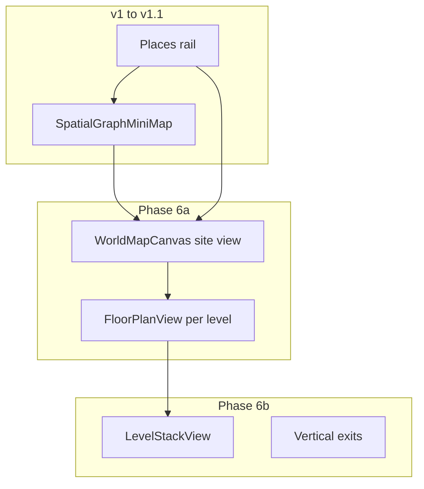
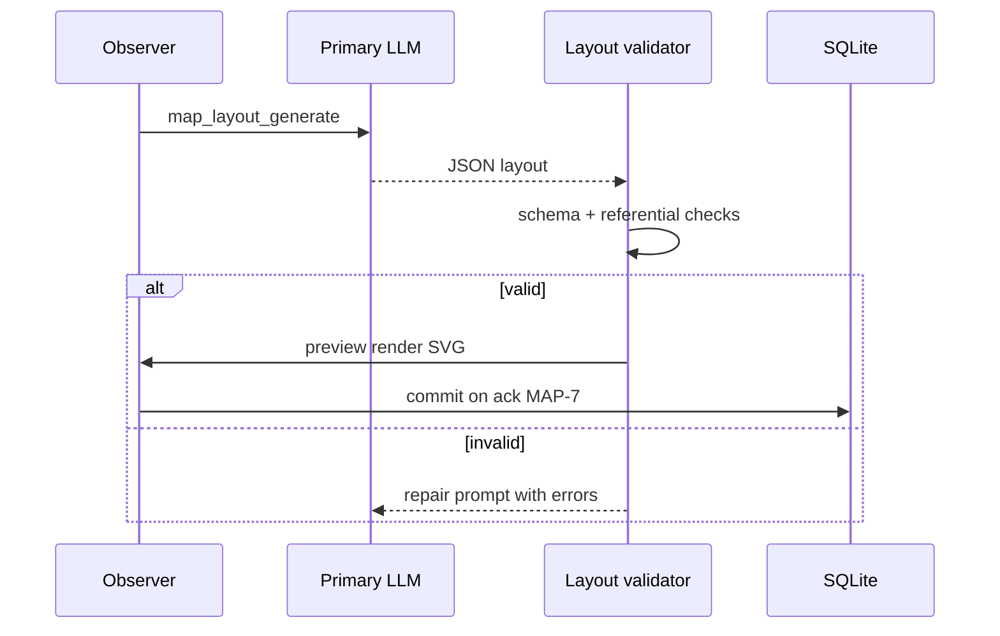

# 18 — Location Maps (Future)

**Status:** Post-v1 (Phase 6). Normative target so implementation aligns with core GPU, memory, and Observer rules.

**Companion UI:** mini-map and envelopes in [14-web-ui.md](14-web-ui.md) §21.1–§21.3 (v1–v1.1). **This document** defines the **large-scale world map** and **multi-level (vertical) navigation** plan.

## 1. Goal

Operator gets a **spatial feel** when moving between scenes—interactive maps in Web UI, grounded in world state ([20-product-principles.md](20-product-principles.md) spatial wedge).

At full maturity the operator can:

1. Glance at the **left mini-map** for local context (room, building envelope, you-are-here).
2. Open a **large-scale world map** for site/campus orientation (all structures, distances, outdoors).
3. Switch **vertical levels** (floors) and see how rooms stack—stairs, ladders, shafts—without losing place on the plan.

## 2. Requirements

| ID | Requirement |
|----|-------------|
| MAP-1 | Each `sceneId` MAY have `mapArtifact`: versioned JSON (grid/vector), layers, legend, bounds—not reasoning dumps. |
| MAP-2 | World overview links scenes via `exits[]` and world pool loci. |
| MAP-3 | Tools: `map_generate`, `map_update_region`, `map_set_hotspot` — JSON output only; MP-14. |
| MAP-4 | Hotspots bind to fixtures, exit `targetSceneId`, or operator actions. |
| MAP-5 | Web UI: pan/zoom, scene picker, hotspot → fixture / persona move on exit. |
| MAP-6 | Map gen reads scene framing + world loci; memory tools if blocking on (MP-10). |
| MAP-7 | Regen MUST NOT silently retcon fixtures—diff and operator ack. |
| MAP-8 | Optional fog: cast framing may show reduced map; operator sees full map. |
| MAP-9 | Each scene MAY have **`mapLevel`** (integer, default `0`) and **`levelLabel`** (e.g. `Ground`, `Upper`, `Basement -1`). |
| MAP-10 | **Vertical exits** (`kind`: `stairs` \| `ladder` \| `elevator` \| `shaft`) link scenes at the same **plan position** on adjacent levels. |
| MAP-11 | World **`worldMapArtifact`**: site-scale bounds, terrain/outdoor regions, structure footprints at geographic coordinates. |
| MAP-12 | **`WorldMapCanvas`**: large-scale pan/zoom view; syncs with mini-map and active scene. |
| MAP-13 | **`LevelStackView`**: exploded or isometric stack of floor plates for one structure; vertical connectors visible. |
| MAP-14 | **`FloorPlanView`**: single-level detail from per-scene `mapArtifact` (MAP-1) at full canvas resolution. |
| MAP-15 | Mini-map shows **level badge** and ghosts other levels’ rooms at same structure (dimmed). |
| MAP-16 | Operator MAY toggle **view mode**: `site` \| `structure` \| `floor` \| `stack` ([14-web-ui.md](14-web-ui.md) §21.4). |
| MAP-17 | Vertical moves respect presence rules—changing level via map uses same join/exit semantics as horizontal ([03-locations-and-presence.md](03-locations-and-presence.md)). |
| MAP-18 | Level `-1` (basement) through `+N` (towers) MUST remain stable in world package export (DM-4). |
| MAP-19 | LLM **`map_layout_generate`** (and related tools) MUST emit **validated JSON** matching §12 schemas—never prose-only or reasoning blocks (MP-14, OQ-3). |
| MAP-20 | Generated layout MUST be sufficient for Web UI to render mini-map, site map, and level stack without inventing geometry (UI-MAP-D*). |
| MAP-21 | Reference images in [guides/reference-images/](guides/reference-images/) are the **visual acceptance targets** for generated layouts (non-normative pixels; normative structure). |
| MAP-22 | Layout generation runs on GpuResourceQueue `kind: chat`; illustration remains ComfyUI `kind: image` ([19-comfyui-media.md](19-comfyui-media.md)). |
| MAP-23 | Observer or location admin initiates regen; MAP-7 diff + operator ack before overwrite. |
| MAP-24 | CI fixtures MUST include at least one LLM-produced layout JSON per surface: `mini`, `site`, `stack`. |

**Note on “3D”:** WorldEngine maps are **stacked floor plans + vertical connectivity**, not a game-engine free-camera 3D world. Optional **axonometric preview** (MAP-13) is schematic—operator-console clarity, not walkable geometry.

## 3. Shared rules

| Rule | Application |
|------|-------------|
| GpuResourceQueue | Layout LLM uses `chat`; illustration uses `image` (ComfyUI) |
| MP-8–MP-19 | Store map JSON and captions only |
| MP-1 | Hidden rooms stay in mind pool, not world map layer |
| OBS-2, OBS-5 | Observer/location admin initiates; tools for mutations |
| Approvals | `requireApprovalForMapOverwrite` optional |
| stripReasoning | Prompt summary loci stripped |

## 4. Storage

- `map_artifacts` table or blob column per sceneId
- Thumbnail via ComfyUI or static render under `assets/{worldId}/maps/`

## 5. Relationship to mini-map (v1–v1.1)

Maps are **not implemented** in v1. `exits[]` and spatial-graph API (CC-1) prepare data for MAP-2.

**v1 Web UI bridge:** read-only `SpatialGraphMiniMap` — §21.1–§21.3 in [14-web-ui.md](14-web-ui.md) (structured layout, shapes, building envelopes).

The mini-map remains the **always-visible** local orienteer. Large-scale and multi-level views **extend** it; they do not replace Places or persona compose.



## 6. Phased delivery

| Phase | Deliverable | Spec |
|-------|-------------|------|
| **v1** | Mini-map schematic only | [14-web-ui.md](14-web-ui.md) §21.1 |
| **v1.1** | Shapes, envelopes, `mapLevel` on scenes (data only; UI badge optional) | §21.2–§21.3; MAP-9 |
| **6a** | `WorldMapCanvas` site view; `FloorPlanView`; `mapArtifact` per scene; MAP tools | MAP-1–MAP-7, MAP-11–MAP-12, MAP-14–MAP-16 |
| **6b** | `LevelStackView`; vertical exits; exploded stack; mini-map level ghosts | MAP-10, MAP-13, MAP-15, MAP-17 |
| **6+** | ComfyUI map illustration, fog (MAP-8), Observer map edit | [19-comfyui-media.md](19-comfyui-media.md) |

## 7. Large-scale world map (MAP-11, MAP-12)

### 7.1 Purpose

**WorldMapCanvas** answers: *Where is everything on the site?* — manor, keep, bailey, roads, wells—at a scale too large for the left panel.

| Question | Surface |
|----------|---------|
| How far is the keep from the manor? | Site view measuring edge / grid distance |
| Which buildings exist? | Structure footprints at `worldMapArtifact` coordinates |
| Where am I now? | Active structure highlighted; optional line to active scene footprint |

### 7.2 `worldMapArtifact` (world scope)

Stored per `worldId` (blob or `worlds.worldMapJson`).

| Field | Description |
|-------|-------------|
| `bounds` | `{ minX, minY, maxX, maxY }` in world units (meters abstract or grid cells) |
| `scale` | Units per grid cell for display |
| `terrain` | Optional regions: `forest`, `water`, `road`, `wall` — polygons |
| `structures` | `{ structureId, origin: {x,y}, rotation, footprint }` — placement on site |
| `outdoorScenes` | Scenes with no structure but a site position (bailey, road) |

Per-scene `mapPosition` in mini-map normalized space is a **simplification** of site coordinates; `WorldMapCanvas` uses **world coordinates** as source of truth when `worldMapArtifact` exists.

### 7.3 WorldMapCanvas UI (MAP-12, UI-MAP-W*)

| ID | Requirement |
|----|-------------|
| UI-MAP-W1 | Open from **TopBar** or `SceneHeader` (“Map” / `[⌖ World]`) as **overlay** (80% viewport) or **dedicated mode** (transcript hidden, map hero) |
| UI-MAP-W2 | Pan (drag), zoom (wheel/pinch), fit-to-world, fit-to-active-structure |
| UI-MAP-W3 | Renders `worldMapArtifact` terrain + structure footprints + outdoor scenes |
| UI-MAP-W4 | Click structure → zoom to structure bounds; click scene footprint → offer “Go to scene” (same as Places) |
| UI-MAP-W5 | Active scene footprint: `active-scene` stroke; label `structure › scene › level` |
| UI-MAP-W6 | Mini-map in corner (picture-in-picture) showing same viewport rectangle **or** mini-map highlights region when world map open |
| UI-MAP-W7 | Knock/signal indicators on target structure (badge), not auto-NPC ([21-cross-scene-awareness.md](21-cross-scene-awareness.md)) |
| UI-MAP-W8 | Esc closes overlay; state restores previous layout |

## 8. Multi-level / vertical maps (MAP-9, MAP-10, MAP-13)

### 8.1 Concepts

| Term | Meaning |
|------|---------|
| **Level** | Discrete floor index `mapLevel` (integer). `0` = ground unless world defines otherwise |
| **Plan position** | `{ planX, planY }` within a structure—same coordinates for Hall-Ground and Hall-Upper when stacked |
| **Vertical exit** | Stairs/ladder/shaft connecting two scenes at same plan position, different `mapLevel` |
| **Floor plan** | `mapArtifact` for one scene at one level (walls, fixtures, hotspots) |
| **Level stack** | All scenes in one `structureId` grouped by `mapLevel`, drawn as separated plates |

### 8.2 Scene fields (MAP-9)

| Field | Type | Notes |
|-------|------|-------|
| `mapLevel` | integer | Default `0`; negative = below ground |
| `levelLabel` | string | Display: `Ground floor`, `Attic`, `B1` |
| `planPosition` | `{ planX, planY }` | Within structure; required when structure has >1 level |
| `structureId` | string | Same as mini-map envelope ([14-web-ui.md](14-web-ui.md) §21.3) |

**SceneHeader breadcrumb (extended):** `Manor House › Ground floor › Hall` (UI-MAP-N3 in [14-web-ui.md](14-web-ui.md)).

### 8.3 Vertical exits (MAP-10)

Extend `exitsJson` ([11-data-model.md](11-data-model.md)):

```json
{
  "exitId": "hall-stairs-up",
  "label": "Stairs to upper gallery",
  "targetSceneId": "scene-hall-upper",
  "kind": "stairs",
  "vertical": true,
  "levelDelta": 1,
  "planPosition": { "planX": 12, "planY": 8 }
}
```

| `kind` | Use |
|--------|-----|
| `stairs` | Interior stairwell |
| `ladder` | Short vertical link |
| `elevator` | Mechanical (fiction-dependent) |
| `shaft` | Drop, dumbwaiter, secret passage |

| Field | Rule |
|-------|------|
| `vertical` | `true` — edge rendered in **LevelStackView**, not as horizontal site edge |
| `levelDelta` | `+1` up, `-1` down (multi-floor jumps explicit) |
| `planPosition` | Same on source and target scenes for stack alignment |

Horizontal `door` / `path` / `portal` exits remain on the **same level** only unless explicitly `vertical`.

### 8.4 FloorPlanView (MAP-14)

Single `mapLevel` of one `structureId` (or active scene’s floor):

- Full `mapArtifact` vector/grid render (MAP-1)
- Hotspots (MAP-4): fixtures, exits, persona position
- Pan/zoom within floor
- Entry from WorldMapCanvas double-click structure or level selector

### 8.5 LevelStackView (MAP-13)

**Exploded axonometric** or **vertical section** diagram for one structure:

```
     ┌─────────────┐  Level +1  Upper gallery
     │   (scenes)  │
     └──────┬──────┘
            │ stairs
     ┌──────▼──────┐  Level  0  Ground — Hall, Kitchen  ● you
     │   (scenes)  │
     └──────┬──────┘
            │ ladder
     ┌──────▼──────┐  Level -1  Cellar
     │   (scenes)  │
     └─────────────┘
```

| ID | Requirement |
|----|-------------|
| UI-MAP-L1 | **Level selector** strip: one tab per `mapLevel` present in structure; active level emphasized |
| UI-MAP-L2 | **Stack mode**: plates offset vertically with connector lines for `vertical` exits |
| UI-MAP-L3 | Click scene plate → switch active scene (UI-S2); persona join policy applies |
| UI-MAP-L4 | Ghost plates: inactive levels at 40% opacity; active level 100% |
| UI-MAP-L5 | Circular keep: each level plate uses `mapShape` (circle) from §21.2 |
| UI-MAP-L6 | Optional **side elevation** silhouette when `structure.elevationProfile` authored |

### 8.6 Mini-map integration (MAP-15)

When active scene has `mapLevel` ≠ default or structure has multiple levels:

- Badge on mini-map: `L0`, `L+1`, or `levelLabel`
- Other levels’ footprints in same structure: **ghost** outlines (dashed, 35% opacity) at same plan positions
- Vertical exit icon (▲/▼) on footprint instead of horizontal door

## 9. View modes (MAP-16)

Operator selects mode in map chrome (segmented control):

| Mode | Canvas | Best for |
|------|--------|----------|
| **site** | WorldMapCanvas | Campus/site orientation |
| **structure** | Structure bounds + level selector | Pick floor in one building |
| **floor** | FloorPlanView | Room detail, fixtures, hotspots |
| **stack** | LevelStackView | Understanding vertical layout |

Default when opening map: `structure` if active scene has `structureId`; else `site`.

## 10. API (sketch)

See [12-api-sketch.md](12-api-sketch.md):

| Method | Path | Description |
|--------|------|-------------|
| GET | `/worlds/{worldId}/world-map` | `worldMapArtifact`, structure placements, terrain |
| GET | `/worlds/{worldId}/structures/{structureId}/levels` | Scenes grouped by `mapLevel`, vertical edges, stack layout hints |
| GET | `/worlds/{worldId}/scenes/{sceneId}/map` | Per-scene `mapArtifact` (MAP-1) |

`GET .../spatial-graph` gains `mapLevel`, `planPosition` on nodes; `verticalEdges[]` when v1.1+ data present.

## 11. Acceptance (Phase 6)

| ID | Test |
|----|------|
| MAP-ACC-1 | World with manor + keep: site view shows both structures; click manor zooms envelope |
| MAP-ACC-2 | Manor ground + upper gallery: stack view shows two plates; stairs connector; active level highlighted |
| MAP-ACC-3 | Persona on ground Hall; ghost upper gallery on mini-map; level badge `Ground` |
| MAP-ACC-4 | `FloorPlanView` shows fixtures and exit hotspots from `mapArtifact` |
| MAP-ACC-5 | Vertical exit changes scene via join; presence rules unchanged |
| MAP-ACC-6 | MAP-7: regen floor plan shows diff before overwrite |
| MAP-GEN-ACC-1–4 | LLM layout tools produce valid JSON; render matches reference-image structure (§12) |

## 12. LLM layout generation (MAP-GEN-*)

The primary LLM (and Observer tools) MUST be able to **author and revise** map layouts as structured data that the Web UI renders into diagrams comparable to [reference images](guides/reference-images/README.md).

### 12.1 Surfaces the LLM produces

| Surface | Tool (suggested) | Persists to | Visual reference |
|---------|------------------|-------------|------------------|
| **Mini-map / spatial graph** | `map_layout_generate` scope `world` \| `structure` | `exitsJson` hints, scene layout fields, `structures[].boundary` | [worldengine-building-envelope-minimap.png](guides/reference-images/worldengine-building-envelope-minimap.png), [worldengine-architecture-diagram-minimap.png](guides/reference-images/worldengine-architecture-diagram-minimap.png) |
| **Site / world map** | `map_layout_generate` scope `site` | `worldMapJson` | [worldengine-world-map-overlay-example.png](guides/reference-images/worldengine-world-map-overlay-example.png) |
| **Level stack** | `map_layout_generate` scope `stack` | scenes `mapLevel`, `planPosition`, vertical exits | [worldengine-level-stack-example.png](guides/reference-images/worldengine-level-stack-example.png) |
| **Floor plan detail** | `map_generate` (MAP-3) | `mapArtifactJson` per scene | MAP-1 vector/grid (higher resolution than mini-map) |

### 12.2 Tools (MAP-3 extension)

Registered in [05-tool-calling.md](05-tool-calling.md) §7.6. All return **JSON only** in the tool result; `stripReasoning` before parse (MP-14).

| Tool | Purpose |
|------|---------|
| `map_layout_generate` | Create or replace layout for `scope`: `mini` \| `site` \| `stack` \| `floor` |
| `map_layout_patch` | Merge partial update (e.g. add one scene, one exit) without full regen |
| `map_generate` | Floor-plan artifact for one `sceneId` (walls, fixtures, hotspots) |
| `map_update_region` | Patch region of existing `mapArtifact` |
| `map_set_hotspot` | Add/move hotspot binding fixture or exit |

**Gating:** Observer Studio or location admin (OBS-2); `map_layout_generate` for `scope: site` SHOULD require approval when overwriting `worldMapJson` (MAP-23).

### 12.3 Prompt inputs (MAP-6)

`map_layout_generate` MUST receive:

| Input | Source |
|-------|--------|
| World name, scene list | `worldId` |
| Scene framing | `locationName`, `locationDescription`, `fixturesJson` |
| Existing exits | `exitsJson` (CC-1) |
| World pool loci | layout hints only (e.g. `kitchen_layout`) — MP-10 if blocking |
| Target `scope` | operator or tool args |
| Reference diagram type | enum matching §12.1 (for eval prompts, include link to reference image id) |

MUST NOT include raw diary or mind pool (MP-1). Hidden rooms MUST NOT appear on map layers (MAP-8, MP-1).

### 12.4 Output schema (`map_layout_generate`)

Single JSON object. No markdown fences in stored artifact. Example abbreviated:

```json
{
  "schemaVersion": 1,
  "scope": "site",
  "architectureStyle": "diagram",
  "structures": [
    {
      "structureId": "manor",
      "displayName": "Manor House",
      "kind": "building",
      "boundary": { "shape": "hull", "vertices": [{ "x": 38, "y": 22 }, { "x": 62, "y": 58 }] }
    }
  ],
  "scenes": [
    {
      "sceneId": "scene-hall",
      "structureId": "manor",
      "mapLevel": 0,
      "levelLabel": "Ground floor",
      "mapShape": "rect",
      "mapSize": { "w": 18, "h": 12 },
      "layout": { "x": 50, "y": 50 },
      "planPosition": { "planX": 12, "planY": 10 }
    }
  ],
  "edges": [
    {
      "exitId": "hall-kitchen",
      "sourceSceneId": "scene-hall",
      "targetSceneId": "scene-kitchen",
      "kind": "door",
      "travelSteps": 1,
      "direction": "N",
      "exitAnchor": { "side": "N", "offset": 0.5 },
      "crossesStructure": false
    }
  ],
  "verticalEdges": [
    {
      "exitId": "hall-stairs-up",
      "sourceSceneId": "scene-hall",
      "targetSceneId": "scene-hall-upper",
      "kind": "stairs",
      "levelDelta": 1,
      "planPosition": { "planX": 12, "planY": 10 }
    }
  ],
  "worldMap": {
    "bounds": { "minX": 0, "minY": 0, "maxX": 100, "maxY": 100 },
    "terrain": [],
    "structurePlacements": [
      { "structureId": "manor", "origin": { "x": 45, "y": 40 } },
      { "structureId": "keep", "origin": { "x": 72, "y": 50 } }
    ]
  }
}
```

**Validation (server-side, MAP-GEN-2):**

| Rule | Action if fail |
|------|----------------|
| JSON Schema match | Reject tool result; retry once with schema errors |
| All `sceneId` / `structureId` exist in world | Reject |
| `targetSceneId` on edges valid | Reject |
| `mapLevel` + `planPosition` present when structure has >1 level | Reject or warn |
| No duplicate `exitId` | Reject |
| Coordinates in `0–100` normalized space | Clamp or reject |
| No `reasoning`, `think`, chain-of-thought fields | Strip per MP-14 |

### 12.5 Structural fidelity (MAP-GEN-3)

Generated layouts MUST satisfy these **diagram invariants** (compare to reference images):

| Invariant | Reference |
|-----------|-----------|
| Building = **outer envelope** wrapping room footprints | [worldengine-building-envelope-minimap.png](guides/reference-images/worldengine-building-envelope-minimap.png) |
| Circular scenes use `mapShape: circle`, not rect icons | [worldengine-architecture-diagram-minimap.png](guides/reference-images/worldengine-architecture-diagram-minimap.png) |
| Site view places **all structures** with outdoor scenes outside envelopes | [worldengine-world-map-overlay-example.png](guides/reference-images/worldengine-world-map-overlay-example.png) |
| Stack view lists **levels** with vertical connectors between matching `planPosition` | [worldengine-level-stack-example.png](guides/reference-images/worldengine-level-stack-example.png) |
| Interior edges do not cross structure outer wall; `crossesStructure` edges do | §21.3 UI-MAP-S5 |

### 12.6 Apply pipeline



1. Tool returns JSON → validator → optional **preview** in Observer (side-by-side reference thumbnail).
2. Operator ack → write `worldMapJson`, scene columns, `exitsJson` layout fields.
3. `GET spatial-graph` reflects new layout immediately for mini-map.

### 12.7 Acceptance (MAP-GEN-ACC*)

| ID | Test |
|----|------|
| MAP-GEN-ACC-1 | Given demo world framing only, `map_layout_generate` scope `mini` returns valid JSON; mini-map renders Hall–Kitchen with envelope |
| MAP-GEN-ACC-2 | scope `site` produces ≥2 structures + 1 outdoor scene; matches WF-14 topology |
| MAP-GEN-ACC-3 | scope `stack` produces ≥2 `mapLevel` values + `verticalEdges`; matches WF-15 topology |
| MAP-GEN-ACC-4 | Output contains no reasoning leakage (MP-14 fixture) |

Fixture JSON MAY live under `tests/fixtures/map-layouts/` when implementation starts (MAP-24).

## Documentation history

| Date | Change |
|------|--------|
| 2026-05 | Phase 6 world map + level stack plan (§6–§11) |
| 2026-05 | LLM layout generation (§12, MAP-19–MAP-24); reference images in [guides/reference-images/](guides/reference-images/README.md) |

## Related documents

- [21-cross-scene-awareness.md](21-cross-scene-awareness.md)
- [19-comfyui-media.md](19-comfyui-media.md)
- [14-web-ui.md](14-web-ui.md)
- [05-tool-calling.md](05-tool-calling.md) §7.6
- [guides/reference-images/README.md](guides/reference-images/README.md)
