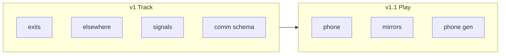

# 21 — Cross-Scene Awareness

Cross-scene interaction (door knock, phone, speakerphone) is a **core product promise**. v1 **tracks** signals and supports **emergent** responses (no required knock reply); v1.1 adds **phone play** and explicit answer/generation affordances.

## 1. Phasing

## 2. v1 — track and surface (CC-1–CC-7)

| ID | Requirement |
|----|-------------|
| CC-1 | `exits[]` on each scene: exitId, label, targetSceneId, kind (`door` \| `path` \| `portal`). Optional: `travelSteps` (1–3), `direction` (8-way compass) for mini-map distance/layout ([14-web-ui.md](14-web-ui.md) UI-MAP-D3–D4). |
| CC-2 | `CrossSceneSignal`: knock \| ring \| buzz; status pending \| acknowledged \| expired; durable. |
| CC-3 | Elsewhere roster includes `presentSceneId`. |
| CC-4 | `activeChannels[]` shape reserved; empty in v1. |
| CC-5 | Message `meta.communication` supports `phone`; UI/tools disabled until v1.1. |
| CC-6 | Observer digest lists pending signals and channel summary. |
| CC-7 | `canPerceive` extensible; v1 implements public, whisper, DM, narrator only. |

### v1 operator affordances

- "Knock on [exit]" → `CrossSceneSignal` (`pending`)
- Target scene banner: e.g. "Someone knocks"
- Operator MAY **dismiss** or **expire** signal without story progression
- Hearers MAY **ignore** (signal stays `pending`)
- Progression is **emergent** — not a mandatory pipeline:
  - Cast MAY speak via normal orchestration when operator drives the scene
  - Location tools MAY set exit `doorState` (`closed`, `unlocked`, `open`, `broken`) or fixture door state ([03-locations-and-presence.md](03-locations-and-presence.md))
  - Forced entry: break door → explicit tool/Observer action + `scene_join` / presence — no silent retcon
- No auto-generation on knock create (CC-11a)
- No primary UI button that forces NPC reply on knock (v1.1 phone adds explicit answer flows)

API: [12-api-sketch.md](12-api-sketch.md) spatial-graph and signals routes.

### v1 emergent knock requirements (CC-11a–CC-11d)

| ID | Requirement |
|----|-------------|
| CC-11a | Creating a knock MUST NOT enqueue `GenerationJob` by itself |
| CC-11b | Acknowledging, dismissing, or expiring a signal MUST NOT imply an NPC spoke |
| CC-11c | Door/exit state changes MUST use location tools or Observer world edits (OBS-2); breaking in MUST be explicit |
| CC-11d | Golden path verifies signal + banner persistence, not mandatory NPC reply |

## 3. v1.1 — implement play (CC-8–CC-13)

| ID | Requirement |
|----|-------------|
| CC-8 | **Handset (default):** call participants hear both sides; present bystanders hear **one side** only (local `speakerSceneId`) per C-8, C-9. |
| CC-9 | **Speakerphone:** optional **per endpoint**; when on at a scene, present bystanders there hear both sides; other end unaffected per C-10, C-11. |
| CC-10 | Mirror stubs on remote transcript with `mirrorOf` ref; mirrors obey same perception rules ([04-communication.md](04-communication.md) §4). |
| CC-11 | Operator-initiated knock/phone **answer** MAY enqueue generation or join/channel (not automatic on signal create). |
| CC-12 | AO-2 `phone_target` and `knock_answered` triggers enabled for explicit answer actions. |
| CC-13 | Persona compose: phone + **per-scene** speakerphone toggle. |

## 4. Perception (v1)

`canPerceive(viewer, message)` MUST handle:

| scope | v1 |
|-------|-----|
| `public` | Present at scene |
| `whisper` | participants + speaker |
| `dm` | participants |
| `narrator` | Present at scene |
| `phone` | Parse only; exclude until v1.1; then C-4–C-11 / CC-8–CC-9 |

Messages with `channelKind=meta` MUST return false for all cast viewers.

## 5. Narrator scope

Added in [04-communication.md](04-communication.md): omniscient description at scene, not meta channel.

## 6. Explicit v1 non-goals

- Live phone conversation
- Mirror append to remote scenes
- Speakerphone
- Auto-generation when knock is created
- Required knock response pipeline

## 7. Requirements summary

| ID | Phase |
|----|-------|
| CC-1–CC-7, CC-11a–CC-11d | v1 |
| CC-8–CC-13 | v1.1 |

## Related documents

- [04-communication.md](04-communication.md)
- [03-locations-and-presence.md](03-locations-and-presence.md)
- [11-data-model.md](11-data-model.md)
- [17-acceptance-criteria.md](17-acceptance-criteria.md)
