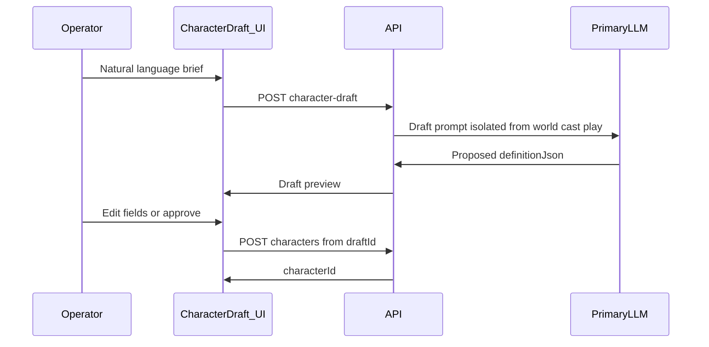

# 24 — Character Authoring

AI-guided creation of cast members: operator describes a character in natural language; the primary LLM drafts `definitionJson`; the operator approves before the record is persisted.

Greenfield flow — not SillyTavern PNG cards ([appendix-provenance.md](appendix-provenance.md)).

## 1. Scope and phases

| Phase | What ships |
|-------|------------|
| **v1 spec** | Normative IDs (CHAR-1–CHAR-6), API sketch, `definitionJson` shape |
| **v1 runtime** | Demo world pre-seeded cast; no draft UI required for golden path |
| **Phase 3** | UI + acceptance tests (CHAR-1–CHAR-5) with world wizard |

## 2. Flow



## 3. Requirements

| ID | Requirement |
|----|-------------|
| CHAR-1 | Draft generation uses **meta/draft channel** — not scene transcript ([14-web-ui.md](14-web-ui.md) UI-CHAR-1) |
| CHAR-2 | Draft MUST NOT add character to world membership until operator approves |
| CHAR-3 | Approved create uses `character_create` / REST equivalent — not `fs_write` ([08-real-world-capabilities.md](08-real-world-capabilities.md) RW-5) |
| CHAR-4 | Draft LLM call acquires GpuResourceQueue lease; visible in queue strip |
| CHAR-5 | Operator MAY edit fields before approve; streaming completion MUST NOT auto-persist |
| CHAR-6 | Dedicated preview panel (recommended); MAY reuse approval drawer pattern but lighter than filesystem approvals |

Cast generation in a scene MUST NOT create `Character` rows ([05-tool-calling.md](05-tool-calling.md) §7.2).

## 4. definitionJson shape

Persisted in `Character.definitionJson` ([11-data-model.md](11-data-model.md) §3.3):

```json
{
  "persona": "Display-facing personality and voice",
  "instructions": "Behavioral constraints for the agent",
  "focusTags": ["optional", "tags"],
  "speechWeight": 0.5,
  "modelProfile": "qwen3.6-35b-a3b"
}
```

| Field | Required | Default |
|-------|----------|---------|
| `persona` | Yes | — |
| `instructions` | Yes | — |
| `focusTags` | No | `[]` |
| `speechWeight` | No | `0.5` |
| `modelProfile` | No | World `defaultModelProfile` |
| `webToolsAccess` | No | `off` when unset and no role default — `off` \| `ask` \| `allow` ([06-web-tools.md](06-web-tools.md) §5). Worlds may set `defaultWebToolsAccessBySceneRole` (e.g. demo: `cto` and `director` → `ask`). New characters from the draft UI default to `ask`. |

## 5. Draft entity (implementation)

Implementations SHOULD store in-progress drafts separately from `Character`:

| Field | Description |
|-------|-------------|
| `draftId` | Stable id |
| `definitionJson` | Proposed payload |
| `operatorBrief` | Original natural-language input |
| `status` | `drafting` \| `ready` \| `approved` \| `discarded` |
| `createdAt` | ISO timestamp |

## 6. API

See [12-api-sketch.md](12-api-sketch.md) §14.

| Method | Path | Description |
|--------|------|-------------|
| POST | `/characters/draft` | Body `{ "brief": "..." }` → starts draft generation |
| GET | `/characters/draft/{draftId}` | Poll draft status + proposed `definitionJson` |
| POST | `/characters` | Body `{ "draftId", "definitionJson?" }` — create on approve; optional field overrides |
| DELETE | `/characters/draft/{draftId}` | Discard |

Adding to a world: `POST /worlds/{worldId}/members` with `{ "characterId" }` after create.

## 7. UI entry points

| Surface | Use |
|---------|-----|
| Observer Studio | Studio-side "Create character from description" |
| World settings | Same component when editing cast |
| Phase 3 wizard step 3 | Embed CharacterDraft for two NPCs + Observer setup |

One shared component; two entry points ([14-web-ui.md](14-web-ui.md) UI-CHAR-2).

## 8. Acceptance

Phase 3 gate: [17-acceptance-criteria.md](17-acceptance-criteria.md) §5.

## Related documents

- [01-world-model.md](01-world-model.md)
- [05-tool-calling.md](05-tool-calling.md)
- [11-data-model.md](11-data-model.md)
- [12-api-sketch.md](12-api-sketch.md)
- [14-web-ui.md](14-web-ui.md)
- [20-product-principles.md](20-product-principles.md)
