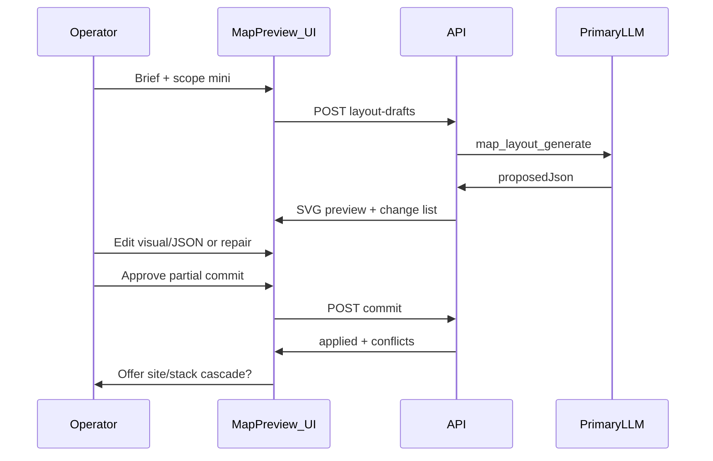
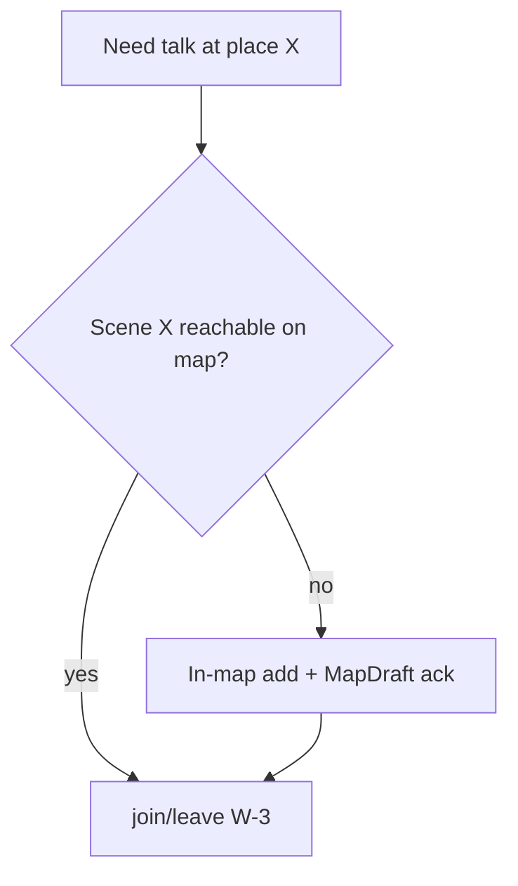

# 25 — Map Authoring

LLM-assisted layout authoring with operator review: **MapDraft**, Observer tools, **evolving geography** (in-map growth), and **play-time movement** that respects the map. Companion to [18-location-maps.md](18-location-maps.md) (Phase 6 canvases, MAP-GEN-*) and [14-web-ui.md](14-web-ui.md) (UI-MAP-P*).

## 1. Scope and phases

| Phase | What ships |
|-------|------------|
| **v1** | Deterministic `GET spatial-graph` from exits; demo fixture layout; no MapDraft UI |
| **v1.1** | `mapShape`, structure envelopes, `mapLevel` data ([14-web-ui.md](14-web-ui.md) §21.2–§21.3) |
| **Phase 3** | **Architect World** — define initial graph, grow scenes/exits until geography lock; CharacterDraft; no LLM MapDraft |
| **Phase 6** | MapDraft UI/API, layout tools, World builder (required mini MapDraft), **Enhance layout**, WorldMapCanvas |

Normative layout JSON schema: [`packages/schemas/map-layout-v1.schema.json`](../packages/schemas/map-layout-v1.schema.json).

## 2. MapDraft flow

**Cascade:** First draft is `scope: mini`. After commit, UI **offers** optional follow-up drafts for `site`, then `stack` (floor detail bundled in stack per [18-location-maps.md](18-location-maps.md) §12.1). Declining an offer skips **this chain only**; a later mini regen MAY offer site/stack again.

**Entry points:** World builder step 2 (required mini), world settings **Enhance layout**, Observer Studio (regen / patch / add location). Observer-initiated tools land in the **same** preview panel; operator still acks (MAP-7).

## 3. Requirements — MapDraft and ack

| ID | Requirement |
|----|-------------|
| MAP-AUTH-1 | Layout generation uses **draft channel** — not scene cast transcript ([14-web-ui.md](14-web-ui.md) UI-MAP-P5) |
| MAP-AUTH-2 | Layout MUST NOT persist until operator **commit** ack (MAP-7, TC-MAP-2) |
| MAP-AUTH-3 | Draft LLM call acquires GpuResourceQueue lease; visible in queue strip (CHAR-4 pattern) |
| MAP-AUTH-4 | Poll `GET layout-drafts/{id}` until `status: ready`; no partial diagram from streaming JSON |
| MAP-AUTH-5 | At most **one** active (non-discarded) layout draft per `worldId` |
| MAP-AUTH-EDIT-1 | Operator MAY edit via **visual tab** (default) and **JSON tab**; server re-validates on change |
| MAP-AUTH-SYNC-1 | Commit disabled until JSON and visual tabs are **reconciled** (explicit sync action) |
| MAP-AUTH-COMMIT-1 | Commit applies **non-conflicting** portions only; returns `conflicts[]` |
| MAP-AUTH-REPAIR-1 | Unlimited operator repair; modes `fix-validation` \| `describe-change`; bumps `revision` on same `layoutDraftId` |
| MAP-AUTH-PREVIEW-1 | Preview/diff render **SVG from JSON**; reference PNGs are design-only ([guides/reference-images/README.md](guides/reference-images/README.md)) |
| MAP-AUTH-PATCH-1 | Observer `map_layout_patch`: auto-apply **safe** deltas; conflicts open full draft panel |
| APR-MAP-1 | Map ack in **dedicated preview panel only** — never FS/web unified queue ([07-approvals.md](07-approvals.md)) |

Cast scene generation MUST NOT create scenes or layout ([05-tool-calling.md](05-tool-calling.md) §7.2).

## 4. Evolving geography

Worlds **grow over time** within the existing map (structure/site). Places persist; the graph is not frozen after first play.

| ID | Requirement |
|----|-------------|
| MAP-AUTH-LOCK-1 | `layoutDesignMode: true` until operator **Lock geography** OR **first play** (persona message), whichever is first |
| MAP-AUTH-LOCK-2 | When `layoutDesignMode: false`, scene **removal** is forbidden for cast/Observer; operator explicit removal only during **initial design** (World builder / pre-lock Architect World) |
| MAP-AUTH-LOCK-3 | Lock ends casual deletion and bulk reckless regen — **not** expansion |
| MAP-GROW-1 | Observer / location admin MAY add scenes **within** existing `structureId` / site bounds + connecting exits when operator directs (OBS-2) |
| MAP-GROW-2 | In-map add MUST connect new scenes via at least one **exit** from a reachable scene; no orphan nodes |
| MAP-GROW-3 | Layout-affecting adds MUST use MapDraft or `map_layout_patch` → preview + operator ack |

**Enhance layout (Phase 6):** Optional `mini` → `site` → `stack` cascade on **any** existing world; never required for worlds already in play.

## 5. Play-time movement

Characters and persona **move** via presence ([03-locations-and-presence.md](03-locations-and-presence.md)): `join` / `leave` / exits — **one scene per world** (W-3). They MUST NOT teleport or invent rooms.

| ID | Requirement |
|----|-------------|
| MAP-MOVE-1 | Generation scheduled only for characters **present** at `sceneId` ([13-agent-orchestration.md](13-agent-orchestration.md)) |
| MAP-MOVE-2 | Cast MUST NOT create `sceneId`, exits, or layout JSON |
| MAP-MOVE-3 | If story implies a **missing** destination, system MUST NOT silently create a scene; surface add-location flow ([14-web-ui.md](14-web-ui.md) UI-MAP-P14) → in-map add → ack → then join |
| MAP-MOVE-4 | Persona movement uses same join rules (`__persona__`); comms per [04-communication.md](04-communication.md) |

Narrative presence `auto` / `llm` ([03-locations-and-presence.md](03-locations-and-presence.md) §7) MAY apply join/leave **only** when the target scene already exists. Scene **create** in auto mode is forbidden.

**Recommended default:** `detect` — suggest "Add [Garden] to map?" when destination missing; no join until ack.

## 6. Partial commit and conflicts

| `conflictKind` | Severity | Behavior |
|----------------|----------|----------|
| `fixture_drift` | soft | Warn in change list; apply unless other hard conflicts |
| `exit_target_invalid` | hard | Block until resolved |
| `scene_remove_forbidden` | hard | Reject removal post-lock; validator error on draft |
| `hull_violation` | hard | Room outside structure envelope |
| `duplicate_exitId` | hard | Reject |

| ID | Requirement |
|----|-------------|
| MAP-AUTH-CONFLICT-1 | Operator MAY resolve per conflict: `accept` \| `revert` \| `skip`; then PATCH draft and recommit without new LLM |
| MAP-AUTH-STATIC-1 | Existing `sceneId` MUST remain addressable for diary and export (MP-11) |

## 7. Draft entity

Implementations SHOULD store in `layout_drafts` (see [11-data-model.md](11-data-model.md) non-normative note):

| Field | Description |
|-------|-------------|
| `layoutDraftId` | Stable id |
| `worldId` | Parent world |
| `scope` | `mini` \| `site` \| `stack` \| `floor` |
| `parentDraftId` | Optional — cascade linkage |
| `intent` | `create` \| `expand` \| `regen` |
| `operatorBrief` | Original NL input |
| `proposedJson` | Latest validated layout |
| `revision` | Integer ≥ 1 |
| `status` | `drafting` \| `ready` \| `committed` \| `discarded` |
| `conflicts[]` | After partial commit |

## 8. API

See [12-api-sketch.md](12-api-sketch.md) §6.2.

| Method | Path | Description |
|--------|------|-------------|
| POST | `/worlds/{worldId}/layout-drafts` | Start draft `{ brief, scope, parentDraftId?, intent? }` |
| GET | `/worlds/{worldId}/layout-drafts/{draftId}` | Status, `proposedJson`, `changeList[]`, `previewSvgUrl` |
| GET | `/worlds/{worldId}/layout-drafts/{draftId}/preview.svg` | SVG render of `proposedJson` |
| PATCH | `/worlds/{worldId}/layout-drafts/{draftId}` | Operator edits → re-validate |
| POST | `.../repair` | `{ mode, feedback?, validationErrors? }` |
| POST | `.../sync` | `{ source: json \| visual }` |
| POST | `.../resolve-conflict` | `{ conflictId, action }` |
| POST | `.../commit` | Partial apply → `{ applied, conflicts }` |
| DELETE | `.../layout-drafts/{draftId}` | Discard |

## 9. UI

Normative preview behavior: [14-web-ui.md](14-web-ui.md) §21.5 (UI-MAP-P1–P14). Wireframe: [guides/web-ui-wireframes.md](guides/web-ui-wireframes.md) WF-16.

When `requireApprovalForMapOverwrite` is on: **Approve** then **Confirm overwrite** in map panel (UI-MAP-P12).

## 10. Acceptance

| ID | Test |
|----|------|
| MAP-GROW-ACC-1 | Post-lock Observer in-map add + ack → new scene on `spatial-graph`; existing scenes untouched |
| MAP-MOVE-ACC-1 | Alice Hall / Bob Kitchen: Alice generates only at Hall until join Kitchen via exit |
| MAP-MOVE-ACC-2 | Story implies new Garden: no scene until in-map add + ack; then join legal |
| MAP-MOVE-ACC-3 | New room inside structure envelope; exit from existing room on mini-map |
| MAP-GEN-ACC-1–4 | [17-acceptance-criteria.md](17-acceptance-criteria.md) §6; fixtures under `tests/fixtures/map-layouts/` |

## 11. Non-normative — repair merge

**fix-validation:** Send validator errors + current `proposedJson` + `revision` to LLM; overwrite `proposedJson` on success.

**describe-change:** Amendment-style prompt — apply **only** feedback to existing JSON; append feedback lines to `operatorBriefHistory[]` for audit; working brief MAY summarize latest intent.

## 12. Non-normative — safe patch allowlist

| Category | Auto-apply via `map_layout_patch` |
|----------|-----------------------------------|
| Labels | `levelLabel`, exit `label`, structure `displayName` |
| Geometry | scene `layout`, `exitAnchor`, structure `boundary` vertices (`fixture_drift` = warn) |
| Topology add | new exit, new scene **within envelope** — preview if conflicts |
| Topology remove | scene remove post-lock — **reject**; exit remove — draft panel |

## Related documents

- [18-location-maps.md](18-location-maps.md)
- [05-tool-calling.md](05-tool-calling.md) §7.6
- [01-world-model.md](01-world-model.md)
- [03-locations-and-presence.md](03-locations-and-presence.md)
- [09-roles-and-privilege.md](09-roles-and-privilege.md)
- [12-api-sketch.md](12-api-sketch.md)
- [14-web-ui.md](14-web-ui.md)
- [17-acceptance-criteria.md](17-acceptance-criteria.md)
- [20-product-principles.md](20-product-principles.md)
