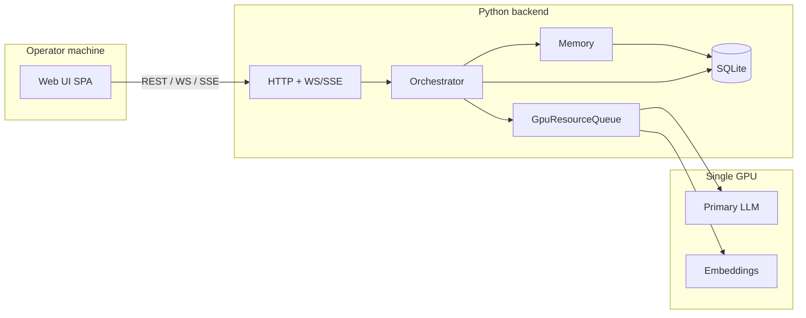

# 26 — System Architecture

Implementation stack for Altrasia: **Python-first, highly extensible backend** and a **first-class professional Web UI** as a separate frontend. Behavioral requirements remain in specs `00`–`25`; this document defines *how* the system is built without changing product semantics.

## 1. Stack summary

| Layer | Choice | Normative? |
|-------|--------|------------|
| **Backend** | Python 3.11+ — domain, memory, orchestration, inference adapters, tools, persistence, HTTP/WS API | **Yes** (SYS-1) |
| **Web UI** | Dedicated frontend app — operator console per [14-web-ui.md](14-web-ui.md) | **Yes** (SYS-2) |
| **Contract** | REST + WebSocket/SSE per [12-api-sketch.md](12-api-sketch.md) | **Yes** (SYS-3) |
| **Database** | SQLite per [11-data-model.md](11-data-model.md) | **Yes** (DM-1, DM-9) |
| **Frontend framework** | Modern SPA (e.g. React + TypeScript) — **recommended**, not mandated | Informative |

The backend and Web UI MUST be separable processes in development and production: the UI is not server-rendered templates inside the Python process (SYS-4).

## 2. Python-first backend

### 2.1 Rationale

| Factor | Why Python |
|--------|------------|
| Agent runtime | Tool loops, orchestration, and LLM adapters align with the Python ecosystem |
| Extensibility | Entry points, importable plugins, and clear port boundaries suit operator-local extension |
| Operability | Single-machine studio: one `altrasia` (or `uv run`) process for API + scheduler + GPU queue |
| Spec stability | [12-api-sketch.md](12-api-sketch.md) is language-agnostic; clients never depend on Python types |

### 2.2 Requirements

| ID | Requirement |
|----|-------------|
| SYS-1 | All **core** world logic (world model, memory, presence, comms, orchestration, tool invoke, persistence) MUST be implemented in **Python**. |
| SYS-5 | HTTP API, WebSocket/SSE, and background scheduler MUST run in the same backend deployment (single operator process for v1). |
| SYS-6 | External callers (Web UI, CLI, future automation) MUST use only the public API — no direct import of internal modules from outside the backend package. |
| SYS-7 | Durable storage MUST go through **`PersistencePort`** ([11-data-model.md](11-data-model.md) DM-8–DM-10); orchestration and memory code MUST NOT embed ad hoc SQL. |

### 2.3 Backend module layout (v1 target)

```
backend/
  altrasia/
    domain/          # worlds, scenes, characters, presence rules
    memory/          # loci, diary, recall, MP-1 enforcement
    perception/      # canPerceive, scope filtering
    orchestrator/    # Agent orchestrator, GenerationJob (AO-*)
    inference/       # GpuResourceQueue, llama.cpp adapter (INF-*)
    tools/           # Tool registry + invoke loop (TC-*)
    persistence/     # PersistencePort + SQLite migrations
    api/             # FastAPI (or equivalent) routes + WS/SSE
  pyproject.toml
```

Package names MAY differ; boundaries MUST match the rows above so specs `01`–`13` map to one owner module each.

### 2.4 Extensibility (backend)

Extensibility is a **first-class** backend concern, not an afterthought.

| Mechanism | v1 | Later |
|-----------|----|-------|
| **`PersistencePort`** | SQLite implementation; swappable for tests | Alternate stores only via new port impl |
| **Tool registry** | Fixed core set ([05-tool-calling.md](05-tool-calling.md)) | Plugins register tools ([15-plugin-platform.md](15-plugin-platform.md)) |
| **Inference adapters** | llama.cpp profile for Qwen3.6-35B-A3B | Additional profiles under `inference/` |
| **Hooks** | Not loaded in v1 | `onGenerationStart`, `onToolInvoke`, etc. (PL-2) |
| **Plugin discovery** | N/A | `~/.altrasia/plugins/`, `./plugins/` (PL-1) |

| ID | Requirement |
|----|-------------|
| SYS-8 | Tool registration MUST use a single registry API; core and plugin tools MUST share approval and MP-1 gates ([05](05-tool-calling.md), [07](07-approvals.md)). |
| SYS-9 | Plugin hooks (when enabled) MUST receive world-scoped context only; hooks MUST NOT bypass `PersistencePort` or cross-character mind pools (PL-*, MP-1). |
| SYS-10 | Optional capabilities (web-tools, FS agent, ComfyUI) SHOULD ship as **plugins or adapter modules** behind the same ports, not forks of orchestration. |

Illustrative plugin manifest (informative):

```python
# altrasia_plugin_example — not normative
from dataclasses import dataclass

@dataclass
class PluginManifest:
    id: str
    version: str
    hooks: list[str]
    tools: list[str]
    permissions: list[str]
```

## 3. Professional Web UI

### 3.1 Product bar

The Web UI is a **first-class product surface**, not a thin admin panel on the API.

| ID | Requirement |
|----|-------------|
| SYS-2 | v1 MUST ship a **professional operator console** meeting [14-web-ui.md](14-web-ui.md) (v1 subset §0): persona-first play, streaming transcript, Observer Studio, spatial mini-map, queue honesty. |
| SYS-11 | Visual and interaction quality MUST follow [14-web-ui.md](14-web-ui.md) Appendix A (design system) and Appendix B (accessibility) when the Web UI exists. |
| SYS-12 | The Web UI MUST NOT replicate SillyTavern layouts, preset matrices, or character-card PNG workflows ([20-product-principles.md](20-product-principles.md) §10). |

Normative UI requirements use the `UI-*` prefix in [14-web-ui.md](14-web-ui.md); `SYS-*` here only binds delivery of that console as the primary client.

### 3.2 Frontend layout (v1 target)

```
web/
  src/               # SPA source (components per §19 inventory in 14)
  public/
  package.json       # or pnpm workspace root
```

| ID | Requirement |
|----|-------------|
| SYS-4 | Web UI MUST be a **standalone frontend** built and served separately from the Python process (dev: proxy to API; prod: static assets + API origin). |
| SYS-13 | Web UI MUST consume **only** `/api/v1` and documented realtime channels ([12-api-sketch.md](12-api-sketch.md)); no duplicate domain rules in the browser. |
| SYS-14 | Token streaming, queue strip, and generation events MUST use the same event contract as the API sketch (STR-*, `generation.*`, `queue.updated`). |

Recommended (informative): TypeScript, React (or equivalent component model), Vite (or equivalent bundler), design tokens from [guides/design-tokens.yaml](guides/design-tokens.yaml).

## 4. Process and deployment (v1)



| Process | Role |
|---------|------|
| `altrasia serve` (name illustrative) | API + orchestrator + scheduler + static UI proxy or UI URL hint |
| Browser | Operator console; MAY be closed in v1 without global heartbeat ([08](08-real-world-capabilities.md) §8) |

CLI and integration tests MAY call the same Python services in-process without HTTP ([IMPLEMENTATION-CHECKLIST.md](IMPLEMENTATION-CHECKLIST.md) Sprint 1).

## 5. Shared artifacts (language-neutral)

These paths stay valid regardless of backend language:

| Artifact | Path | Owner |
|----------|------|--------|
| Map layout JSON Schema | `packages/schemas/map-layout-v1.schema.json` | Contract between API, UI, and LLM tools |
| Demo world fixture | `tests/fixtures/demo-world/` | Seed data for golden path |
| Model profile | `config/models/qwen3.6-35b-a3b.yaml` | Inference adapter config |

Python validates and emits JSON that conforms to shared schemas; the Web UI validates responses the same way.

## 6. Non-goals (architecture)

- **Not** a TypeScript monorepo for core domain logic (supersedes earlier README sketch).
- **Not** embedding the operator UI in Jinja/FastAPI templates for v1.
- **Not** requiring plugins in v1 ([15-plugin-platform.md](15-plugin-platform.md) §6).
- **Not** multi-tenant or horizontally scaled API in v1.

## 7. Traceability

| Topic | Spec |
|-------|------|
| API surface | [12-api-sketch.md](12-api-sketch.md) |
| Web UI behavior | [14-web-ui.md](14-web-ui.md) |
| Plugins | [15-plugin-platform.md](15-plugin-platform.md) |
| Persistence | [11-data-model.md](11-data-model.md) DM-8–DM-10 |
| Acceptance | [17-acceptance-criteria.md](17-acceptance-criteria.md) |
| Build order | [IMPLEMENTATION-CHECKLIST.md](IMPLEMENTATION-CHECKLIST.md), root [README.md](../README.md) |

## Related documents

- [README.md](README.md) — spec index
- [ROADMAP.md](ROADMAP.md) — milestones
- [REQUIREMENTS-INDEX.md](REQUIREMENTS-INDEX.md) — `SYS-*` prefix
