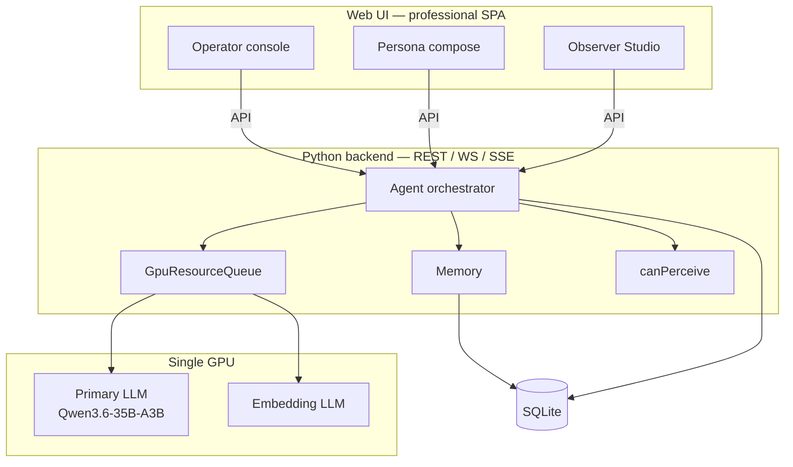

# Altrasia Design Specification

## Vision

Altrasia is a **persistent stage for AI characters—memory-grounded, spatial, operator-run.** The same world supports narrative play and **in-world work** (commissions, deliberation at locations, evidence grounded in scenes) without abandoning presence or diegesis.

In practice:

- You play primarily as the **persona** across **scenes** with tangible presence, exits, and scoped communication.
- **Characters** retain structured memory (mind/world pools, diary) without cross-leaking private knowledge; research commissions default to the assignee's **mind pool** so they can answer later in any scene ([23-in-world-work.md](23-in-world-work.md)).
- The **Observer** is your studio side-channel and world-control surface (narrate, intervene, tune)—not the main play voice.
- A single **GPU** runs primary chat (Qwen3.6-35B-A3B via llama.cpp) and embeddings under a unified **GpuResourceQueue**.
- Optional tools (web, filesystem, schedules) and future maps/ComfyUI follow the same memory and queue rules.

This specification describes *what* the system MUST do. Normative specs are `00`–`25`. **Implementation stack:** Python-first extensible backend + professional Web UI frontend — [26-system-architecture.md](26-system-architecture.md). Persistence: SQLite ([11-data-model.md](11-data-model.md)). Operator console: [14-web-ui.md](14-web-ui.md).

**Repository status:** design specifications complete (`00`–`26`); **implementation Alpha** (v1 + v1.1 + Phase 3–6 wedge in tree, including reflection AO-8 and idle social/banter). Milestones: [ROADMAP.md](ROADMAP.md). Traceability: [IMPLEMENTATION-CHECKLIST.md](IMPLEMENTATION-CHECKLIST.md). Remaining normative depth: [SPEC-GAPS.md](SPEC-GAPS.md). Personas: [personas.md](personas.md). Target first session: [guides/first-run-experience.md](guides/first-run-experience.md).

## Reading order

| # | Document | Topics |
|---|----------|--------|
| 0 | [00-inference-runtime.md](00-inference-runtime.md) | GpuResourceQueue, streaming, model profiles, embeddings |
| 1 | [01-world-model.md](01-world-model.md) | Worlds, scenes, characters, persona, persistence |
| 2 | [02-memory.md](02-memory.md) | Loci, pools, diary, recall, mandatory recall |
| 3 | [03-locations-and-presence.md](03-locations-and-presence.md) | Presence, fixtures, inventory, scene framing |
| 4 | [04-communication.md](04-communication.md) | Scopes, narrator, phone (v1.1), perception |
| 5 | [05-tool-calling.md](05-tool-calling.md) | Registry, invoke loop, tool categories |
| 6 | [06-web-tools.md](06-web-tools.md) | Search, fetch, plugin vs provider paths |
| 7 | [07-approvals.md](07-approvals.md) | Approval queue, states, exemptions |
| 8 | [08-real-world-capabilities.md](08-real-world-capabilities.md) | Filesystem agent, schedules, character admin |
| 9 | [09-roles-and-privilege.md](09-roles-and-privilege.md) | Observer, admins, persona, memory discipline |
| 10 | [10-prompt-injection.md](10-prompt-injection.md) | Layered prompts and refresh triggers |
| 11 | [11-data-model.md](11-data-model.md) | SQLite entities, events |
| 12 | [12-api-sketch.md](12-api-sketch.md) | REST, WebSocket, SSE |
| 13 | [13-agent-orchestration.md](13-agent-orchestration.md) | Scheduler, fairness, GPU integration |
| 14 | [14-web-ui.md](14-web-ui.md) | Operator console, streaming, Observer Studio; design system (Appendix A), accessibility (Appendix B) |
| 15 | [15-plugin-platform.md](15-plugin-platform.md) | Future plugins |
| 16 | [16-learning.md](16-learning.md) | Output-only storage, stripReasoning |
| 17 | [17-acceptance-criteria.md](17-acceptance-criteria.md) | Test matrix, golden path |
| 18 | [18-location-maps.md](18-location-maps.md) | World map, floor plans, multi-level stack (Phase 6) |
| 19 | [19-comfyui-media.md](19-comfyui-media.md) | Future ComfyUI |
| 20 | [20-product-principles.md](20-product-principles.md) | Wedge, presets, metrics |
| 21 | [21-cross-scene-awareness.md](21-cross-scene-awareness.md) | v1 track / v1.1 phone |
| 22 | [22-output-quality.md](22-output-quality.md) | Convergence, anti-repetition, reasoning hygiene |
| 23 | [23-in-world-work.md](23-in-world-work.md) | Commissions, debate activity, briefing fixtures, commons (post-v1) |
| 24 | [24-character-authoring.md](24-character-authoring.md) | AI draft → approve character creation |
| 25 | [25-map-authoring.md](25-map-authoring.md) | MapDraft, evolving geography, LLM layout + operator ack |
| 26 | [26-system-architecture.md](26-system-architecture.md) | Python-first backend, professional Web UI, repo layout |
| — | [appendix-glossary.md](appendix-glossary.md) | Term definitions |
| — | [appendix-provenance.md](appendix-provenance.md) | SillyTavern source map (non-normative) |
| — | [ROADMAP.md](ROADMAP.md) | Milestones, feature matrix, design vs shipped status |
| — | [personas.md](personas.md) | Operator personas (non-normative) |
| — | [guides/first-run-experience.md](guides/first-run-experience.md) | Target first session (non-normative) |
| — | [guides/web-ui-wireframes.md](guides/web-ui-wireframes.md) | ASCII wireframes for Web UI (non-normative) |
| — | [guides/stitch-handoff.md](guides/stitch-handoff.md) | Stitch Pack A screen list + global prompt (non-normative) |
| — | [guides/design-tokens.yaml](guides/design-tokens.yaml) | Machine-readable tokens from 14 Appendix A |
| — | [guides/reference-images/](guides/reference-images/README.md) | Map layout reference images for UI + LLM generation targets |
| — | [REQUIREMENTS-INDEX.md](REQUIREMENTS-INDEX.md) | Requirement ID → defining document |
| — | [IMPLEMENTATION-CHECKLIST.md](IMPLEMENTATION-CHECKLIST.md) | Sprint 1/2 → golden path → fixtures |

## Architecture overview

Stack detail: [26-system-architecture.md](26-system-architecture.md).

## v1 wedge and non-goals

**v1 wedge:** spatial world — multi-scene, presence, scoped comms, cross-scene tracking (knock signals), persona-first UI. See [20-product-principles.md](20-product-principles.md) and [17-acceptance-criteria.md](17-acceptance-criteria.md).

### In scope (v1)

- Web UI operator console with token streaming
- GpuResourceQueue and reference model Qwen3.6-35B-A3B
- Memory subsystem, mandatory recall, output-only durable storage
- Observer Studio (meta channel) and narrator mode
- Public, whisper, DM; cross-scene exits and emergent knock signals (CC-11a–CC-11d)
- Demo world fixture `demo-spatial-v1` for first session ([tests/fixtures/demo-world/README.md](../tests/fixtures/demo-world/README.md))
- Output quality CI gate OQ-1, OQ-3 ([17-acceptance-criteria.md](17-acceptance-criteria.md) §2b)
- Character authoring **spec + API** ([24-character-authoring.md](24-character-authoring.md)); UI tests Phase 3
- **Structured mini-map** — read-only `SpatialGraphMiniMap` from `GET spatial-graph` (exits + layout hints); [14-web-ui.md](14-web-ui.md) §21.1, [12-api-sketch.md](12-api-sketch.md) §6

### Map terminology (avoid mis-scoping)

| Term | Release gate | Alpha wedge |
|------|--------------|-------------|
| **Structured mini-map** | Yes — schematic graph from exits; no LLM layout | Done — [14-web-ui.md](14-web-ui.md) §21.1 |
| **MapDraft / layout drafts** | No (Phase 6 normative target) | **Yes** — API + `MapDraftPanel`; full MAP-ACC UI depth open ([SPEC-GAPS.md](SPEC-GAPS.md)) |
| **Location maps** (WorldMapCanvas, levels) | No | **Partial** — `map-artifacts`, 3D explorer, LevelStack/FloorPlan components; MAP-ACC-1–6 not fully gated ([18-location-maps.md](18-location-maps.md)) |

v1.1 adds footprint shapes and building envelopes on the same mini-map ([14-web-ui.md](14-web-ui.md) §21.2–§21.3); Phase 6 site/stack authoring extends beyond that wedge.

### v1.1 (Phase 2.5)

- Phone, speakerphone, mirror stubs ([21-cross-scene-awareness.md](21-cross-scene-awareness.md) CC-8–CC-13)
- Global server heartbeat ([08-real-world-capabilities.md](08-real-world-capabilities.md) §8)
- World package export + import ([11-data-model.md](11-data-model.md) DM-4)
- Explicit knock/phone answer flows (CC-11, CC-12)

### Deferred for release gate; Alpha wedge status

Capabilities below were **out of scope for the v1 release gate** but may exist as **Alpha wedge** (mock-default, partial UI, or off-by-default). Normative depth gaps: [SPEC-GAPS.md](SPEC-GAPS.md). Checklist: [IMPLEMENTATION-CHECKLIST.md](IMPLEMENTATION-CHECKLIST.md).

| Capability | Release gate | Alpha wedge |
|------------|--------------|-------------|
| Phone play, global heartbeat, world package | **v1.1 done** | Done |
| Commissions, debate, briefing | Post-v1 gate | Runtime + UI wedge |
| MapDraft, map artifacts, geography lock | Post-v1 gate | API + UI wedge |
| FS / web-tools / scheduler | Post-v1 gate | Wedge (mock/stub defaults) |
| Reflection (AO-8), idle social/banter | Post-v1 gate | Wedge (`reflectionEnabled` off by default) |
| World commons (MP-22) | Post-v1 gate | API only; no Web UI panel |
| ComfyUI portraits | Post-v1 gate | Stub + portrait endpoint |
| Plugins | Post-v1 gate | Loader + reference plugin; off by default |
| Vector RAG as primary episodic memory | Not planned | Diary + mandatory recall canonical |
| Multi-tenant accounts | Not planned | — |
| SillyTavern-compatible UI / character card PNG | Not planned | — |
| Required plugins | Not planned | Optional ([15-plugin-platform.md](15-plugin-platform.md)) |

## Normative language

Requirements use [RFC 2119](https://www.rfc-editor.org/rfc/rfc2119) keywords:

- **MUST** / **MUST NOT** — absolute requirement.
- **SHOULD** / **SHOULD NOT** — recommended; deviation needs documented rationale.
- **MAY** — optional.

Rationale and historical notes appear in blockquotes or *ST note* sidebars where helpful.

## Configuration

Reference model profile: [`config/models/qwen3.6-35b-a3b.yaml`](../config/models/qwen3.6-35b-a3b.yaml)
