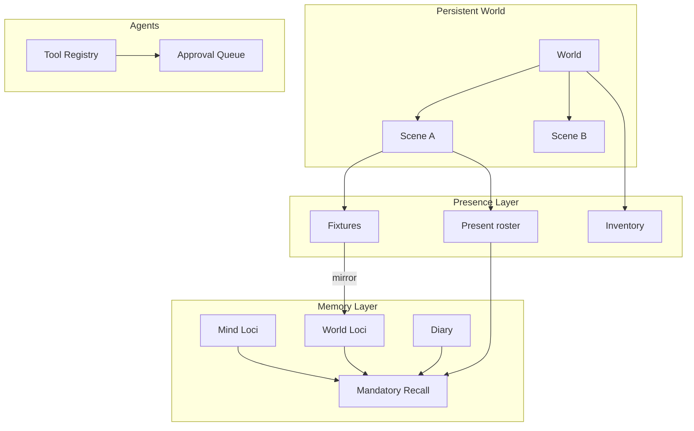

# WorldEngine Design Specification

## Vision

WorldEngine is a **persistent world** in which:

- You interact with **characters** across multiple **scenes** (locations) that each maintain their own transcript and cast presence.
- Characters retain **memory** across scenes (private mind, shared world facts, episodic diary) without leaking private knowledge to other agents.
- Selected characters can invoke **tools**—memory recall, scene manipulation, web access, filesystem changes, scheduled jobs—under explicit **approval** and **role** constraints.
- The **operator** (human persona) participates in scenes with the same presence and communication rules as the cast, plus elevated privileges where configured.

This specification describes *what* the system MUST do. It does not prescribe a specific UI framework, LLM vendor, or storage backend.

## Reading order

| # | Document | Topics |
|---|----------|--------|
| 1 | [01-world-model.md](01-world-model.md) | Worlds, scenes, characters, persona, persistence |
| 2 | [02-memory-palace.md](02-memory-palace.md) | Loci, pools, diary, recall, mandatory recall |
| 3 | [03-locations-and-presence.md](03-locations-and-presence.md) | Presence, fixtures, inventory, scene framing |
| 4 | [04-communication.md](04-communication.md) | Scopes, phone, mirrors, perception |
| 5 | [05-tool-calling.md](05-tool-calling.md) | Registry, invoke loop, tool categories |
| 6 | [06-web-tools.md](06-web-tools.md) | Search, fetch, plugin vs provider paths |
| 7 | [07-approvals.md](07-approvals.md) | Approval queue, states, exemptions |
| 8 | [08-real-world-capabilities.md](08-real-world-capabilities.md) | Filesystem agent, schedules, character admin |
| 9 | [09-roles-and-privilege.md](09-roles-and-privilege.md) | Observer, admins, persona rules |
| 10 | [10-prompt-injection.md](10-prompt-injection.md) | Layered prompts and refresh triggers |
| — | [appendix-glossary.md](appendix-glossary.md) | Term definitions |
| — | [appendix-provenance.md](appendix-provenance.md) | SillyTavern source map (implementers only) |

## Architecture overview

## Non-goals (v1)

The following are **out of scope** for this specification unless added in a future revision:

- Rebuilding a SillyTavern-compatible chat UI, preset matrix, or character card PNG format.
- Image generation, expression sprites, or vector RAG as primary episodic memory (diary is canonical; vectors are a known conflict—see [02-memory-palace.md](02-memory-palace.md)).
- Full REST/OpenAPI definitions (optional future `11-data-model.md` / `12-api-sketch.md`).
- Frontend wireframes or component libraries.

## Normative language

Requirements use [RFC 2119](https://www.rfc-editor.org/rfc/rfc2119) keywords:

- **MUST** / **MUST NOT** — absolute requirement.
- **SHOULD** / **SHOULD NOT** — recommended; deviation needs documented rationale.
- **MAY** — optional.

Rationale and historical notes appear in blockquotes or *ST note* sidebars where helpful.
