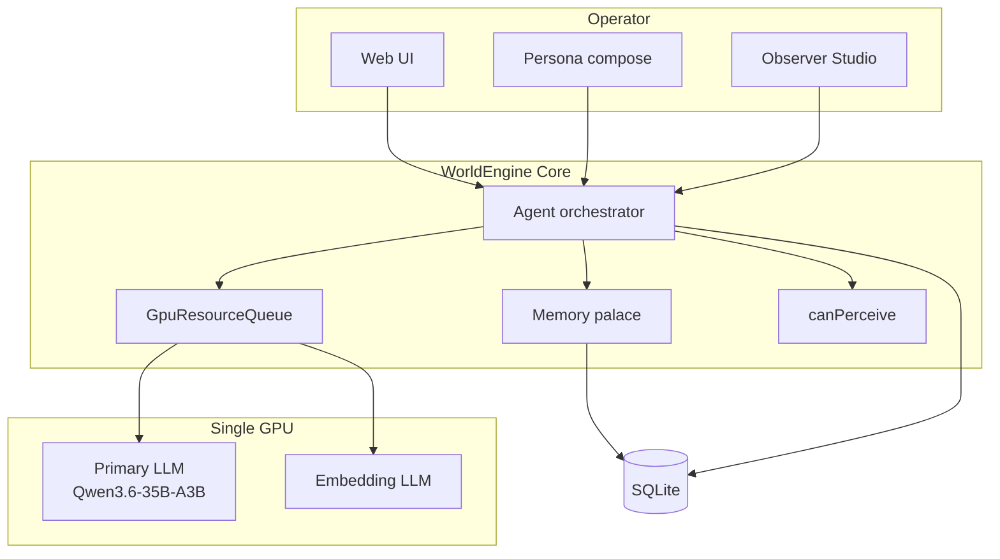

# WorldEngine Design Specification

## Vision

WorldEngine is a **persistent stage for AI characters—memory-grounded, spatial, operator-run.**

In practice:

- You play primarily as the **persona** across **scenes** with tangible presence, exits, and scoped communication.
- **Characters** retain structured memory (mind/world pools, diary) without cross-leaking private knowledge.
- The **Observer** is your studio side-channel and world-control surface (narrate, intervene, tune)—not the main play voice.
- A single **GPU** runs primary chat (Qwen3.6-35B-A3B via llama.cpp) and embeddings under a unified **GpuResourceQueue**.
- Optional tools (web, filesystem, schedules) and future maps/ComfyUI follow the same memory and queue rules.

This specification describes *what* the system MUST do. Implementation uses SQLite, a TypeScript monorepo, and a professional Web UI ([14-web-ui.md](14-web-ui.md)).

## Reading order

| # | Document | Topics |
|---|----------|--------|
| 0 | [00-inference-runtime.md](00-inference-runtime.md) | GpuResourceQueue, streaming, model profiles, embeddings |
| 1 | [01-world-model.md](01-world-model.md) | Worlds, scenes, characters, persona, persistence |
| 2 | [02-memory-palace.md](02-memory-palace.md) | Loci, pools, diary, recall, mandatory recall |
| 3 | [03-locations-and-presence.md](03-locations-and-presence.md) | Presence, fixtures, inventory, scene framing |
| 4 | [04-communication.md](04-communication.md) | Scopes, narrator, phone (v1.1), perception |
| 5 | [05-tool-calling.md](05-tool-calling.md) | Registry, invoke loop, tool categories |
| 6 | [06-web-tools.md](06-web-tools.md) | Search, fetch, plugin vs provider paths |
| 7 | [07-approvals.md](07-approvals.md) | Approval queue, states, exemptions |
| 8 | [08-real-world-capabilities.md](08-real-world-capabilities.md) | Filesystem agent, schedules, character admin |
| 9 | [09-roles-and-privilege.md](09-roles-and-privilege.md) | Observer, admins, persona, memory discipline |
| 10 | [10-prompt-injection.md](10-prompt-injection.md) | Layered prompts and refresh triggers |
| 11 | [11-data-model.md](11-data-model.md) | SQLite entities, events |
| 12 | [12-api-sketch.md](12-api-sketch.md) | REST, WebSocket, SSE |
| 13 | [13-agent-orchestration.md](13-agent-orchestration.md) | Scheduler, fairness, GPU integration |
| 14 | [14-web-ui.md](14-web-ui.md) | Operator console, streaming, Observer Studio |
| 15 | [15-plugin-platform.md](15-plugin-platform.md) | Future plugins |
| 16 | [16-learning.md](16-learning.md) | Output-only storage, stripReasoning |
| 17 | [17-acceptance-criteria.md](17-acceptance-criteria.md) | Test matrix, golden path |
| 18 | [18-location-maps.md](18-location-maps.md) | Future maps |
| 19 | [19-comfyui-media.md](19-comfyui-media.md) | Future ComfyUI |
| 20 | [20-product-principles.md](20-product-principles.md) | Wedge, presets, metrics |
| 21 | [21-cross-scene-awareness.md](21-cross-scene-awareness.md) | v1 track / v1.1 phone |
| — | [appendix-glossary.md](appendix-glossary.md) | Term definitions |
| — | [appendix-provenance.md](appendix-provenance.md) | SillyTavern source map (non-normative) |

## Architecture overview

## v1 wedge and non-goals

**v1 wedge:** spatial world — multi-scene, presence, scoped comms, cross-scene tracking (knock signals), persona-first UI. See [20-product-principles.md](20-product-principles.md) and [17-acceptance-criteria.md](17-acceptance-criteria.md).

### In scope (v1)

- Web UI operator console with token streaming
- GpuResourceQueue and reference model Qwen3.6-35B-A3B
- Memory palace, mandatory recall, output-only durable storage
- Observer Studio (meta channel) and narrator mode
- Public, whisper, DM; cross-scene exits and signals

### Out of scope (v1)

- SillyTavern-compatible UI, preset matrix, or character card PNG format
- Phone, speakerphone, mirror stubs (**v1.1** — [21-cross-scene-awareness.md](21-cross-scene-awareness.md))
- Image generation, location maps (**future** — [18](18-location-maps.md), [19](19-comfyui-media.md))
- Vector RAG as primary episodic memory (diary is canonical)
- Multi-tenant accounts
- Required plugins ([15-plugin-platform.md](15-plugin-platform.md))
- FS / scheduler / web-tools (Phase 4+)

## Normative language

Requirements use [RFC 2119](https://www.rfc-editor.org/rfc/rfc2119) keywords:

- **MUST** / **MUST NOT** — absolute requirement.
- **SHOULD** / **SHOULD NOT** — recommended; deviation needs documented rationale.
- **MAY** — optional.

Rationale and historical notes appear in blockquotes or *ST note* sidebars where helpful.

## Configuration

Reference model profile: [`config/models/qwen3.6-35b-a3b.yaml`](../config/models/qwen3.6-35b-a3b.yaml)
